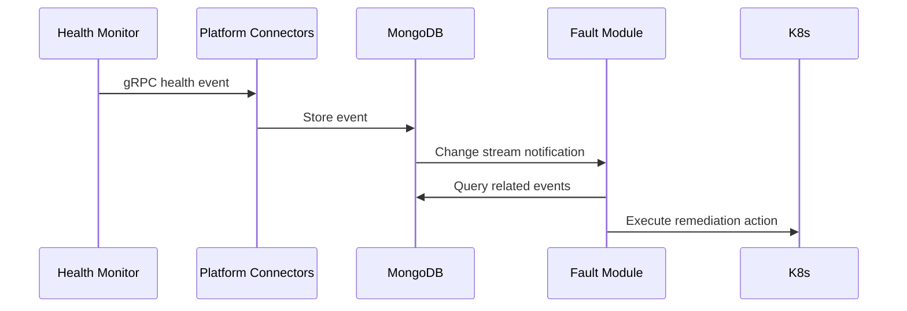

# NVSentinel Development Guide

Welcome to the NVSentinel development team! This guide will help you understand the project structure, development workflows, and best practices for contributing to the codebase.

## 📋 Table of Contents

- [Getting Started](#getting-started)
- [Project Architecture](#project-architecture)
- [Development Environment Setup](#development-environment-setup)
- [Development Workflows](#development-workflows)
- [Module Development](#module-development)
- [Testing](#testing)
- [Code Standards](#code-standards)
- [CI/CD Pipeline](#cicd-pipeline)
- [Debugging](#debugging)
- [Common Tasks](#common-tasks)

## 🚀 Getting Started

### Prerequisites

Before you start developing, ensure you have the following tools installed:

**Required Tools:**
- [Go 1.23.4+](https://golang.org/dl/) (current: 1.25.0)
- [Docker](https://docs.docker.com/get-docker/)
- [kubectl](https://kubernetes.io/docs/tasks/tools/install-kubectl/)
- [Helm 3.0+](https://helm.sh/docs/intro/install/)
- [Protocol Buffers Compiler (protoc)](https://grpc.io/docs/protoc-installation/)

**Development Tools:**
- [golangci-lint](https://golangci-lint.run/usage/install/) - Go linting
- [gotestsum](https://github.com/gotestyourself/gotestsum) - Enhanced test runner
- [gocover-cobertura](https://github.com/boumenot/gocover-cobertura) - Coverage reporting
- [addlicense](https://github.com/google/addlicense) - License header management
- [Poetry](https://python-poetry.org/) - Python dependency management (for GPU health monitor)
- [shellcheck](https://github.com/koalaman/shellcheck) - Shell script linting

**Optional but Recommended:**
- [Tilt](https://tilt.dev/) - Local Kubernetes development
- [ctlptl](https://github.com/tilt-dev/ctlptl) - Declarative local Kubernetes cluster management
- [Kind](https://kind.sigs.k8s.io/) - Local Kubernetes clusters (managed via ctlptl)
- [MongoDB Compass](https://www.mongodb.com/products/compass) - Database GUI

### Linux x86_64 Prerequisites Installation

For a fresh Linux x86_64 system, run the following commands to install all required dependencies:

```bash
# Set environment variables
export PATH=/usr/local/go/bin:$PATH
export PYTHONPATH=/usr/local/dcgm/bindings/python3
export PYTHONUNBUFFERED=1

# Update system
apt-get update
apt -y autoremove

# Install basic tools
apt-get install -y python3 python3-pip curl git wget unzip

# Install Poetry
pip install --break-system-packages poetry==1.8.2

# Install Helm
curl https://raw.githubusercontent.com/helm/helm/main/scripts/get-helm-3 | bash
helm plugin install https://github.com/chartmuseum/helm-push || true

# Install Protocol Buffers
wget https://github.com/protocolbuffers/protobuf/releases/download/v27.1/protoc-27.1-linux-x86_64.zip
unzip -o protoc-27.1-linux-x86_64.zip -d protoc-27.1-linux-x86_64
cp protoc-27.1-linux-x86_64/bin/protoc /usr/local/bin/
mkdir -p /usr/local/bin/include/google
cp -r protoc-27.1-linux-x86_64/include/google /usr/local/bin/include
rm -rf protoc*

# Install Python gRPC tools
python3 -m pip install --break-system-packages grpcio grpcio-tools

# Install NVIDIA DCGM
wget https://developer.download.nvidia.com/compute/cuda/repos/debian12/x86_64/cuda-keyring_1.1-1_all.deb
dpkg -i cuda-keyring_1.1-1_all.deb && rm cuda-keyring_1.1-1_all.deb
apt-get install -y datacenter-gpu-manager=1:3.3.5

# Install Go development tools
go install github.com/google/addlicense@latest && mv $(go env GOPATH)/bin/addlicense /usr/local/bin/
go install github.com/boumenot/gocover-cobertura@latest && mv $(go env GOPATH)/bin/gocover-cobertura /usr/local/bin/
go install gotest.tools/gotestsum@latest && mv $(go env GOPATH)/bin/gotestsum /usr/local/bin/
go install google.golang.org/protobuf/cmd/protoc-gen-go@v1.36.6 && mv $(go env GOPATH)/bin/protoc-gen-go /usr/local/bin/
go install google.golang.org/grpc/cmd/protoc-gen-go-grpc@v1.3.0 && mv $(go env GOPATH)/bin/protoc-gen-go-grpc /usr/local/bin/
go install sigs.k8s.io/kind@v0.30.0 && mv $(go env GOPATH)/bin/kind /usr/local/bin/
go install github.com/tilt-dev/ctlptl/cmd/ctlptl@latest && mv $(go env GOPATH)/bin/ctlptl /usr/local/bin/

# Install golangci-lint
curl -sSfL https://raw.githubusercontent.com/golangci/golangci-lint/master/install.sh | sh -s -- -b /usr/local/bin v1.61.0

# Install kubectl
curl -L "https://dl.k8s.io/release/$(curl -L -s https://dl.k8s.io/release/stable.txt)/bin/linux/$(case $(uname -m) in aarch64) echo arm64;; x86_64) echo amd64;; *) echo $(uname -m);; esac)/kubectl" -o /usr/local/bin/kubectl
chmod +x /usr/local/bin/kubectl

# Install shellcheck
curl -sSL "https://github.com/koalaman/shellcheck/releases/latest/download/shellcheck-$(curl -sSL https://api.github.com/repos/koalaman/shellcheck/releases/latest | grep tag_name | cut -d'"' -f4).linux.$(case $(uname -m) in x86_64) echo x86_64;; aarch64) echo aarch64;; *) echo $(uname -m);; esac).tar.xz" | tar -xJ --wildcards -C /usr/local/bin/ --strip-components=1 "*/shellcheck"
chmod +x /usr/local/bin/shellcheck

# Install Tilt
curl -L https://github.com/tilt-dev/tilt/releases/download/v0.35.1/tilt.0.35.1.linux.x86_64.tar.gz | tar -xz -C /usr/local/bin
 tilt

# Clean up
apt-get clean
```

### Quick Setup

```bash
# Clone the repository
git clone https://gitlab-master.nvidia.com/dgxcloud/mk8s/k8s-addons/nvsentinel.git
cd nvsentinel

# Install development tools
make help  # See all available commands

# Run full test suite to verify setup
make lint-test-all
```

### Makefile Organization

The project uses a **modular Makefile structure** for better organization:

```
nvsentinel/
├── Makefile                              # Main coordinator - delegates to sub-Makefiles
├── health-monitors/Makefile              # Health monitor coordination
│   ├── nic-health-monitor/Makefile      # Individual module targets
│   ├── syslog-health-monitor/Makefile   # Individual module targets
│   ├── nvswitch-health-monitor/Makefile # Individual module targets
│   ├── csp-health-monitor/Makefile      # Individual module targets
│   └── gpu-health-monitor/Makefile      # Python-specific targets
├── docker/Makefile                       # Docker build targets (delegation-based)
├── dev/Makefile                         # Development environment targets
├── distros/kubernetes/Makefile          # Kubernetes/Helm targets
├── [module]/Makefile                    # Each module has its own Makefile
└── store-client-sdk/Makefile            # SDK library targets
```

**Benefits:**
- **Modular**: Each area has focused, specialized targets
- **Self-contained**: Individual modules can be developed independently
- **Consistent**: Same interface maintained across all levels
- **Technology-specific**: Go vs Python modules have appropriate tooling

## 🏗️ Project Architecture

NVSentinel follows a **microservices architecture** with event-driven communication:

### Core Principles

1. **Independence**: Modules operate autonomously
2. **Event-Driven**: Communication through MongoDB change streams
3. **Modular**: Pluggable health monitors
4. **Cloud-Native**: Kubernetes-first design

### Module Types

```
nvsentinel/
├── health-monitors/           # Hardware/software fault detection
│   ├── gpu-health-monitor/   # Python - DCGM GPU monitoring
│   ├── nic-health-monitor/   # Go - Network interface monitoring
│   ├── nvswitch-health-monitor/ # Go - NVSwitch monitoring
│   ├── syslog-health-monitor/   # Go - System log monitoring
│   └── csp-health-monitor/      # Go - Cloud provider monitoring
├── platform-connectors/      # gRPC event ingestion service
├── fault-quarantine-module/   # CEL-based event quarantine logic
├── fault-remediation-module/   # Kubernetes controller for remediation
├── health-events-analyzer/    # Event analysis and correlation
├── health-event-client/       # Event streaming client
├── labeler-module/           # Node labeling controller
├── node-drainer-module/      # Graceful workload eviction
├── store-client-sdk/         # MongoDB interaction library (tested in CI)
└── nvsentinel-log-collector/ # Log aggregation (shell scripts)
```

### Communication Flow



## 🛠️ Development Environment Setup

### 1. Local Development with Tilt

Tilt provides the fastest development experience with hot reloading. The development environment targets are organized in `dev/Makefile`:

```bash
# Quick start - create cluster and start Tilt in one command
make dev-env                    # Delegates to: make -C dev env-up

# Manual step-by-step approach
make cluster-create             # Delegates to: make -C dev cluster-create
make tilt-up                    # Delegates to: make -C dev tilt-up

# Direct dev/ Makefile usage
make -C dev cluster-create      # Creates ctlptl-managed Kind cluster with registry
make -C dev tilt-up            # Starts Tilt with UI
make -C dev cluster-status     # Check cluster and registry status

# View Tilt UI
# Navigate to http://localhost:10350

# Stop everything when done
make dev-env-clean             # Delegates to: make -C dev env-down

# Or stop individually
make tilt-down                 # Delegates to: make -C dev tilt-down
make cluster-delete            # Delegates to: make -C dev cluster-delete
```

**ctlptl Cluster Features:**
- Declarative cluster configuration with YAML
- Multi-node Kind cluster (3 control-plane, 2 worker nodes)
- Cluster name: `kind-nvsentinel` (required `kind-` prefix)
- Integrated local container registry at `localhost:5001`
- Automatic registry configuration for Tilt
- Simplified cluster lifecycle management
- No external dependencies beyond Docker, ctlptl, and Kind

### 2. Manual Development Setup

For module-specific development without full cluster:

```bash
# Set up Go environment
export GOPATH=$(go env GOPATH)
export GO_CACHE_DIR=$(go env GOCACHE)

# Install development dependencies
go install github.com/golangci/golangci-lint/cmd/golangci-lint@latest
go install gotest.tools/gotestsum@latest
go install github.com/boumenot/gocover-cobertura@latest

# For controller modules
go install sigs.k8s.io/controller-runtime/tools/setup-envtest@latest
```

### 3. Private Repository Access

Some modules require access to private NVIDIA repositories:

```bash
# Configure Go private modules
export GOPRIVATE=gitlab-master.nvidia.com/dgxcloud/mk8s/*

# Authentication is handled automatically via SSH keys or other configured methods
# No CI_JOB_TOKEN needed for local development
```

## 🔄 Development Workflows

### Daily Development Workflow

1. **Start Development Session**
   ```bash
   git checkout main
   git pull origin main
   git checkout -b feature/your-feature-name

   # Start local development environment
   make dev-env  # Creates ctlptl-managed cluster and starts Tilt
   ```

2. **Develop with Live Reload**
   ```bash
   # Edit code - Tilt automatically rebuilds and redeploys
   vim health-monitors/nic-health-monitor/pkg/monitor/monitor.go

   # View logs in Tilt UI at http://localhost:10350
   # Or use kubectl for specific logs
   kubectl logs -f deployment/nic-health-monitor -n nvsentinel
   ```

3. **Test Changes**
   ```bash
   # Run tests locally (while Tilt is running)
   make health-monitors-lint-test-all              # All health monitors
   make -C health-monitors lint-test-nic-health-monitor  # Specific module

   # Or run individual module tests directly
   make -C health-monitors/nic-health-monitor lint-test

   # Test integration with other services via Tilt UI
   # Access services via port-forwards set up by Tilt
   ```

4. **Validate Before Commit**
   ```bash
   # Run full test suite
   make lint-test-all

   # Stop Tilt for final testing if needed
   make tilt-down
   ```

5. **Commit and Push**
   ```bash
   git add .
   git commit -s -m "feat: add new monitoring capability"
   git push origin feature/your-feature-name

   # Clean up development environment
   make dev-env-clean
   ```

### Protocol Buffer Development

When modifying `.proto` files:

```bash
# Generate protobuf files
make protos-lint

# This runs:
# - protoc generation for Go modules
# - Python protobuf generation for GPU monitor
# - Import path fixes for Python
# - Git diff check to ensure files are up to date
```

### Container Development

The project has a **comprehensive Docker build system** that matches GitLab CI exactly. All builds use multi-platform architecture, build caching, and proper secret management.

#### Environment Variables

Set these for production-like builds:

```bash
# Docker configuration (matching GitLab CI)
export NVCR_CONTAINER_REPO="nvcr.io"
export NGC_ORG="nv-ngc-devops"
export CI_COMMIT_REF_NAME="feature-branch"  # Or your branch name
# Note: CI_JOB_TOKEN no longer needed - authentication handled automatically

# These are computed automatically:
# SAFE_REF_NAME=$(echo $CI_COMMIT_REF_NAME | sed 's/\//-/g')
# PLATFORMS="linux/arm64,linux/amd64"
```

#### Docker Build Commands

**🎯 Delegation-Based Architecture**

The Docker build system now uses a **delegation pattern** where the centralized `docker/Makefile` coordinates builds by calling individual module Makefiles. This eliminates duplicate build logic and ensures each module is the single source of truth for its Docker configuration.

**Main build targets (delegation to individual modules):**

```bash
# Local Development (--load) - builds images into local Docker daemon
make docker-all                       # All 13 images locally
make docker-health-monitors           # All health monitor images locally
make docker-main-modules              # All non-health-monitor images locally
make docker-gpu-health-monitor        # Both DCGM 3.x and 4.x versions locally

# CI/Production (--push) - builds and pushes directly to registry
make docker-publish-all               # Build and push all images to registry
make docker-publish-health-monitors   # Build and push health monitor images
make docker-publish-main-modules      # Build and push main module images
make docker-publish-gpu-health-monitor # Build and push both DCGM variants

# Individual module targets
make docker-nic-health-monitor        # Build NIC monitor locally
make docker-publish-nic-health-monitor # Build and push NIC monitor to registry
make docker-csp-health-monitor        # Build CSP monitor locally
make docker-publish-csp-health-monitor # Build and push CSP monitor to registry
```

**Direct docker/ Makefile usage:**

```bash
cd docker

# Local development builds (--load)
make build-all                    # Build all 12 images locally
make build-health-monitors        # Build health monitor group locally
make build-nic-health-monitor     # Build specific module locally

# CI/production builds (--push)
make publish-all                  # Build and push all images to registry
make publish-nic-health-monitor   # Build and push specific image to registry

# Utility commands
make setup-buildx                 # Setup multi-platform builder
make clean                        # Remove all nvsentinel images
make list                         # List built nvsentinel images
make help                         # Show all available targets
```

**Individual module usage (direct module control):**

```bash
# Standard modules
make -C health-monitors/nic-health-monitor docker-build    # Local build
make -C health-monitors/nic-health-monitor docker-publish  # CI build

# GPU monitor with DCGM variants
make -C health-monitors/gpu-health-monitor docker-build-dcgm3  # DCGM 3.x local
make -C health-monitors/gpu-health-monitor docker-publish-dcgm4 # DCGM 4.x CI

# Private repo modules
make -C health-event-client docker-build    # Local build
make -C health-event-client docker-publish  # CI build
```

#### Module-Level Docker Builds

Each module now has its own Docker targets that match GitLab CI exactly:

```bash
# Individual module builds (examples)
make -C health-monitors/nic-health-monitor image    # Standard build
make -C health-monitors/nic-health-monitor publish  # Build and push

make -C health-monitors/gpu-health-monitor image-dcgm3  # DCGM 3.x
make -C health-monitors/gpu-health-monitor image-dcgm4  # DCGM 4.x
make -C health-monitors/gpu-health-monitor publish      # Push both versions

make -C health-monitors/csp-health-monitor image       # Private repo build
make -C platform-connectors image                      # Standard build
make -C nvsentinel-log-collector image                 # Shell script module
```

#### Docker Build Features

All builds now include GitLab CI features:

1. **Multi-Platform Support**: `linux/arm64,linux/amd64`
2. **Build Caching**: Registry-based build cache for faster builds
3. **Private Repository Support**: BuildKit secrets for private Go modules
4. **Dynamic Tagging**: Uses branch/tag name (`${SAFE_REF_NAME}`)
5. **Registry Integration**: Proper NVCR.io registry paths
6. **Cluster Integration**: Built images work with `kind-nvsentinel` cluster

#### Example Build Scenarios

**Local Development:**
```bash
# Quick local build (single platform)
make -C health-monitors/nic-health-monitor image

# Full multi-platform build (like CI)
PLATFORMS="linux/arm64,linux/amd64" make docker-nic-health-monitor
```

**CI-like Build:**
```bash
# Set up environment like GitLab CI
export NVCR_CONTAINER_REPO="nvcr.io"
export NGC_ORG="nv-ngc-devops"
export CI_COMMIT_REF_NAME="main"

# Build all images with full CI features
make docker-all

# Images will be tagged like:
# nvcr.io/nv-ngc-devops/nvsentinel-nic-health-monitor:main
# nvcr.io/nv-ngc-devops/nvsentinel-gpu-health-monitor:main-dcgm-3.x
# nvcr.io/nv-ngc-devops/nvsentinel-gpu-health-monitor:main-dcgm-4.x
```

**Testing Specific Module:**
```bash
# Build and test individual module
make docker-platform-connectors
docker run --rm nvcr.io/nv-ngc-devops/nvsentinel-platform-connectors:local --help

# Build private repo module
make docker-health-events-analyzer
```

#### Build Cache Benefits

The new system uses Docker BuildKit registry cache:
- **First build**: Downloads and caches layers
- **Subsequent builds**: Reuses cached layers for 10x+ speed improvement
- **Multi-developer**: Cache shared across team via registry

#### Troubleshooting Docker Builds

**Build failures:**
```bash
# Check buildx setup
make -C docker setup-buildx

# Clean and retry
make -C docker clean
docker system prune -f
make docker-nic-health-monitor
```

**Private repo access:**
```bash
# Verify SSH key access
git ls-remote git@gitlab-master.nvidia.com:dgxcloud/mk8s/some-private-repo.git

# Build with debug output
BUILDKIT_PROGRESS=plain make docker-csp-health-monitor
```

**Registry issues:**
```bash
# Test registry login
docker login nvcr.io -u '$oauthtoken' -p "$NGC_PASSWORD"

# Check image tags
make -C docker list
```

## 🧩 Module Development

### Creating a New Health Monitor

1. **Create Module Structure**
   ```bash
   mkdir -p health-monitors/my-monitor/{cmd,pkg,internal}
   cd health-monitors/my-monitor
   ```

2. **Initialize Go Module**
   ```bash
   go mod init gitlab-master.nvidia.com/dgxcloud/mk8s/k8s-addons/nvsentinel/health-monitors/my-monitor
   ```

3. **Create Module Makefile**
   ```bash
   # Copy template from existing health monitor
   cp ../nic-health-monitor/Makefile ./Makefile

   # Update module-specific settings
   sed -i 's/nic-health-monitor/my-monitor/g' Makefile
   sed -i 's/NIC Health Monitor/My Monitor/g' Makefile
   ```

4. **Implement gRPC Client**
   ```go
   // pkg/monitor/monitor.go
   package monitor

   import (
       "context"
       pb "gitlab-master.nvidia.com/dgxcloud/mk8s/k8s-addons/nvsentinel/platform-connectors/pkg/protos"
       "google.golang.org/grpc"
   )

   type Monitor struct {
       client pb.PlatformConnectorClient
   }

   func (m *Monitor) SendEvent(ctx context.Context, event *pb.HealthEvent) error {
       _, err := m.client.SendHealthEvent(ctx, event)
       return err
   }
   ```

5. **Update health-monitors/Makefile**
   ```bash
   # Add your module to the health monitors list
   # Edit health-monitors/Makefile:
   # - Add 'my-monitor' to GO_HEALTH_MONITORS list
   # - Add lint-test delegation target
   # - Add build delegation target
   # - Add clean delegation target
   ```

6. **Test Your Module**
   ```bash
   # Test the individual module
   make -C health-monitors/my-monitor lint-test

   # Test via health-monitors coordination
   make -C health-monitors lint-test-my-monitor

   # Test via main Makefile delegation
   make health-monitors-lint-test-all
   ```

7. **Add to CI Pipeline**
   Edit `.gitlab-ci.yml` to add your module to the lint-test and container build stages.

### Creating a New Core Module

1. **Follow Kubernetes Controller Pattern**
   ```bash
   # Use controller-runtime for Kubernetes controllers
   go get sigs.k8s.io/controller-runtime
   ```

2. **Implement MongoDB Change Streams**
   ```go
   // Use store-client-sdk for MongoDB operations
   import "gitlab-master.nvidia.com/dgxcloud/mk8s/k8s-addons/nvsentinel/store-client-sdk/pkg/client"
   ```

3. **Add Proper RBAC**
   Create Kubernetes RBAC manifests in `distros/kubernetes/nvsentinel/templates/`.

## 🧪 Testing

### Test Strategy

- **Unit Tests**: Test individual functions and methods
- **Integration Tests**: Test module interactions
- **End-to-End Tests**: Test complete workflows via CI

### Running Tests

The modular Makefile structure provides multiple ways to run tests:

```bash
# Test all modules
make lint-test-all                          # Main Makefile - runs everything

# Test by category
make health-monitors-lint-test-all          # All health monitors
make go-lint-test-all                       # Non-health-monitor Go modules
make python-lint-test-all                   # Non-health-monitor Python modules

# Test individual modules via delegation
make -C health-monitors lint-test-nic-health-monitor  # Via health-monitors/Makefile
make lint-test-platform-connectors                    # Via main Makefile (non-health-monitor)

# Test individual modules directly
make -C health-monitors/nic-health-monitor lint-test  # Direct module access
make -C health-monitors/gpu-health-monitor lint-test  # Python module

# Run specific test with verbose output
cd platform-connectors
go test -v ./pkg/connectors/...

# Use individual module targets for development
cd health-monitors/nic-health-monitor
make vet        # Just go vet
make lint       # Just golangci-lint
make test       # Just tests
make coverage   # Tests + coverage
```

### Test Requirements

Each module must include:
- Unit tests with `_test.go` suffix
- Coverage reporting via `go test -coverprofile`
- Integration tests where applicable
- Mocks for external dependencies

### Python Testing (GPU Health Monitor)

```bash
# Using the module's Makefile (recommended)
make -C health-monitors/gpu-health-monitor lint-test  # Full lint-test
make -C health-monitors/gpu-health-monitor setup      # Just Poetry setup
make -C health-monitors/gpu-health-monitor lint       # Just Black check
make -C health-monitors/gpu-health-monitor test       # Just tests
make -C health-monitors/gpu-health-monitor format     # Run Black formatter

# Manual Poetry commands
cd health-monitors/gpu-health-monitor
poetry install
poetry run pytest -v
poetry run black --check .
poetry run coverage run --source=gpu_health_monitor -m pytest
```

## 📏 Code Standards

### Go Standards

- **Linting**: Use `golangci-lint` with project configuration
- **Formatting**: Use `gofmt` (enforced by linting)
- **Imports**: Group standard, third-party, and local imports
- **Error Handling**: Always check and handle errors appropriately
- **Context**: Pass `context.Context` for cancellation and timeouts

### Code Review Checklist

- [ ] All tests pass
- [ ] Code coverage maintained or improved
- [ ] No linting violations
- [ ] Proper error handling
- [ ] Documentation updated
- [ ] License headers present
- [ ] Signed commits (`git commit -s`)

### License Headers

All source files must include the Apache 2.0 license header:

```bash
# Add license headers to new files
addlicense -f license-header.txt .

# Check license headers
make license-headers-lint
```

## 🚀 CI/CD Pipeline

### Pipeline Stages

1. **`.pre`**: Variable preparation and MR cop
2. **`lint-test`**: Code quality and testing
3. **`generate`**: Artifact generation
4. **`publish`**: Container image publishing
5. **`deploy`**: Helm chart publishing
6. **`release`**: Semantic release
7. **`security`**: Security scanning

### Local CI Simulation

```bash
# Run the same commands as CI locally
make lint-test-all

# Individual module CI commands - use module Makefiles
make -C health-monitors/nic-health-monitor lint-test
make -C health-monitors/gpu-health-monitor lint-test
make -C store-client-sdk lint-test                  # Now has CI presence
make -C nvsentinel-log-collector lint-test          # Shell script linting

# Or run individual steps for debugging
cd health-monitors/nic-health-monitor
make vet        # go vet ./...
make lint       # golangci-lint run
make test       # gotestsum with coverage
make coverage   # generate coverage reports

# Manual commands (what the Makefile runs)
go vet ./...
golangci-lint run --config ../../.golangci.yml
gotestsum --junitfile report.xml -- -race -short $(go list ./... | grep -v pkg/protos) -coverprofile=coverage.txt -covermode atomic
```

### GitLab CI Variables

Required for CI/CD:
- `NGC_PASSWORD`: NVIDIA NGC registry password
- `DGXC_RELEASE_BOT_TOKEN`: Release automation token
- Private repository access handled via SSH keys

## 🐛 Debugging

### Local Development Debugging

1. **Tilt Debugging**
   ```bash
   # Start Tilt with Makefile (recommended)
   make tilt-up
   # Navigate to http://localhost:10350

   # Or run Tilt in CI mode (no UI, good for debugging)
   make tilt-ci

   # Stream logs for specific service
   kubectl logs -f deployment/platform-connectors -n nvsentinel

   # Access Tilt logs and resource status
   tilt get all
   tilt logs platform-connectors
   ```

2. **gRPC Debugging**
   ```bash
   # Use grpcurl to test endpoints
   grpcurl -plaintext localhost:50051 list
   grpcurl -plaintext localhost:50051 platformconnector.PlatformConnector/SendHealthEvent
   ```

### Common Issues

1. **Module Dependencies**
   ```bash
   # Clean module cache if dependency issues
   go clean -modcache
   go mod download
   ```

2. **Private Repository Access**
   ```bash
   # Verify SSH key configuration
   ssh -T git@gitlab-master.nvidia.com

   # Test access
   git ls-remote git@gitlab-master.nvidia.com:dgxcloud/mk8s/k8s-addons/nvsentinel.git
   ```

3. **Container Build Issues**
   ```bash
   # Clean Docker cache
   docker system prune -f

   # Rebuild without cache
   docker build --no-cache -t nvsentinel-platform-connectors platform-connectors/
   ```

4. **Shellcheck Version Differences (Log Collector)**
   ```bash
   # GitLab CI uses koalaman/shellcheck-alpine:stable Docker image
   # Local shellcheck version may differ, causing different linting results
   
   # For exact CI parity, use Docker-based linting:
   make -C nvsentinel-log-collector lint-ci
   
   # Or use local shellcheck:
   make -C nvsentinel-log-collector lint-test    # Uses local shellcheck
   make log-collector-lint                       # Main Makefile delegation
   
   # Manual Docker command for debugging:
   cd nvsentinel-log-collector
   docker run --rm -v "$(pwd):/mnt" koalaman/shellcheck-alpine:stable shellcheck /mnt/entrypoint.sh
   
   # Install shellcheck locally if needed:
   # macOS: brew install shellcheck
   # Ubuntu: apt-get install shellcheck
   # See: https://github.com/koalaman/shellcheck#installing
   ```

## 🔧 Makefile Reference

### Makefile Structure Overview

The project uses a **hierarchical Makefile structure** for better organization and maintainability:

#### Main Makefile (`./Makefile`)
Acts as the primary coordinator, delegating to specialized sub-Makefiles:

```bash
make help                     # Show all available targets
make lint-test-all           # Run full test suite (delegates to all sub-Makefiles)
make health-monitors-lint-test-all  # Delegate to health-monitors/Makefile
make docker-all              # Delegate to docker/Makefile
make dev-env                 # Delegate to dev/Makefile
make kubernetes-distro-lint  # Delegate to distros/kubernetes/Makefile
```

#### Health Monitors Makefile (`health-monitors/Makefile`)
Coordinates all health monitoring modules:

```bash
make -C health-monitors help                    # Show health monitor targets
make -C health-monitors lint-test-all          # Test all health monitors
make -C health-monitors build-all              # Build all health monitors
make -C health-monitors lint-test-nic-health-monitor  # Test specific module
```

#### Individual Module Makefiles (`health-monitors/*/Makefile`)
Each health monitor has its own focused Makefile:

```bash
make -C health-monitors/nic-health-monitor help       # Module-specific help
make -C health-monitors/nic-health-monitor lint-test  # Full lint and test
make -C health-monitors/nic-health-monitor build      # Build module
make -C health-monitors/nic-health-monitor clean      # Clean artifacts

# Individual development steps
make -C health-monitors/nic-health-monitor vet        # Just go vet
make -C health-monitors/nic-health-monitor lint       # Just linting
make -C health-monitors/nic-health-monitor test       # Just tests
make -C health-monitors/nic-health-monitor coverage   # Generate coverage
```

#### Docker Makefile (`docker/Makefile`)
**Comprehensive Docker build system matching GitLab CI exactly:**

```bash
make -C docker help                    # Show all Docker targets and configuration

# Main build targets
make -C docker build-all              # Build all 12 images (multi-platform)
make -C docker publish-all            # Build and push all images
make -C docker setup-buildx           # Setup Docker buildx builder

# Group targets
make -C docker build-health-monitors  # Build all health monitor images
make -C docker build-main-modules     # Build all non-health-monitor images

# Individual module targets (all 12 modules supported)
make -C docker build-nic-health-monitor          # Standard module
make -C docker build-csp-health-monitor          # Private repo module
make -C docker build-gpu-health-monitor-dcgm3    # GPU with DCGM 3.x
make -C docker build-gpu-health-monitor-dcgm4    # GPU with DCGM 4.x
make -C docker build-platform-connectors         # Standard module
make -C docker build-health-events-analyzer      # Private repo module
make -C docker build-log-collector               # Shell script module
# ... and 5 more individual targets

# Publish targets (push to registry)
make -C docker publish-nic-health-monitor        # Build and push specific image
make -C docker publish-all                       # Build and push all images

# Utility targets
make -C docker clean                  # Remove all nvsentinel images
make -C docker list                   # List built nvsentinel images
```

**Key Features:**
- **Multi-platform builds**: `linux/arm64,linux/amd64`
- **Build caching**: Registry-based cache for faster builds
- **Private repo support**: BuildKit secrets for modules needing GitLab access
- **Dynamic tagging**: Uses `${SAFE_REF_NAME}` from branch/tag names
- **Registry integration**: Full NVCR.io paths and authentication

#### Development Makefile (`dev/Makefile`)
Focused on development environment:

```bash
make -C dev help           # Show development targets
make -C dev env-up         # Create cluster + start Tilt
make -C dev env-down       # Stop Tilt + delete cluster
make -C dev cluster-create # Create Kind cluster
make -C dev tilt-up        # Start Tilt
make -C dev cluster-status # Check cluster status
```

#### Kubernetes Makefile (`distros/kubernetes/Makefile`)
Helm and Kubernetes operations:

```bash
make -C distros/kubernetes help         # Show Kubernetes targets
make -C distros/kubernetes lint         # Lint Helm charts
make -C distros/kubernetes helm-publish # Publish Helm chart
```

### Development Workflow Examples

```bash
# 1. Full development cycle
make dev-env                           # Start development environment
make health-monitors-lint-test-all     # Test health monitors
make docker-all                        # Build containers
make dev-env-clean                     # Clean up

# 2. Individual module development
make -C health-monitors/nic-health-monitor lint-test  # Test specific module
make -C docker build-nic-health-monitor               # Build its container

# 3. Focused development on specific module
cd health-monitors/nic-health-monitor
make lint-test    # Full module test
make vet          # Quick syntax check
make test         # Run tests only
```

### Backwards Compatibility

All original targets still work - they now delegate appropriately:
- `make docker-all` → `make -C docker build-all`
- `make tilt-up` → `make -C dev tilt-up`
- `make cluster-create` → `make -C dev cluster-create`

## 📚 Common Tasks

### Adding a New Dependency

1. **For Go modules:**
   ```bash
   cd your-module/
   go get github.com/new/dependency@v1.2.3
   go mod tidy
   ```

2. **For Python modules:**
   ```bash
   cd health-monitors/gpu-health-monitor/
   poetry add new-dependency
   ```

### Updating Protobuf Definitions

1. **Edit `.proto` files in `protobufs/` directory**
2. **Regenerate code:**
   ```bash
   make protos-lint
   ```
3. **Update affected modules and test**

### Adding New Configuration Options

1. **Update Helm values in `distros/kubernetes/nvsentinel/values.yaml`**
2. **Update templates in `distros/kubernetes/nvsentinel/templates/`**
3. **Update module code to read new configuration**
4. **Test with Tilt or manual Helm install**

### Performance Profiling

```bash
# Enable pprof in Go applications
import _ "net/http/pprof"

# Access profiles
go tool pprof http://localhost:6060/debug/pprof/profile
go tool pprof http://localhost:6060/debug/pprof/heap
```

### Database Schema Changes

1. **Never break backward compatibility**
2. **Add fields with default values**
3. **Use MongoDB schema validation if needed**
4. **Test with existing data**

## 🎯 Best Practices

### Development Best Practices

1. **Start Small**: Make incremental changes
2. **Test Early**: Write tests alongside code
3. **Document Changes**: Update relevant documentation
4. **Review Dependencies**: Minimize external dependencies
5. **Monitor Resources**: Be aware of CPU/memory usage

### Kubernetes Best Practices

1. **Resource Limits**: Always set resource requests/limits
2. **Health Checks**: Implement readiness and liveness probes
3. **Graceful Shutdown**: Handle SIGTERM properly
4. **Security Context**: Run with minimal privileges
5. **Observability**: Emit metrics and structured logs

### MongoDB Best Practices

1. **Indexes**: Create appropriate indexes for queries
2. **Connection Pooling**: Reuse connections efficiently
3. **Change Streams**: Use resume tokens for reliability
4. **Error Handling**: Handle network partitions gracefully

**🎯 Usage Examples:**

**Local Development Workflow:**
```bash
# Build for local testing (loads into local Docker daemon)
make -C docker build-nic-health-monitor           # Individual module
make -C docker build-all                          # All modules
make -C health-monitors/gpu-health-monitor docker-build-dcgm3  # Specific variant

# Test the built images locally
docker run nvcr.io/nv-ngc-devops/nvsentinel-nic-health-monitor:local
```

**CI/Production Workflow:**
```bash
# Environment setup (matches GitLab CI)
export NVCR_CONTAINER_REPO="nvcr.io"
export NGC_ORG="nv-ngc-devops"
export CI_COMMIT_REF_NAME="main"
# Private repo modules authentication handled automatically

# Build and push directly to registry (matches GitLab CI exactly)
make -C docker publish-nic-health-monitor         # Individual module
make -C docker publish-all                        # All modules
make -C health-monitors/gpu-health-monitor docker-publish  # Both DCGM variants
```

**Development vs CI Behavior:**
```bash
# Development: Build locally with --load
make -C health-monitors/nic-health-monitor docker-build

# CI/Production: Build and push with --push (matches .gitlab-ci.yml exactly)
make -C health-monitors/nic-health-monitor docker-publish
```

## 📞 Getting Help

- **Internal Documentation**: Check module-specific READMEs
- **GitLab Issues**: Report bugs and feature requests
- **Team Chat**: Reach out to the development team
- **Code Reviews**: Learn from feedback on merge requests
- **Docker Issues**: All Docker builds now match `.gitlab-ci.yml` exactly

---

Happy coding! 🚀

For questions about this guide or the development process, please reach out to the NVSentinel development team.
