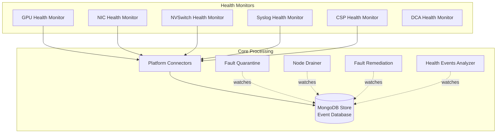

# NVSentinel

[](LICENSE)
[](https://kubernetes.io/)
[](https://helm.sh/)

**GPU Node Resilience System for Kubernetes**

NVSentinel is a comprehensive collection of Kubernetes services that automatically detect, classify, and remediate hardware and software faults in GPU nodes. Designed for GPU clusters, it ensures maximum uptime and seamless fault recovery in high-performance computing environments.

## 🚀 Quick Start

### Prerequisites

- Kubernetes cluster 1.25+
- Helm 3.0+
- NVIDIA GPU Operator (includes DCGM service required for GPU monitoring)

### Installation

```bash
# Add the NVIDIA NGC Helm repository
helm repo add ngc https://helm.ngc.nvidia.com/nv-ngc-devops
helm repo update

# Install with default configuration
helm install nvsentinel ngc/nvsentinel

# Or install with custom values
helm install nvsentinel ngc/nvsentinel -f values.yaml
```

> **Note**: DCGM (Data Center GPU Manager) is included with the NVIDIA GPU Operator and provides the telemetry data required for GPU health monitoring.

## ✨ Key Features

- **🔍 Comprehensive Monitoring**: Real-time detection of GPU, NIC, NVSwitch, and system-level failures
- **🔧 Automated Remediation**: Intelligent fault handling with cordon, drain, and break-fix workflows
- **📦 Modular Architecture**: Pluggable health monitors with standardized gRPC interfaces
- **🔄 High Availability**: Kubernetes-native design with replica support and leader election
- **⚡ Real-time Processing**: Event-driven architecture with immediate fault response
- **📊 Persistent Storage**: MongoDB-based event store with change streams for real-time updates
- **🛡️ Graceful Handling**: Coordinated workload eviction with configurable timeouts

## 🏗️ Architecture

NVSentinel follows a microservices architecture with modular health monitors and core processing modules:



**Data Flow**:
1. **Health Monitors** detect hardware/software faults and send events via gRPC
2. **Platform Connectors** receive and persist events to MongoDB
3. **Core Modules** independently watch MongoDB for relevant events via change streams
4. **Each module** acts autonomously based on their configured rules and policies

> **Note**: Modules operate independently and don't communicate directly with each other. All coordination happens through the shared MongoDB event store using change streams.

## ⚙️ Configuration

### Quick Configuration

Enable/disable modules and set global options:

```yaml
global:
  # Global settings
  dryRun: false  # Enable for testing without actual actions
  
  # Health Monitors (enabled by default)
  gpuHealthMonitor:
    enabled: true
  nicHealthMonitor:
    enabled: true
  nvSwitchHealthMonitor:
    enabled: true
  syslogHealthMonitor:
    enabled: true
  
  # Core Modules (disabled by default - enable for production)
  faultQuarantineModule:
    enabled: false
  nodeDrainerModule:
    enabled: false
  faultRemediationModule:
    enabled: false
  healthEventsAnalyzer:
    enabled: false
  
  # Cloud Monitors (disabled by default)
  cspHealthMonitor:
    enabled: false
```

For detailed configuration options for each module, see the [Module Details](#-module-details) section below.

## 📦 Module Details

### 🔍 Health Monitors

### GPU Health Monitor
**Purpose**: Monitors GPU hardware health via DCGM, detecting thermal issues, ECC errors, and XID events.

**Key Configuration Options**:
```yaml
global:
  gpuHealthMonitor:
    enabled: true
    useHostNetworking: false  # Enable for direct DCGM access
  dcgm:
    service:
      endpoint: "nvidia-dcgm.gpu-operator.svc"
      port: 5555
```

**Features**:
- Real-time GPU telemetry monitoring
- XID error detection and classification
- Temperature and power monitoring
- ECC error tracking


### NIC Health Monitor
**Purpose**: Monitors network interface health, RoCE connectivity, and network link status.

**Key Configuration Options**:
```yaml
global:
  nicHealthMonitor:
    enabled: true
    monitorNetworkType: "all"  # "all", "ethernet", "infiniband"
    roCEInterfaceRegexes: "^rdma\\\\d+$,^eth\\\\d+$"
    nicExclusionRegexes: "^gketmp.*"
    pollingInterval: 1000  # milliseconds
    maxRetryDurationForDownDetectedNICInMilliseconds: 500
```

**Features**:
- Network interface link state monitoring
- RoCE interface health checks
- Configurable interface filtering
- Retry logic for transient failures


### NVSwitch Health Monitor
**Purpose**: Monitors high-speed NVSwitch interconnect fabric for errors and performance issues.

**Key Configuration Options**:
```yaml
global:
  nvSwitchHealthMonitor:
    enabled: true
securityContext:
  privileged: true  # Required for hardware access
```

**Features**:
- NVSwitch fabric error detection
- Link status monitoring
- Kernel message parsing for hardware events


### Syslog Health Monitor
**Purpose**: Analyzes system logs for hardware and software fault patterns.

**Key Configuration Options**:
```yaml
global:
  syslogHealthMonitor:
    enabled: true
pollingInterval: "30m"  # How often to check logs
stateFile: "/var/run/syslog_health_monitor/state.json"
securityContext:
  capabilities:
    add: ["SYSLOG", "SYS_ADMIN"]
```

**Features**:
- Journalctl integration
- Regex pattern matching
- Persistent cursor state
- Configurable lookback periods


### CSP Health Monitor
**Purpose**: Integrates with cloud service provider APIs for maintenance events and health notifications.

**Key Configuration Options**:
```yaml
global:
  cspHealthMonitor:
    enabled: false
cspName: "gcp"  # or "aws"
configToml:
  maintenanceEventPollIntervalSeconds: 60
  gcp:
    targetProjectId: "your-project"
    apiPollingIntervalSeconds: 60
  aws:
    accountId: "123456789012"
    region: "us-east-1"
```

**Features**:
- GCP and AWS maintenance event detection
- Proactive node quarantine for scheduled maintenance
- Cloud provider API integration

### 🏗️ Core Modules

### Platform Connectors
**Purpose**: Receives health events from monitors via gRPC, persists them to MongoDB, and updates Kubernetes node status.

**Key Configuration Options**:
```yaml
platformConnector:
  mongodbStore:
    enabled: true
    connectionString: "mongodb://nvsentinel-mongodb:27017"
```

**Features**:
- gRPC server interface for health monitors
- Event validation and persistence
- MongoDB integration with TLS support
- Updates Kubernetes node conditions based on health events
- Creates Kubernetes events for node health status changes

### Fault Quarantine Module
**Purpose**: Watches MongoDB for health events and cordons nodes based on configurable rule sets.

**Key Configuration Options**:
```yaml
global:
  faultQuarantineModule:
    enabled: false
logLevel: 1
config: |
  label-prefix = "k8saas.nvidia.com/"
  [[rule-sets]]
    name = "GPU fatal error ruleset"
    [[rule-sets.match.all]]
      kind = "HealthEvent"
      expression = "event.isFatal == true"
    [rule-sets.cordon]
      shouldCordon = true
```

**Features**:
- Watches MongoDB change streams for new events
- TOML-based rule configuration
- Multi-condition rule evaluation
- Percentage-based cordon limits
- Label-based node management


### Node Drainer Module
**Purpose**: Watches MongoDB for cordoned nodes and gracefully evicts workloads with configurable policies.

**Key Configuration Options**:
```yaml
global:
  nodeDrainerModule:
    enabled: false
config: |
  evictionTimeoutInSeconds = "60"
  [[userNamespaces]]
  name = "runai-*"
  mode = "AllowCompletion"
```

**Features**:
- Watches MongoDB change streams for node cordon events
- Configurable eviction timeouts
- Namespace-specific drain policies
- Workload completion awareness
- Graceful termination handling


### Fault Remediation Module
**Purpose**: Watches MongoDB for drain completion events and triggers external break-fix systems.

**Key Configuration Options**:
```yaml
global:
  faultRemediationModule:
    enabled: false
maintenanceResource:
  apiGroup: "janitor.dgxc.nvidia.com"
  namespace: "dgxc-janitor"
  rebootResource:
    name: "rebootnodes"
```

**Features**:
- Watches MongoDB change streams for remediation trigger events
- Kubernetes CRD integration
- Template-based remediation workflows
- External system integration


### Health Events Analyzer
**Purpose**: Watches MongoDB change streams to analyze event patterns and generate recommended actions.

**Key Configuration Options**:
```yaml
global:
  healthEventsAnalyzer:
    enabled: false
logLevel: 1
config: |
  [[rules]]
  name = "XID13->XID31 Detection"
  time_window = "30m"
  recommended_action = "RESET_GPU"
```

**Features**:
- Watches MongoDB change streams for health event patterns
- Time-window based pattern analysis
- Sequential event correlation
- Automated action recommendations
- Complex rule evaluation


### MongoDB Store
**Purpose**: Provides persistent storage for health events with real-time change streams.

**Key Configuration Options**:
```yaml
mongodb:
  architecture: replicaset
  replicaCount: 3
  auth:
    enabled: true
  tls:
    enabled: true
    mTLS:
      enabled: true
  resources:
    requests:
      cpu: 1
      memory: 1.5Gi
```

**Features**:
- High availability replica set
- TLS/mTLS encryption
- Change stream notifications
- Automatic credential management

## 📋 Requirements

- **Kubernetes**: 1.25 or later
- **Helm**: 3.0 or later
- **NVIDIA GPU Operator**: For GPU monitoring capabilities (includes DCGM)
- **Storage**: Persistent storage for MongoDB (recommended 10GB+)
- **Network**: Cluster networking for inter-service communication

## 🛠️ Development

### Project Structure

```
nvsentinel/
├── health-monitors/          # Individual health monitor implementations
├── platform-connectors/     # gRPC platform connector services
├── fault-quarantine-module/ # Node quarantine logic
├── node-drainer-module/     # Workload draining coordination
├── fault-remediation-module/# External remediation integration
├── store-client-sdk/        # MongoDB client SDK
├── distros/kubernetes/      # Helm charts and manifests
└── testcases/              # Test suites and utilities
```

### Building

NVSentinel uses a monorepo structure. Build each module independently:

```bash
# Build a specific module (example: platform-connectors)
cd platform-connectors
docker build -t nvsentinel-platform-connectors .

# Or build Go binaries directly
cd fault-quarantine-module
go build ./...

# Run tests for a module
cd health-monitors/nic-health-monitor
go test ./...
```

## 🤝 Contributing

We welcome contributions! Please see our [Contributing Guide](CONTRIBUTING.md) for details on:

- Code of conduct
- Development workflow
- Signing your commits
- Submitting pull requests

## 📄 License

This project is licensed under the Apache License 2.0 - see the [LICENSE](LICENSE) file for details.

## 🆘 Support

- **Issues**: Report bugs and feature requests via the KACE jira project

*Built with ❤️ by NVIDIA for GPU infrastructure reliability*
