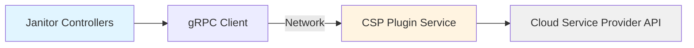

# ADR-013: Architecture — Remediation Plugins

## Status
**Proposed** | Date: 2025-11-25

## Context

NVSentinel has multiple `RecommendedAction` values defined in the [health event protobuf](../../data-models/protobufs/health_event.proto) such as:

- `COMPONENT_RESET` - Reset GPU or other component
- `RESTART_VM` - Reboot virtual machine node
- `REPLACE_VM` - Terminate and replace virtual machine

These `RecommendedActions`'s map to a Janitor custom resource in the fault-remediation module. This creates an opinionated end-to-end remediation flow where NVSentinel can define a set of conditions that map to a given remediation.

- `COMPONENT_RESET` - ResetGPU CR
- `RESTART_VM` - RebootNode CR
- `REPLACE_VM` - TerminateNode CR

This strong coupling can let implementation of the individual actions in a workflow be delegated to an outside system (e.g. new CSPs).

Janitor currently uses an internal Go package ([`janitor/pkg/csp`](https://github.com/NVIDIA/NVSentinel/tree/main/janitor/pkg/csp)) that provides hardcoded implementations for major cloud providers (AWS, Azure, GCP, OCI). The package implements the `CSPClient` interface:

```go
type CSPClient interface {
    SendRebootSignal(ctx context.Context, node corev1.Node) (ResetSignalRequestRef, error)
    IsNodeReady(ctx context.Context, node corev1.Node, message string) (bool, error)
    SendTerminateSignal(ctx context.Context, node corev1.Node) (TerminateNodeRequestRef, error)
}
```

Controllers instantiate CSP clients directly and call methods synchronously during reconciliation loops.

This hardcoded approach has several limitations:

1. **Limited Extensibility**: End users cannot customize remediation behavior for their specific environments
2. **Provider Coverage**: We cannot anticipate every CSP provider or private cloud implementation
3. **Operational Rigidity**: Changing remediation logic requires rebuilding and redeploying Janitor

## Decision

Transform the CSP interface from an internal Go package to a **gRPC-based plugin architecture** where remediation backends run as independent services that Janitor controllers communicate with over the network.

## Implementation

### Architecture Overview

Janitor controllers will communicate with external gRPC-based plugins instead of calling cloud provider APIs directly:



This enables users to deploy their own plugin implementations with custom logic while Janitor focuses solely on Kubernetes control loops.

### Protobuf Service Definition

New protobuf definition included in `janitor/`:

```proto
syntax = "proto3";
package janitor.csp.v1;

service CSPService {
  rpc SendRebootSignal(RebootRequest) returns (RebootResponse) {}
  rpc IsNodeReady(NodeReadyRequest) returns (NodeReadyResponse) {}
  rpc SendTerminateSignal(TerminateRequest) returns (TerminateResponse) {}
}

// continue with definition
```

### Configuration

Janitor configuration supports plugin endpoints at global and per-controller levels:

```yaml
global:
  cspPluginHost: "csp-plugin-default.nvsentinel.svc.cluster.local:9090"

rebootNodeController:
  enabled: true
  # Optional: override with custom plugin
  cspPluginHost: "custom-reboot-plugin.acme.svc.cluster.local:9090"

terminateNodeController:
  enabled: true
  # Uses global.cspPluginHost if not specified
```

### Key Implementation Points

**Janitor Side**:
- Controllers instantiate a gRPC client from config (endpoint, timeout, etc)
- Use the codegen client from the protobuf definition for handing server calls

**Plugin Side**:
- Handle cloud provider SDK calls and any custom logic (approvals, logging, etc.)
- Deploy as separate Kubernetes Deployment/Service

**Deployment**:
- `NVIDIA/NVSentinel` included plugins deployed via Helm sub-charts alongside Janitor
- Standard Kubernetes Service for network discovery

## Rationale

### Why gRPC?

- **Strong Contract**: Protobuf provides strongly-typed contracts with codegen compatibility
- **Language Agnostic**: End users can write plugins in any language (Go, Python, Rust, etc.)

### Why Plugin Architecture?

- **Separation of Concerns**: Janitor focuses on Kubernetes control loops; plugins handle CSP-specific logic
- **Independent Versioning**: Plugin updates don't require Janitor redeployment
- **Extensibility**: End users can inject custom workflows without forking Janitor

## Consequences

### Positive

- **Extensibility**: End users can implement custom remediation logic matching their operational requirements
- **Security**: CSP credentials isolated to plugin pods; Janitor never requires cloud provider permissions
- **Innovation**: Community can contribute plugins for new CSPs without NVSentinel maintainer review
- **Reduced Maintenance**: NVSentinel maintainers not responsible for every CSP integration

### Negative

- **Deployment Complexity**: Additional Kubernetes resources (Deployments, Services, ServiceAccounts) to manage
- **Network Dependency**: Inter-service communication introduces potential failure points

### Mitigations

- **Helm Chart Integration**: NVSentinel Helm chart will include plugin sub-charts with sensible defaults
- **Health Checks**: gRPC health check probes ensure Janitor fails fast on plugin unavailability
- **Circuit Breakers**: Implement client-side retry logic with exponential backoff for transient failures
- **Documentation**: Provide comprehensive migration guide, example custom plugins, and troubleshooting playbooks

## Alternatives Considered

### Alternative A: Keep In-Process CSP Clients

**Rejected** because:
- Does not solve the extensibility problem for end users with custom requirements
- Forces all CSP logic to be open-sourced (some enterprises have proprietary workflows)
- Increases Janitor's complexity as more CSPs are added

## Notes

## References

- [NVSentinel Health Event Protobuf](../../data-models/protobufs/health_event.proto)
- [Current CSP Interface](https://github.com/NVIDIA/NVSentinel/blob/main/janitor/pkg/model/csp.go)
