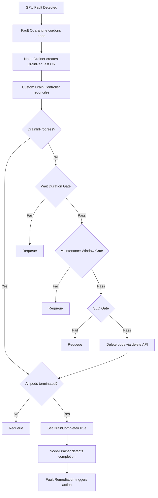

# ADR-030: Behavior — Custom Drain Controller

## Context

Clusters using AllowCompletion drain mode never delete running pods. Long-running workloads (e.g., inference, training) may never terminate naturally, leaving faulty GPU nodes cordoned but un-remediated for hours or days. This blocks GPU fault remediation and strands healthy GPU capacity on affected nodes.

The existing custom drain extensibility framework (ADR-015) allows NVSentinel's node-drainer to delegate drain decisions to external controllers via the DrainRequest CRD. The custom drain controller plugs into this framework as a policy-driven drain controller that gates pod deletion behind three configurable checks:

1. **SLO Gate** — only drain when the cluster has sufficient schedulable capacity
2. **Wait Duration Gate** — give workloads a grace period to finish naturally
3. **Maintenance Window Gate** — restrict drain to approved time windows

Options considered:
- (A) Build the three-gate logic directly into node-drainer as a new built-in drain mode
- (B) Build a standalone controller that consumes DrainRequest CRDs via the ADR-015 custom drain framework

## Decision

Build the custom drain controller as a standalone Kubernetes controller (option B) deployed in the `nvsentinel` namespace. It watches `DrainRequest` CRDs, evaluates three gates, deletes pods via the Kubernetes delete API when all gates pass, and sets `DrainComplete=True`. Node-drainer is configured with `customDrain.enabled=true` pointing to the DrainRequest CRD.

## Implementation

### Architecture



### Directory Structure

Layout:

```
plugins/custom-drainer/
├── main.go
├── go.mod
├── Makefile
├── pkg/
│   ├── controller/
│   │   └── drainrequest_controller.go    # Reconciler
│   ├── gates/
│   │   ├── slo.go                        # SLO gate (behind interface)
│   │   ├── wait.go                       # Wait duration gate
│   │   ├── window.go                     # Maintenance window gate
│   │   └── types.go                      # Gate interface
│   ├── config/
│   │   └── config.go                     # Configuration loading
│   └── metrics/
│       └── metrics.go                    # Prometheus metrics
├── config/
│   ├── default/kustomization.yaml        # Ties all resources together, namespace=nvsentinel
│   ├── crd/                              # Reuses existing DrainRequest CRD
│   ├── rbac/rbac.yaml                    # ServiceAccount, ClusterRole, ClusterRoleBinding
│   ├── manager/deployment.yaml           # Controller Deployment
│   └── custom-drain-config/              # Gate config ConfigMap
└── api/v1alpha1/                         # Reuses existing DrainRequest types
```

### Gate Interface

```go
type Gate interface {
    // Evaluate returns (pass, requeueAfter, reason).
    // If pass is false, requeueAfter indicates when to re-evaluate.
    Evaluate(ctx context.Context, req *DrainRequest) (bool, time.Duration, string)
}
```

The SLO gate is further abstracted behind a `CapacityChecker` interface to allow future swap to GPU-count or function-level SLO without changing the reconciler:

```go
type CapacityChecker interface {
    // AboveThreshold returns true if cluster capacity is strictly above the threshold.
    AboveThreshold(ctx context.Context, threshold float64) (bool, float64, error)
}

// NodeCapacityChecker implements CapacityChecker using schedulable/total node ratio.
type NodeCapacityChecker struct {
    nodeInformer cache.SharedIndexInformer
}
```

### Reconciler Logic

```go
func (r *DrainRequestReconciler) Reconcile(ctx context.Context, req ctrl.Request) (ctrl.Result, error) {
    dr := &v1alpha1.DrainRequest{}
    if err := r.Get(ctx, req.NamespacedName, dr); err != nil {
        return ctrl.Result{}, client.IgnoreNotFound(err)
    }

    if isDrainComplete(dr) {
        return ctrl.Result{}, nil
    }

    // Skip gate evaluation and pod deletion if already in progress
    if !isDrainInProgress(dr) {
        // Evaluate gates in order: Wait → Window → SLO
        for _, gate := range r.gates {
            pass, requeueAfter, reason := gate.Evaluate(ctx, dr)
            if !pass {
                r.recorder.Eventf(dr, corev1.EventTypeNormal, "GateBlocked", reason)
                return ctrl.Result{RequeueAfter: requeueAfter}, nil
            }
        }

        // All gates pass — delete pods
        if err := r.deletePods(ctx, dr); err != nil {
            return ctrl.Result{RequeueAfter: 10 * time.Second}, err
        }

        r.markDrainInProgress(ctx, dr)
    }

    // Wait until all pods are terminated before marking complete
    allTerminated, err := r.allPodsTerminated(ctx, dr)
    if err != nil {
        return ctrl.Result{RequeueAfter: 10 * time.Second}, err
    }

    if !allTerminated {
        return ctrl.Result{RequeueAfter: r.podCheckInterval}, nil
    }

    r.markDrainComplete(ctx, dr)
    return ctrl.Result{}, nil
}
```

### Pod Deletion

- Uses the Kubernetes **delete API** (`clientset.CoreV1().Pods().Delete()`), not the eviction API. PDBs are not consulted.
- Respects pod's `terminationGracePeriodSeconds` unless `deleteGracePeriodSeconds` is configured.
- Never force-deletes. Always waits for all pods to be fully terminated (gone from the API server) before setting `DrainComplete=True`. This matches the contract established by node-drainer's built-in drain modes.
- If a pod is stuck in Terminating state, node-drainer's `timeout` config provides the safety net — it marks the drain as failed after the configured duration.

### Configuration

```yaml
# Loaded from ConfigMap mounted at /etc/nvsentinel/custom-drainer/config.yaml
sloThreshold: 0.95              # Schedulable nodes / total nodes, strict greater-than
minWaitMinutes: 0               # Grace period after cordon before deleting pods
deleteGracePeriodSeconds: 0     # Override pod's terminationGracePeriodSeconds (0 = use pod's value)
podCheckIntervalSeconds: 15     # Polling interval when waiting for pods to terminate

maintenanceWindows:             # Empty = drain allowed at all times; drain if ANY window matches
  - days: [1, 2, 3, 4, 5]       # 0=Sun .. 6=Sat; all hours in UTC
    startHour: 22
    endHour: 6                  # Overnight
  - days: [0, 6]                # Sat-Sun: all day
    startHour: 0
    endHour: 24
```

### Node-Drainer Configuration

Node-drainer is configured to use custom drain mode with the DrainRequest CRD:

```toml
[customDrain]
    enabled = true
    templateMountPath = "/etc/drain-templates"
    templateFileName = "drain-template.yaml"
    namespace = "nvsentinel"
    apiGroup = "nvsentinel.nvidia.com"
    version = "v1alpha1"
    kind = "DrainRequest"
    resource = "drainrequests"
    statusConditionType = "DrainComplete"
    statusConditionStatus = "True"
    timeout = "86400s"
```

### Metrics

| Metric | Type | Description |
|--------|------|-------------|
| `custom_drain_slo_gate_blocked_total` | Counter | Incremented once per DrainRequest when SLO gate first blocks it. |
| `custom_drain_wait_gate_blocked_total` | Counter | Incremented once per DrainRequest when wait duration gate first blocks it. |
| `custom_drain_window_gate_blocked_total` | Counter | Incremented once per DrainRequest when maintenance window gate first blocks it. |
| `custom_drain_pods_deleted_total` | Counter | Total pods deleted by the controller. |
| `custom_drain_duration_seconds` | Histogram | Time from DrainRequest creation to DrainComplete. |
| `custom_drain_cluster_schedulable_ratio` | Gauge | Current schedulable/total node ratio. |

### Deployment

Kustomize manifests under `plugins/custom-drainer/config/` include:
- **CRD**: Reuses existing `DrainRequest` CRD (`config/crd/`)
- **RBAC**: ServiceAccount, ClusterRole (watch/update `DrainRequest`, list/delete `Pods`, list/watch `Nodes`), ClusterRoleBinding (`config/rbac/rbac.yaml`)
- **Deployment**: Controller deployment with ConfigMap volume mount (`config/manager/deployment.yaml`)
- **ConfigMap**: Gate configuration at `/etc/nvsentinel/custom-drainer/config.yaml` (`config/custom-drain-config/`)

Per-cluster gate parameter overrides are applied via Kustomize patches in the GitOps/ArgoCD pipeline.

### Key Behaviors

| Scenario | Behavior |
|----------|----------|
| Single fault, all gates pass | Delete pods, wait for termination, set DrainComplete |
| Cascading faults, SLO blocks | Defer drain, requeue; as nodes recover, backlog drains |
| Wait + window interact | Both must pass simultaneously |
| Window closes mid-drain | Drain continues to completion (no re-check) |
| External cordons (GPU Operator) | Reduce SLO headroom; affect gate calculation |
| Partial drain (COMPONENT_RESET) | Controller deletes only pods listed in `spec.podsToDrain` (populated by node-drainer template) |
| Partial → full escalation | New DrainRequest created; both evaluated independently |
| Stuck pod in Terminating | Requeue until terminated; node-drainer timeout is the safety net |

## Consequences

### Positive
- Unblocks GPU fault remediation on clusters where AllowCompletion causes indefinite stalls
- Three independent, composable gates give operators fine-grained control
- Plugs into existing ADR-015 framework — no changes to node-drainer core
- Per-cluster configuration via existing GitOps/ArgoCD pipeline

### Negative
- SLO gate uses raw node counts, not actual GPU counts
- Maintenance window depends on system clock accuracy

## Alternatives Considered

### Built-in drain mode in node-drainer
Add SLO/wait/window gating as a new drain mode alongside Immediate, DeleteAfterTimeout, AllowCompletion.

**Rejected** because: The three-gate drain policy is deployment-specific. Adding it to node-drainer increases complexity for all users and violates the extensibility design in ADR-015. Node-drainer should remain a generic drain orchestrator.

## Testing

- **Unit**: Gate logic (SLO threshold math, wait duration elapsed, maintenance window parsing), CapacityChecker interface, config loading, pod deletion filtering
- **Integration**: Mock Kubernetes API; verify reconciler creates/requeues/completes DrainRequests through gate sequences
- **E2E**: Deploy CRD + controller in envtest, create DrainRequest, verify pods deleted and DrainComplete condition set

## Notes

- The custom drain controller does not modify the DrainRequest CRD schema — it reuses the existing `nvsentinel.nvidia.com/v1alpha1` DrainRequest
- Rack-level remediation is out of scope; this covers node-level drain only

## References

- [ADR-015: Custom Drain Extensibility](./015-custom-drain-extensibility.md) — Framework this controller plugs into
- DrainRequest CRD: `plugins/slinky-drainer/api/v1alpha1/types.go`
- Slinky-drainer reference: `plugins/slinky-drainer/pkg/controller/drainrequest_controller.go`
