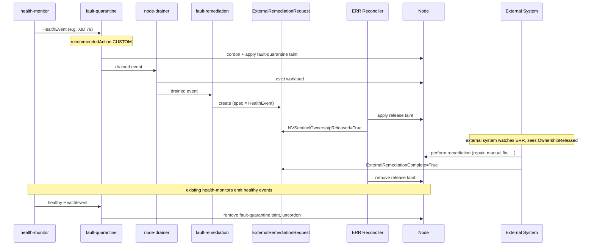

# ADR-040: API — External Remediations (EF / ERR)

## Context

NVSentinel is the primary owner of nodes in the clusters where it operates: when a node joins, NVSentinel owns it, and any cordon/drain/reboot/terminate flows through NVSentinel's pipeline (health-monitor → fault-quarantine → node-drainer → fault-remediation).

External breakfix systems — automated orchestrators driving CSP-side repair, long-running workflows, hardware swaps, or human operators performing manual maintenance — also have authority to perform destructive actions on the same nodes. Today these systems coordinate with NVSentinel ad-hoc, through side channels and operator knowledge.

A node must be owned by **exactly one** system at any point in time. Without a formal protocol, NVSentinel and an external system can both decide to act on the same node and race — duplicating remediation work, fighting over taints, or interleaving operations that corrupt cluster state.

The two crossing points needed are:

1. **NVSentinel-detected fault that an external system must fix.** NVSentinel's triage maps a known failure mode to a remediation that NVSentinel cannot perform itself (e.g. CSP-side repair, long-running workflows). NVSentinel needs to signal "I no longer own this node" and stop attempting remediations.
2. **External-detected fault that NVSentinel must prepare for.** An external system observes a fault NVSentinel can't see (e.g. a CSP-scheduled maintenance window, an out-of-band monitoring signal, an operator-driven request). The external system needs NVSentinel to cordon and drain the node, then transfer ownership.

The same protocol must work for human operators preparing nodes for manual remediation. Multiple bespoke entry points (one per external system) would not. The design must be agnostic to which external system is on the other side — NVSentinel cannot make assumptions about how, when, or whether an external system completes its work.

## Decision

Introduce two CRDs in the existing `nvsentinel.nvidia.com/v1alpha1` API group, plus two new reconcilers and one integration point in `fault-remediation`:

| CRD | Created by | Role |
| --- | --- | --- |
| `ExternalRemediationRequest` (ERR) | NVSentinel (`fault-remediation` or `ExternalFault` reconciler) | **Exit door.** Taints the node and signals "NVSentinel has released the node." External system reads this to know it can begin work, and writes a completion condition back when done. |
| `ExternalFault` (EF) | External system | **Entry door.** External system declares "this node has a fault I need to take ownership of." Triggers the standard NVSentinel pipeline (quarantine → drain → fault-remediation), which produces an ERR. |

Both CRD specs are a `datamodels.HealthEvent` (the same proto already emitted by every health-monitor and consumed by every downstream stage — see `data-models/protobufs/health_event.proto`). All coordination state lives in `status.conditions`. There is exactly **one** entry point into external ownership (EF) and exactly **one** exit point (ERR); every external system speaks the same protocol.

EF creation always results in ERR creation by routing through the normal pipeline with `recommendedAction = CUSTOM` (per [ADR-036](036-custom-remediation-actions.md)). The EF reconciler does not create the ERR directly — that keeps a single, well-tested code path responsible for materialising release requests.

## Implementation

### Module layout

The CRD types are defined in proto and generated via the existing `protoc-gen-crd` plugin (the same plugin that generates `HealthEventResource` today — see `data-models/protobufs/health_event.proto` line 121). The reconcilers live alongside the existing maintenance reconcilers in `janitor/`.

```
data-models/
├── protobufs/
│   ├── health_event.proto                 (existing — already defines HealthEvent)
│   └── external_remediation.proto         (new — defines ExternalRemediationRequest,
│                                                 ExternalFault, their statuses, and
│                                                 a shared Condition message)
└── pkg/protos/
    └── external_remediation.pb.go         (generated by protoc-gen-go)

distros/kubernetes/nvsentinel/charts/janitor/crds/
├── external_fault.crd.yaml                (generated by protoc-gen-crd)
└── external_remediation_request.crd.yaml  (generated by protoc-gen-crd)

janitor/
├── api/v1alpha1/
│   ├── external_remediation_register.go   (new — thin scheme registration; no field
│   │                                              definitions, the proto-generated
│   │                                              types are used directly)
│   ├── gpureset_types.go                  (existing)
│   ├── rebootnode_types.go                (existing)
│   ├── terminatenode_types.go             (existing)
│   └── groupversion_info.go               (existing — already nvsentinel.nvidia.com/v1alpha1)
├── pkg/condition/
│   └── condition.go                       (new — adapter between proto Condition and
│                                                 metav1.Condition for controller-runtime
│                                                 helpers like SetCondition)
└── pkg/controller/
    ├── externalfault_controller.go        (new)
    ├── externalremediationrequest_controller.go (new)
    └── ...
```

When a field is added to `HealthEvent` in `health_event.proto`, the EF and ERR CRD schemas update automatically on next `make generate`; no Go struct edits required. This is the same automation already used for `HealthEventResource`.

### API: `ExternalRemediationRequest`

Defined in `data-models/protobufs/external_remediation.proto`:

```protobuf
import "google/protobuf/timestamp.proto";
import "health_event.proto";
import "github.com/yandex/protoc-gen-crd/library/go/k8s/protoc_gen_crd/proto/crd.proto";

// Condition is the wire equivalent of metav1.Condition. Used by both
// ExternalRemediationRequestStatus and ExternalFaultStatus.
message Condition {
  string type = 1;
  string status = 2;          // "True", "False", "Unknown"
  int64 observed_generation = 3;
  google.protobuf.Timestamp last_transition_time = 4;
  string reason = 5;
  string message = 6;
}

message ExternalRemediationRequestStatus {
  repeated Condition conditions = 1;
}

message ExternalRemediationRequest {
  option (protoc_gen_crd.k8s_crd) = {
    api_group: "nvsentinel.nvidia.com",
    kind: "ExternalRemediationRequest",
    plural: "externalremediationrequests",
    singular: "externalremediationrequest",
    short_names: ["err"],
    categories: ["nvsentinel"]
  };
  HealthEvent spec = 1;                              // reused from health_event.proto
  ExternalRemediationRequestStatus status = 2;
}
```

The condition type names (`NVSentinelOwnershipReleased`, `ExternalRemediationComplete`) are defined as Go constants in `janitor/pkg/controller/`:

```go
const (
    ERROwnershipReleasedCondition   = "NVSentinelOwnershipReleased"
    ERRRemediationCompleteCondition = "ExternalRemediationComplete"
)
```

`HealthEvent` in the spec is the **same** `datamodels.HealthEvent` message used everywhere else in NVSentinel — `protoc-gen-crd` walks the reference and emits the full nested schema into the generated CRD. Adding a field to `HealthEvent` propagates here automatically without any code change in this module.

The proto-generated Go types are used directly by the controller; there is no hand-maintained mirror struct. A thin adapter in `janitor/pkg/condition` converts between proto `Condition` and `metav1.Condition` at the controller boundary so existing `meta.SetStatusCondition` / `meta.IsStatusConditionTrue` helpers continue to work.

Printer columns (Node, OwnershipReleased, RemediationComplete, Age) are declared via the `protoc-gen-crd` `column` extension; they appear in `kubectl get err` output identically to kubebuilder-marker-driven CRDs.

Concrete shape from `kubectl get externalremediationrequest -o yaml`:

```yaml
apiVersion: nvsentinel.nvidia.com/v1alpha1
kind: ExternalRemediationRequest
metadata:
  creationTimestamp: "2026-05-11T21:16:02Z"
  generation: 1
  labels:
    nvsentinel.nvidia.com/component-class: gpu
    nvsentinel.nvidia.com/node: node-01.example-cluster.internal
    nvsentinel.nvidia.com/recommended-action: external-remediation
  name: gpu0-xid79-node-01
  namespace: nvsentinel
spec:
  agent: gpu-health-monitor
  checkName: nvml-xid-79
  componentClass: gpu
  customRecommendedAction: external-remediation
  entitiesImpacted:
    - {entityType: GPU,  entityValue: "0"}
    - {entityType: PCIE, entityValue: "0000:18:00.0"}
  errorCode: [XID-79]
  generatedTimestamp: "2026-05-11T20:14:07Z"
  id: he-7f0b3e2c-1cab-4d22-9a96-2d5b3a8ee2f1
  isFatal: true
  isHealthy: false
  message: GPU fell off the bus (XID 79) on /dev/nvidia0; node requires hardware-level repair.
  metadata:
    cluster: example-cluster-01
    cudaVersion: "12.4"
    driverVersion: 550.144.03
    serialNumber: "1320820063748"
  nodeName: node-01.example-cluster.internal
  processingStrategy: EXECUTE_REMEDIATION
  recommendedAction: CUSTOM
  version: 1
status:
  conditions:
    - type: NVSentinelOwnershipReleased
      status: "True"
      observedGeneration: 1
      lastTransitionTime: "2026-05-11T20:14:09Z"
      reason: ReleaseTaintApplied
      message: Applied taint nvsentinel.nvidia.com/external-remediation=gpu0-xid79-node-01:NoSchedule to node-01.example-cluster.internal; node released to external system.
    - type: ExternalRemediationComplete
      status: "Unknown"
      observedGeneration: 1
      lastTransitionTime: "2026-05-11T20:14:09Z"
      reason: AwaitingExternalSystem
      message: Waiting for external system to set ExternalRemediationComplete=True (success) or False (failure).
```

### API: `ExternalFault`

Also in `data-models/protobufs/external_remediation.proto`:

```protobuf
message ExternalFaultStatus {
  repeated Condition conditions = 1;

  // producedERR is the metadata.name of the ExternalRemediationRequest this
  // EF caused fault-remediation to create. Empty until the EF reconciler
  // observes an ERR with ownerReferences pointing to this EF. Operators
  // can follow the chain via:
  //
  //   kubectl get ef <name> -o jsonpath='{.status.producedERR}'
  //
  // and then `kubectl get err <producedERR>` in the configured ERR
  // namespace.
  string produced_err = 2;
}

message ExternalFault {
  option (protoc_gen_crd.k8s_crd) = {
    api_group: "nvsentinel.nvidia.com",
    kind: "ExternalFault",
    plural: "externalfaults",
    singular: "externalfault",
    short_names: ["ef"],
    categories: ["nvsentinel"]
  };
  HealthEvent spec = 1;                              // reused from health_event.proto
  ExternalFaultStatus status = 2;
}
```

Condition type constants in `janitor/pkg/controller/`:

```go
const (
    EFFaultReportedCondition       = "FaultReported"
    EFRemediationCompleteCondition = "ExternalRemediationComplete"
    EFFaultClearedCondition        = "FaultCleared"
)
```

Same proto-driven generation story as ERR — `HealthEvent` is reused by reference, no mirror struct. EF carries no static-validation rules in the CRD schema beyond what `HealthEvent` itself declares; EF-specific tightening (e.g. "isHealthy must be false") is enforced by a validating webhook described in the *Validation* section.

`kubectl get externalfault -o yaml`:

```yaml
apiVersion: nvsentinel.nvidia.com/v1alpha1
kind: ExternalFault
metadata:
  creationTimestamp: "2026-05-11T21:16:02Z"
  generation: 1
  labels:
    nvsentinel.nvidia.com/external-source: csp-events
    nvsentinel.nvidia.com/fault-class: csp-maintenance
    nvsentinel.nvidia.com/node: node-02.example-cluster.internal
  name: csp-maintenance-node-02
  namespace: nvsentinel
spec:
  agent: external-orchestrator
  checkName: csp-scheduled-maintenance
  componentClass: node
  customRecommendedAction: external-remediation
  entitiesImpacted:
    - {entityType: Node, entityValue: node-02.example-cluster.internal}
  errorCode: [CSP-MAINT-EBS-RETIRE]
  generatedTimestamp: "2026-05-11T20:14:07Z"
  id: he-ext-c6d92aa1-2f6e-4e8b-9e3d-b75f86b1aaaa
  isFatal: false
  isHealthy: false
  message: CSP scheduled maintenance window 2026-05-13T03:00Z to 2026-05-13T07:00Z; node must be drained before window.
  metadata:
    cluster: example-cluster-01
    cspEventId: evt-0a9bc8e74e2c2c10c
    maintenanceWindowEnd: "2026-05-13T07:00:00Z"
    maintenanceWindowStart: "2026-05-13T03:00:00Z"
    source: csp-events
  nodeName: node-02.example-cluster.internal
  processingStrategy: EXECUTE_REMEDIATION
  recommendedAction: CUSTOM
  version: 1
status:
  producedERR: csp-maint-node-02
  conditions:
    - type: FaultReported
      status: "True"
      observedGeneration: 1
      lastTransitionTime: "2026-05-11T20:14:08Z"
      reason: ERRObserved
      message: ExternalRemediationRequest csp-maint-node-02 observed in namespace nvsentinel (ownerReferences point to this ExternalFault).
    - type: ExternalRemediationComplete
      status: "Unknown"
      observedGeneration: 1
      lastTransitionTime: "2026-05-11T20:14:08Z"
      reason: AwaitingExternalRemediation
      message: Waiting for owning ExternalRemediationRequest to resolve.
    - type: FaultCleared
      status: "Unknown"
      observedGeneration: 1
      lastTransitionTime: "2026-05-11T20:14:08Z"
      reason: FaultActive
      message: Fault is active; node has not been returned to NVSentinel ownership.
```

### Condition state machines

`True` and `False` are **terminal** states for every condition on these CRDs. Conditions in flight are represented by `Unknown`; once a condition lands on `True` (the named state has been achieved) or `False` (it cannot be achieved), it does not transition again for the same generation. This matches the convention already established by `RebootNode`, `GPUReset`, and `TerminateNode`.

The reconcilers call `SetInitialConditions` on first reconcile, writing every condition as `Unknown` with `reason: Initializing` (modelled after `janitor/api/v1alpha1/rebootnode_types.go`).

**ExternalRemediationRequest:**

| Condition | Initial | Terminal `True` | Terminal `False` | Set by |
| --- | --- | --- | --- | --- |
| `NVSentinelOwnershipReleased` | `Unknown` (`Initializing`) | Release taint applied to `spec.nodeName` | Permanent failure to apply taint (retries exhausted, e.g. invalid configuration) | ERR reconciler |
| `ExternalRemediationComplete` | `Unknown` (`AwaitingExternalSystem`) | External system reports remediation succeeded | External system reports remediation failed (e.g. repair unsuccessful, external system gave up) | **External system** |

Both `True` and `False` on `ExternalRemediationComplete` are meaningful, terminal outcomes from the external system's perspective. The ERR reconciler treats them symmetrically: remove the release taint, propagate the value to the owning EF (if any). What happens *after* the propagation differs by source — the two cases are described below.

**Case A: ERR has no `ExternalFault` owner (NVSentinel-detected fault).**
The standard pipeline produced this ERR via a health-monitor → fault-quarantine → fault-remediation chain. After taint removal, NVSentinel's health monitors are still running and watching the node. If the underlying fault is still present, they re-detect it and produce a fresh health event; the pipeline runs again and a new ERR is created. This is symmetric to how existing in-cluster CRs (`RebootNode`, `GPUReset`) interact with the rest of the system: a failed remediation is followed either by re-detection (if the fault persists) or by silent recovery (if it doesn't). No special action is needed.

**Case B: ERR has an `ExternalFault` owner (external-detected fault).**
NVSentinel has no way to verify whether the fault is still present — only the external system can. After taint removal and propagation, the EF reconciler's `FaultCleared` behaviour is **asymmetric** in `ExternalRemediationComplete`:

- **On `True`**: the external system has reported success. EF reconciler emits a healthy companion event into the pipeline, fault-quarantine clears its taint, node returns to schedulable. `FaultCleared=True`.
- **On `False`**: the external system has reported failure. EF reconciler does **not** emit a healthy event — NVSentinel cannot make that determination on the external system's behalf. The fault-quarantine taint remains on the node; workloads still cannot schedule. `FaultCleared=False` is set as a terminal condition with reason `ExternalRemediationFailed`, message indicating the node remains quarantined and the external system or operator must take further action.

With `FaultCleared=False` set, the EF's three conditions are all terminal. The webhook's "no active EF for this node" dedup check sees terminal-EFs as "not active" and allows a new EF to be created for the same node — this is the retry path. The external system creates a fresh EF (typically with the same `HealthEvent.id` or an incremented one); a new health event flows, a new ERR is produced (with a new release taint value), and the cycle restarts. The old failed EF/ERR pair can be deleted by the external system or an operator at any time (cascade-deletes via the EF ownerRef on the ERR); they do not block forward progress.

During the brief window between the old release taint being removed and the new ERR's taint being applied, the node still carries fault-quarantine's taint — workloads remain off. The "released to external" signal is briefly absent, which is correct: for that window, NVSentinel formally owns the node, the external system has acknowledged failure, no one is actively doing anything.

**ExternalFault:**

| Condition | Initial | Terminal `True` | Terminal `False` | Set by |
| --- | --- | --- | --- | --- |
| `FaultReported` | `Unknown` (`Initializing`) | An ERR with `ownerReferences` pointing to this EF has been observed by the EF reconciler — i.e. the fault made it through the pipeline and produced a remediation request | Set only by the Layer 3 reconciler safety net when the embedded HealthEvent fails validation that slipped past the webhook (reason `InvalidHealthEvent`; see *Validation* section). No retry-budget exhaustion path — the reconciler retries indefinitely while `Unknown`. | EF reconciler |
| `ExternalRemediationComplete` | `Unknown` | Owning ERR resolved with `True` | Owning ERR resolved with `False` | ERR reconciler (propagation) |
| `FaultCleared` | `Unknown` (`FaultActive`) | Healthy event submitted to platform-connector — node returning to NVSentinel ownership | Either: external system reported `ExternalRemediationComplete=False` (terminal external failure; node remains quarantined, see narrative below); OR healthy-event submission persistently failed | EF reconciler |

`FaultReported=True` is a stronger guarantee than "the gRPC call to the platform-connector succeeded" — it means an ERR exists and the rest of the protocol can proceed. While `FaultReported=Unknown`, the EF reconciler re-emits the underlying HealthEvent on each reconcile (idempotent — deterministic ERR naming + fault-remediation's equivalence-group skip mean repeated submissions produce at most one ERR). This is exactly what an operator wants to see when, say, a `RebootNode` CR is in-flight on the target node and the EF's event is being temporarily blocked by cross-kind supersedence: status reflects "still waiting" rather than misleading "reported successfully."

All conditions are append-or-update in place via the `SetCondition` helper, which short-circuits no-op updates so reconcile storms don't flap `lastTransitionTime`.

### ERR reconciler

**Watches:** `ExternalRemediationRequest` (primary); `Node` (secondary, to detect taint drift).

**Reconcile loop:**

1. On first reconcile, call `SetInitialConditions`: write `NVSentinelOwnershipReleased=Unknown (Initializing)` and `ExternalRemediationComplete=Unknown (AwaitingExternalSystem)`.
2. If `NVSentinelOwnershipReleased` is `Unknown`:
   - Apply the configured release taint to `spec.nodeName` (idempotent).
   - On success: set `NVSentinelOwnershipReleased=True` with `reason=ReleaseTaintApplied`.
   - On persistent failure (e.g. an unrecoverable API-server error such as a missing RBAC grant): set `NVSentinelOwnershipReleased=False` with `reason=ReleaseTaintFailed`. The ERR is now in a terminal failed state; no further reconciliation work, but the object remains so the failure is visible to operators. Transient errors continue to retry via the standard controller-runtime backoff.
3. If `ExternalRemediationComplete` has resolved to `True` or `False` (either terminal):
   - Remove the release taint from `spec.nodeName` (idempotent; tolerate missing taint).
   - If this ERR has an `ownerReference` of kind `ExternalFault`, propagate the same value (`True` or `False`) to the EF's `ExternalRemediationComplete` condition.
   - Done; no further work.
4. Otherwise (`ExternalRemediationComplete` is still `Unknown`): no-op until the external system writes a terminal value.

**Release taint** (key configurable via Helm values):

```
nvsentinel.nvidia.com/external-remediation=<err-name>:NoSchedule
```

The taint **value** is the `metadata.name` of the owning `ExternalRemediationRequest` — the same deterministic hash used by `fault-remediation` when constructing the ERR. This is the only piece of node-side metadata the design adds; no Node labels or annotations are created. The taint carries both the operational guard ("don't act on this node") and the correlation key ("which ERR owns the release") in one place.

The taint is the *single source of truth* for "this node is not owned by NVSentinel right now." Any other NVSentinel component that takes destructive action MUST refuse to act on a node carrying any taint with this key, regardless of value. `node-drainer` and `fault-quarantine` get a one-line check; `fault-remediation` already keys off node selection logic and inherits the same guard.

**Single active ERR per node.** Because the `(key, effect)` taint tuple is unique on a Node, only one ERR can have its release taint applied at a time. This invariant is enforced by `fault-remediation`'s existing equivalence-group machinery (see the *`fault-remediation` integration* section): ERRs declare their own equivalence group and a status checker, and the existing "skip CR creation when a CR for a matching group is in progress" logic prevents a second concurrent ERR from ever being created. No new dedup code is required in the ERR reconciler.

**Idempotency:** taint application uses a server-side patch. The ERR reconciler verifies both key AND value match its own ERR name before treating the taint as "its own" — protecting against drift from a previous, no-longer-existing ERR.

**Node deletion:** if `spec.nodeName` no longer exists at reconcile time, the reconciler logs and treats the taint operation as complete. The ERR object remains until the external system writes a terminal value to `ExternalRemediationComplete`; if the external system never acknowledges, the ERR persists with `ExternalRemediationComplete=Unknown` (visible via age metric).

### Discovery from the Node side

An operator who notices a tainted node finds the originating ERR by reading the taint value. With no Node labels or annotations, all discovery flows through the taint:

```bash
# 1. See the ERR name embedded in the taint value
kubectl describe node <node-name>
# Taints: nvsentinel.nvidia.com/external-remediation=gpu0-xid79-node-01:NoSchedule

# Or extract just that value:
kubectl get node <node-name> -o jsonpath=\
  '{.spec.taints[?(@.key=="nvsentinel.nvidia.com/external-remediation")].value}'

# 2. Fetch the ERR (default namespace: nvsentinel; if customised, search with -A)
kubectl get externalremediationrequest -A | grep <err-name>
kubectl get externalremediationrequest -n nvsentinel <err-name> -o yaml
```

To enumerate every node currently under external remediation:

```bash
kubectl get nodes -o json | jq -r '
  .items[]
  | select(.spec.taints[]?.key == "nvsentinel.nvidia.com/external-remediation")
  | [.metadata.name,
     (.spec.taints[] | select(.key=="nvsentinel.nvidia.com/external-remediation") | .value)]
  | @tsv'
```

The trade-off vs. duplicating the ERR name to a Node label is explicit: filtering nodes via `kubectl get nodes -l …` is unavailable; operators use the jq query above. Given how rarely this enumeration is needed in practice, the cost of maintaining a parallel Node label was judged not worth it.

### EF reconciler

**Watches:** `ExternalFault` (primary); `ExternalRemediationRequest` keyed by `ownerReferences[].uid` (secondary, to detect ERR creation).

**Reconcile loop:**

1. On first reconcile, call `SetInitialConditions`: write `FaultReported=Unknown (Initializing)`, `ExternalRemediationComplete=Unknown`, `FaultCleared=Unknown (FaultActive)`.
2. **Observe-then-act for `FaultReported`:**
   - List ERRs in the configured ERR namespace whose `ownerReferences` point to this EF (cheap via the ownerRef indexer).
   - **If an ERR is found**:
     - Write `status.producedERR = <err.metadata.name>`.
     - Set `FaultReported=True` with `reason=ERRObserved` and a message naming the ERR.
     - Continue to step 3.
   - **If no ERR is found** and `FaultReported` is still `Unknown`:
     - Submit the EF's `spec` (the inlined `HealthEvent`) to the platform-connector running on `spec.nodeName` via the existing gRPC client (`platform-connectors/pkg/client`). Idempotent — `fault-remediation` deterministically names the ERR from `(nodeName, healthEvent.id)`, and its equivalence-group skip logic ensures repeated submissions produce at most one ERR.
     - Requeue with backoff (controller-runtime defaults). On the next reconcile, the ERR may or may not exist yet — if not, we re-emit.
3. If `ExternalRemediationComplete=True` and `FaultCleared` is `Unknown`:
   - Submit a healthy companion event to the platform-connector — same `id` family, same `nodeName`, `isHealthy=true`, `recommendedAction=NONE`. This clears fault-quarantine and returns the node to schedulable.
   - On success: set `FaultCleared=True` with `reason=NodeReturnedToNVSentinel`.
   - On permanent failure: set `FaultCleared=False` with `reason=HealthEventEmitFailed`.
4. If `ExternalRemediationComplete=False` and `FaultCleared` is `Unknown`:
   - Do **not** emit a healthy event. NVSentinel cannot determine on the external system's behalf whether the fault has cleared; the fault-quarantine taint must remain so workloads do not schedule on a node the external system has declared unhealthy.
   - Set `FaultCleared=False` with `reason=ExternalRemediationFailed`, message describing that the node remains quarantined and the external system or operator must take further action (typically: create a new EF for retry, or delete this EF and let downstream tooling handle the node).
   - All three conditions on the EF are now terminal. The webhook's no-active-EF-for-node dedup check no longer blocks new EFs targeting this node.
5. Otherwise, no-op.

The EF reconciler does **not** create the ERR directly. The `CUSTOM` recommendedAction in the emitted health event flows through the standard pipeline; `fault-remediation` produces the ERR. The forward pointer `status.producedERR` and the corresponding `FaultReported=True` transition are set by the EF reconciler when it *observes* the ERR — not at submission time. This means a HealthEvent that fault-remediation deduplicates or skips (because the node already has an in-flight maintenance CR for a superseding equivalence group, or because validation rejects the event) leaves the EF in `FaultReported=Unknown` rather than misleadingly `True`. Operators see exactly what is true: the fault has been reported into the pipeline, but no remediation has been produced yet. The reconciler retries on backoff until either an ERR appears or the EF is deleted.

When `fault-remediation` creates an ERR triggered by an EF-emitted health event, it sets an `ownerReference` on the ERR pointing to the EF. The ERR reconciler uses this owner reference to propagate `ExternalRemediationComplete` back to the EF when remediation finishes.

### `fault-remediation` integration

`fault-remediation` already uses `GetEffectiveActionName(he)` (per ADR-036) to resolve the action name for routing. To produce ERRs:

- **TOML config** — declare the external-remediation action's `MaintenanceResource` with `apiGroup: "nvsentinel.nvidia.com"` and `kind: "ExternalRemediationRequest"`. No schema extension is needed; this reuses the same `apiGroup` + `kind` knobs that already route the reboot action to `janitor.dgxc.nvidia.com` / `RebootNode`.
- **`fault-remediation/pkg/remediation/remediation.go`** — `CreateMaintenanceResource` already builds the maintenance CR from `apiGroup` + `kind` via the dynamic client. The branch for `ExternalRemediationRequest` mostly falls out of the existing template-render path; only the ERR-specific fields (ownerRef wiring, labels) need explicit handling.

ERR construction details:

- `metadata.name` is a deterministic hash of `(nodeName, healthEvent.id)` so repeated reconciles of the same event do not create duplicate ERRs. The name **also** becomes the value of the release taint applied by the ERR reconciler — so it MUST be a valid Kubernetes taint value (≤ 63 chars, alphanum + `.`, `-`, `_`).
- `metadata.namespace` is the configured ERR namespace (default: `nvsentinel`).
- `metadata.labels` include `nvsentinel.nvidia.com/node`, `…/component-class`, and `…/recommended-action` for observability inside the ERR API (these do NOT propagate to the Node — see "Discovery from the Node side" in the ERR reconciler section for the rationale).
- `metadata.ownerReferences` is set to the originating EF if and only if the source health event carries a label `nvsentinel.nvidia.com/source-ef` (added by the EF reconciler when emitting); otherwise the ERR is standalone.
- `spec` (the inlined `HealthEvent`) is a full copy of the triaged event.

**Equivalence-group integration.** ERR creation goes through the same `latestFaultRemediationState`-annotation + `ShouldSkipCRCreation` machinery as existing maintenance CRs (`RebootNode`, `GPUReset`, etc.) — see `fault-remediation/pkg/reconciler/reconciler.go` `shouldCreateCRForGroup`. Two pieces are added:

1. **Equivalence group declared in the TOML config** for the external-remediation action, e.g. `equivalenceGroup: "external-remediation"`. Cross-kind supersedence (e.g. `external-remediation` superseded by `restart`, or vice versa) can be declared the same way as today, so a node with an in-flight RebootNode does not get a second concurrent ERR, and a node with an in-flight ERR does not get a concurrent maintenance CR.
2. **A status checker for `ExternalRemediationRequest`** plugging into the existing `StatusChecker` interface: returns `ShouldSkip=true` when the ERR's `ExternalRemediationComplete` condition is `Unknown` (in-flight); `false` once it is terminal (`True` or `False`), at which point the entry is pruned from the annotation as usual.

This gets the "single active ERR per node" invariant for free — it falls out of the existing skip logic, no bespoke deduplication code in the ERR reconciler.

`fault-remediation` does **not** create both an ERR and a maintenance CR for the same event — the equivalence group declares one or the other.

### Validation

Bad inputs at the EF API boundary cannot be allowed to result in stuck-state CRs that need operator cleanup. An EF whose embedded `HealthEvent` is informational (`isHealthy=true`) or observability-only (`processingStrategy=STORE_ONLY`) would never produce an ERR — and without validation would sit in `FaultReported=Unknown` indefinitely, indistinguishable from the legitimate "blocked on superseding equivalence group" wait described in the EF reconciler section.

Validation is layered in three places, modelled directly on the existing `janitor/pkg/webhook/v1alpha1/janitor_webhook.go` for `RebootNode` / `TerminateNode` / `GPUReset`.

| Layer | Static field shape | EF-specific tightening | Cluster state |
| --- | --- | --- | --- |
| **CRD schema** (auto-generated from proto) | ✅ field types, enum values declared in proto | ❌ proto can't express "isHealthy must be `false`" | ❌ |
| **Validating webhook** | ✅ defence-in-depth | ✅ | ✅ (node existence, no-active-EF-for-node) |
| **Reconciler** | safety net | safety net | safety net |

Note: there is one class of bad input the layered validation cannot catch — `customRecommendedAction` values not registered in fault-remediation's TOML config. The webhook lives in a different process from fault-remediation and has no access to that config, so it cannot validate the action name's correctness at admission. EFs carrying such values flow through admission, get emitted as health events, and are silently skipped by fault-remediation's lookup ("Action not found in remediation configuration") — leaving the EF stuck at `FaultReported=Unknown`. Operators rely on the `ef_age_seconds` alert (and fault-remediation's own warning log) to detect these cases. Mitigation is procedural: register custom actions in fault-remediation's TOML before any external system starts emitting them. This is the same coupling that already exists for ADR-036 custom actions.

#### Layer 1: CRD schema (proto-driven)

Whatever static structural rules `HealthEvent` and `Condition` declare in `health_event.proto` and `external_remediation.proto` — required fields, field types, enum members — flow through to the CRD schema automatically via `protoc-gen-crd`. The API server enforces them at admission time. No hand-maintenance.

#### Layer 2: Validating admission webhook

A `ValidateCreate`/`ValidateUpdate` webhook for `ExternalFault`, registered alongside the existing janitor webhooks (same Deployment, same cert-manager-provisioned cert, `failurePolicy=fail`):

```go
// +kubebuilder:webhook:path=/validate-nvsentinel-nvidia-com-v1alpha1-externalfault,
//   mutating=false,failurePolicy=fail,sideEffects=None,
//   groups=nvsentinel.nvidia.com,resources=externalfaults,
//   verbs=create;update,versions=v1alpha1,name=vexternalfault-v1alpha1.kb.io,
//   admissionReviewVersions=v1

func (v *externalFaultValidator) ValidateCreate(ctx context.Context, obj *ExternalFault) (
    admission.Warnings, error) {

    // (a) Controller enabled
    if !v.Config.ExternalFault.Enabled {
        return nil, fmt.Errorf("ExternalFault controller is disabled in configuration")
    }

    he := obj.Spec  // proto-generated HealthEvent

    // (b) HealthEvent shape — defence-in-depth over the proto-derived CRD schema
    if he.GetNodeName() == "" {
        return nil, fmt.Errorf("spec.nodeName is required")
    }
    if he.GetIsHealthy() {
        return nil, fmt.Errorf("spec.isHealthy must be false on an ExternalFault — " +
            "ExternalFault is for declaring unhealthy state to NVSentinel")
    }
    if he.GetProcessingStrategy() == protos.ProcessingStrategy_STORE_ONLY {
        return nil, fmt.Errorf("spec.processingStrategy=STORE_ONLY is not valid on an " +
            "ExternalFault — observability-only events do not trigger remediation")
    }
    if he.GetRecommendedAction() != protos.RecommendedAction_CUSTOM {
        return nil, fmt.Errorf("spec.recommendedAction must be CUSTOM on an ExternalFault")
    }
    if he.GetCustomRecommendedAction() == "" {
        return nil, fmt.Errorf("spec.customRecommendedAction is required when " +
            "recommendedAction=CUSTOM")
    }

    // (c) Target node exists. Mirrors janitor_webhook.go validateNodeForCreate.
    if err := v.validateNode(ctx, he.GetNodeName()); err != nil {
        return nil, err
    }

    // (d) No other non-terminal EF for the same node. Mirrors janitor's
    //     validateNoActiveReboot pattern — closes the second-EF-for-same-node case.
    if err := v.validateNoActiveEFForNode(ctx, he.GetNodeName()); err != nil {
        return nil, err
    }

    return nil, nil
}
```

The webhook deliberately does NOT validate that `customRecommendedAction` is a known action in fault-remediation's config — it doesn't have access to that config (different process, different ConfigMap), and reaching across to read it would couple the janitor process to fault-remediation's deployment in ways neither component currently assumes. The trade-off is documented above: bad action names produce a stuck `FaultReported=Unknown`, surfaced via metric.

`failurePolicy=fail` means the API server rejects EF create/update when the webhook is unreachable. This is the same posture the existing janitor webhooks take.

There is **no** webhook for `ExternalRemediationRequest`. ERR is internally produced by `fault-remediation`, never directly by an external system; its inputs are already validated upstream (by the EF webhook for external-detected faults, by the HealthEvent platform-connector validation for NVSentinel-detected faults). Adding a webhook to ERR would block legitimate fault-remediation writes during webhook outages.

#### Layer 3: Reconciler safety net

The EF reconciler re-validates the HealthEvent shape (the same (b) checks above) on first reconcile before emitting. This catches EFs that slipped past the webhook (upgrade scenarios where the webhook wasn't yet deployed; misconfigured `failurePolicy=Ignore`; future schema changes). On failure, the reconciler sets `FaultReported=False` with `reason=InvalidHealthEvent` and a message describing the validation error — terminal, visible to operators, no further reconciliation.

### Sequence diagrams

**NVSentinel-detected fault → external remediation:**



**Externally-detected fault → NVSentinel pipeline → external remediation:**

```mermaid
sequenceDiagram
    participant EXT as External System
    participant EF as ExternalFault
    participant EFR as EF Reconciler
    participant PC as platform-connector
    participant FQ as fault-quarantine
    participant ND as node-drainer
    participant FR as fault-remediation
    participant ERR as ExternalRemediationRequest
    participant ERRR as ERR Reconciler
    participant N as Node

    EXT->>EF: create (spec = HealthEvent)
    Note over EF: validating webhook gates create
    EFR->>PC: HealthEventOccurredV1 (CUSTOM)
    PC->>FQ: HealthEvent
    FQ->>N: cordon + fault-quarantine taint
    FQ->>ND: drained event
    ND->>N: evict workload
    ND->>FR: drained event
    FR->>ERR: create (ownerRef=EF, spec=HealthEvent)
    EFR->>ERR: observes ERR (ownerRef → me)
    EFR->>EF: producedERR=<name>, FaultReported=True
    ERRR->>N: apply release taint
    ERRR->>ERR: NVSentinelOwnershipReleased=True
    Note over EXT: external system watches ERR, sees OwnershipReleased
    EXT->>N: perform remediation
    alt remediation succeeded
        EXT->>ERR: ExternalRemediationComplete=True
        ERRR->>N: remove release taint
        ERRR->>EF: propagate ExternalRemediationComplete=True
        EFR->>PC: healthy HealthEvent
        EFR->>EF: FaultCleared=True
        PC->>FQ: healthy event → remove fault-quarantine taint, uncordon
    else remediation failed
        EXT->>ERR: ExternalRemediationComplete=False
        ERRR->>N: remove release taint
        ERRR->>EF: propagate ExternalRemediationComplete=False
        EFR->>EF: FaultCleared=False (ExternalRemediationFailed)
        Note over N: fault-quarantine taint stays;<br/>node remains unschedulable
        Note over EXT,EF: retry path: external system creates a new EF<br/>(old EF/ERR are terminal; webhook permits)
    end
```

### RBAC

**ERR reconciler ServiceAccount:**

- `externalremediationrequests` — get, list, watch, update (status only)
- `externalfaults` — get, list, watch, patch (status only; for propagation)
- `nodes` — get, list, watch, patch (for taint apply/remove)
- `events` — create

**EF reconciler ServiceAccount:**

- `externalfaults` — get, list, watch, update (status only)
- `externalremediationrequests` — get, list, watch (for the ownerRef-indexed lookup the reconciler uses to discover its produced ERR)
- gRPC client credentials to reach the platform-connector (already provisioned for other NVSentinel components)
- `events` — create

**EF validating webhook ServiceAccount** (typically the same ServiceAccount as the EF reconciler, since they run in the same Deployment):

- `nodes` — get (for the target-node-existence check)
- `externalfaults` — list (for the no-active-EF-for-node dedup check)

**External system ServiceAccount:**

- `externalfaults` — create, get, list, watch
- `externalremediationrequests` — get, list, watch, patch (status only)

External systems must NOT be granted write access to `nodes` through the external-remediation flow — node operations are mediated by the ERR reconciler via the release taint. External systems may carry separate node-level access if they choose to create in-cluster remediation CRs (e.g. `GPUReset`) as part of their workflow, but that is a separate authorisation surface.

### Observability

**Metrics** (Prometheus, namespace `nvsentinel_external_remediation`):

| Metric | Type | Labels | Meaning |
| --- | --- | --- | --- |
| `err_total` | Counter | `phase` | ERRs entered each phase (`created`, `released`, `completed`) |
| `ef_total` | Counter | `phase` | EFs entered each phase (`created`, `reported`, `cleared`) |
| `err_open` | Gauge | `node`, `recommended_action` | Open ERRs (i.e. with `ExternalRemediationComplete=Unknown` — neither succeeded nor failed yet) |
| `err_age_seconds` | Histogram | `recommended_action` | Time from ERR creation to `ExternalRemediationComplete=True` |
| `taint_apply_latency_seconds` | Histogram | — | Time from ERR creation to release taint applied |
| `health_event_emit_failures_total` | Counter | `source` (`ef-reconciler`) | gRPC failures emitting to platform-connector |
| `ef_webhook_rejections_total` | Counter | `reason` (one of: `disabled`, `bad_health_event`, `node_not_found`, `duplicate_ef`) | EF create/update rejections by the validating webhook |
| `unknown_remediation_action_total` | Counter | `action` | Health events carrying a `customRecommendedAction` not registered in fault-remediation's config — exposes the "bad action name, EF stuck at `FaultReported=Unknown`" case that admission-time validation cannot catch. Emitted by `fault-remediation` itself (the only component with the config) every time `equivalence_groups.go` `GetGroupConfigForEvent` returns its existing "Action not found in remediation configuration" warning. |

**Events** (Kubernetes events on the EF / ERR object):

- `ReleaseTaintApplied`, `ReleaseTaintRemoved`, `OwnershipPropagated` (ERR)
- `HealthEventEmitted`, `HealthyEventEmitted`, `EmitFailed` (EF)

**Tracing:** EF reconciler propagates an OTEL span ID into the emitted health event's `metadata.spanIds` so the full externally-originated lifecycle is observable end-to-end alongside health-monitor-originated events.

## Rationale

- **Single coordination surface.** Two CRDs, two reconcilers, and one integration point in `fault-remediation`. Any external system — automated orchestrator, human operator, future integration — speaks the same protocol. No bespoke per-system entry/exit.
- **Reuses the existing pipeline.** EFs do not bypass `fault-quarantine` or `node-drainer`; the same quarantine/drain that protects NVSentinel-detected faults protects external-detected ones. Adding a new external system requires zero changes to those stages.
- **CRDs are debuggable.** Operators can `kubectl get err,ef -A` to see every node currently outside NVSentinel ownership and the reason. Status conditions surface the exact step the handoff is on.
- **Plugs into ADR-036.** The `CUSTOM` recommended action and `GetEffectiveActionName` resolution already exist; this ADR layers the ERR-producing branch on top of that machinery rather than introducing a parallel routing path.
- **Asynchronous by design.** Remediation can take hours to weeks (replacement parts, scheduled CSP windows). The protocol does not require either system to be online for the other to progress.

## Consequences

### Positive

- Clear, enforceable ownership invariant: **a node is owned by NVSentinel iff it does not carry the release taint.**
- One protocol for all external integrations, present and future.
- Standard Kubernetes patterns throughout (CRDs, conditions, ownerReferences, RBAC) — no custom RPCs, no shared databases.

### Negative

- Two new CRDs and two new reconcilers to operate and monitor.
- Asynchronous handshake adds latency vs. direct RPC (typically seconds, but bounded by controller-runtime reconcile backoff).
- External systems must be granted CRD access in the cluster — this is a new authorisation surface for cluster admins to reason about.

### Mitigations

- The asynchronous latency is dominated by quarantine + drain (already in the pipeline), so the additional ERR/EF reconciliation contributes a small fraction of total handoff time.
- RBAC is intentionally minimal: external systems get write access to EFs (their object) and status-only patch access to ERRs (the system's response). No node-level access is granted via this flow.
- Observability (metrics, events, tracing) gives operators the same level of insight as the existing NVSentinel pipeline.

## Alternatives Considered

### Direct gRPC API between an external system and NVSentinel

**Rejected** because: bespoke per-external-system surface; not debuggable with `kubectl`; doesn't extend to human operators without building a CLI; would require parallel infrastructure (TLS, service accounts, load balancing) that the CRD path inherits from Kubernetes for free.

### Reuse existing maintenance CRs (RebootNode, TerminateNode, GPUReset)

**Rejected** because: those CRs encode specific in-cluster actions performed by the janitor, not generic ownership transfer. An external system performing a long-running operation isn't doing "reboot" or "terminate" — it's doing arbitrary work that NVSentinel doesn't model. Forcing this through existing CRs would muddy their semantics. External systems remain free to create those CRs directly when in-cluster remediation is part of their workflow.

### Just use a taint, no CRDs

**Rejected** because: a taint by itself has no acknowledgment signal. The external system has no way to communicate "I'm done" back to NVSentinel except by removing the taint (which it shouldn't be authorised to do directly on the node API), or via metadata on the node object (which has the same authorisation problem). CRDs give a purpose-built object for the external system to write to.

### Single CRD with a `direction` field instead of EF and ERR

**Rejected** because: the two directions have asymmetric responsibilities and condition lifecycles. Conflating them would force every reconciler and every consumer to branch on the direction field, and the asymmetric RBAC (external system creates EFs but only patches ERR status) would be expressed via field-level admission rather than separate kinds. Two kinds are clearer and idiomatic.

## Notes

### Ownership definition

A node is **owned by NVSentinel** if and only if it does *not* carry any taint with key `nvsentinel.nvidia.com/external-remediation` and effect `NoSchedule`. The taint's *value* identifies the owning `ExternalRemediationRequest` and is used for operator-side discovery; the ownership invariant itself is keyed on the taint's existence, regardless of value. NVSentinel components MUST refuse to take destructive action on a tainted node.

### Failure modes

- **External system never sets `ExternalRemediationComplete`.** No timeout. NVSentinel makes no assumptions about how, when, or whether an external system completes its work. The ERR persists with `ExternalRemediationComplete=Unknown`, the node stays tainted, `err_age_seconds` grows, and operators are notified via existing alert rules on ERR age.
- **External system sets `ExternalRemediationComplete=False` on an ERR with no EF owner (NVSentinel-detected).** Release taint removed; existing health-monitors are still observing the node, so a persistent fault re-triggers the pipeline and produces a fresh ERR. Self-healing without operator action — same behaviour pattern as a failed `RebootNode` CR.
- **External system sets `ExternalRemediationComplete=False` on an ERR owned by an EF (external-detected).** Release taint removed, but the EF reconciler does NOT emit the healthy companion event — NVSentinel has no way to verify the fault is cleared. Fault-quarantine taint remains; node stays unschedulable. `FaultCleared=False` is set as a terminal condition, freeing the per-node webhook dedup so the external system (or an operator) can create a new EF to retry. The old EF/ERR pair can be deleted at any time; cascade-delete via the ownerRef keeps cleanup simple.
- **EF sits in `FaultReported=Unknown` indefinitely.** Expected when fault-remediation is currently skipping the EF's HealthEvent due to a superseding equivalence-group entry on the same node (e.g. a `RebootNode` CR is mid-reboot). The EF reconciler re-emits on backoff; once the blocking CR completes and its entry is pruned from `latestFaultRemediationState`, the next emission produces the ERR and `FaultReported` flips to `True`. Operators see this state accurately in the EF status, and `ef_age_seconds` exposes it for alerting.
- **Node deleted while ERR is open.** ERR reconciler logs and treats taint operations as no-ops. The ERR remains so the external system can still acknowledge completion (which is then a no-op against the missing node). Cascade delete via the owning EF (if any) cleans up.
- **Concurrent EFs for the same node, attempted creation.** Rejected by the validating webhook (rule d) while a non-terminal EF for that node already exists. There is at most one *active* EF per node at any time. Once an EF reaches an all-terminal state — including via the `ExternalRemediationFailed` retry path — the webhook no longer considers it active and a new EF for the same node is permitted. Old terminal EF/ERR pairs can be deleted at any time (cascade-delete via the ownerRef on the ERR); they do not block forward progress.
- **ERR created without a matching EF.** Normal — this is the NVSentinel-detected fault path. ERR has no `ownerReference` of kind `ExternalFault`; reconciler skips the propagation step.
- **Race between EF reconciler emitting the healthy event and the existing fault-quarantine unquarantine path.** Fault-quarantine's normal handling of healthy events is idempotent; double-clearing is a no-op.

### Non-goals

- **External-system implementation.** External systems create EFs and patch ERR conditions; their internal logic is out of scope for this ADR.
- **New remediation actions.** This ADR uses the existing `CUSTOM` action from ADR-036; it does not extend the action set.
- **In-cluster remediation CRs.** External systems that need to trigger in-cluster operations (GPUReset, RebootNode, TerminateNode) create those CRs directly as part of their remediation. This ADR does not change those flows.
- **Standalone-ERR garbage collection.** Standalone ERRs (no EF owner) are not auto-collected by this design; a follow-up ADR will cover TTL/GC policy if it becomes necessary in operation.

### Migration

No migration required — this is a pure addition. Existing `MaintenanceResource` entries continue to route to whatever `apiGroup`+`kind` they already declare; only TOML entries explicitly pointing at `nvsentinel.nvidia.com / ExternalRemediationRequest` produce ERRs.

## References

- Tracking issue: [#1276](https://github.com/NVIDIA/NVSentinel/issues/1276) — the capability gap this ADR addresses.
- [ADR-036: Custom Remediation Actions](036-custom-remediation-actions.md) — the `CUSTOM` recommendedAction this ADR builds on.
- [HealthEvent proto](../../data-models/protobufs/health_event.proto) — the source-of-truth schema for the CRD spec.
- [RebootNode CRD](../../janitor/api/v1alpha1/rebootnode_types.go) — pattern reference for condition-driven CRDs in this repo.

## Appendix A: Alternative module placement — EF reconciler in `csp-health-monitor`

This ADR places both the EF reconciler and the ERR reconciler in `janitor/`. An alternative considered during design was to put the EF reconciler in `health-monitors/csp-health-monitor/` instead, with only the ERR reconciler remaining in `janitor/`. This appendix documents that option for completeness; the main design does not adopt it.

### Conceptual argument

`csp-health-monitor` is the existing "external signal → HealthEvent" component. Its CSP poller packages (`pkg/csp/aws`, `pkg/csp/gcp`) read out-of-cluster signals (AWS Health Dashboard events, GCP scheduled-maintenance metadata, etc.) and emit HealthEvents into the platform-connector. The EF reconciler does the same shape of work, just with a different input source: it observes EF objects (a signal injected by an external system) and emits HealthEvents. By this framing:

- **Health-monitors** are the boundary for *signal ingestion* — anything that turns an external observation into a HealthEvent.
- **Janitor** is the boundary for *remediation actions* — anything that orchestrates node state changes (taints, reboots, drains, terminations).

The EF reconciler fits the first role; the ERR reconciler fits the second. Splitting them across the two components mirrors that conceptual split.

### Structural cost

`csp-health-monitor` today is **not** a controller-runtime application. Its `main.go` runs `golang.org/x/sync/errgroup`-driven pollers; there is no `ctrl.NewManager`, no `Reconciler` implementation, no CRD scheme registration, no webhook infrastructure. Its Helm chart at `distros/kubernetes/nvsentinel/charts/csp-health-monitor/` is `Deployment` + `ServiceAccount` + `ClusterRole`/`ClusterRoleBinding` + `ConfigMap`. There is no `Service`, no `Certificate`, no `ValidatingWebhookConfiguration`.

Adopting this alternative would require introducing the following in `csp-health-monitor`:

1. **controller-runtime Manager bootstrap** in `cmd/csp-health-monitor/main.go`, run inside the existing errgroup alongside the CSP pollers. Adds `sigs.k8s.io/controller-runtime` as a direct dependency.
2. **Scheme registration** for the new CRD types (proto-generated `ExternalFault` and `ExternalRemediationRequest`) — a small `AddToScheme` helper, shared with `janitor` via a common package.
3. **EF reconciler** in `health-monitors/csp-health-monitor/pkg/controller/externalfault_controller.go`.
4. **EF validating webhook** in `health-monitors/csp-health-monitor/pkg/webhook/v1alpha1/external_fault_webhook.go`, with all the supporting Helm chart objects: cert-manager `Certificate`, webhook-serving `Service`, `ValidatingWebhookConfiguration`, plus `Deployment` modifications (webhook port, cert volume mount, readiness probe).
5. **New RBAC**: the `csp-health-monitor` ServiceAccount gains `externalfaults` (get, list, watch, update status), `externalremediationrequests` (get, list, watch — for the ownerRef-indexed lookup), `nodes` (get — for the webhook's node-existence check), and `events` (create).
6. **CRD chart location** decision: the EF CRD and the ERR CRD are tightly coupled (ERR has an ownerRef pointing at EF; the EF reconciler watches for ERR existence). Two reasonable shapes:
   - Both CRDs stay in the `janitor` chart; `csp-health-monitor` consumes them at runtime but does not ship them. Operationally simple, but slightly awkward — `janitor`'s chart ships a CRD whose reconciler lives elsewhere.
   - Move both CRDs to a new shared chart (e.g. `external-remediation-crds`) that both `janitor` and `csp-health-monitor` charts depend on. Cleanest, but adds a new chart.

`janitor`, by contrast, already has all of the above in place for `RebootNode`/`GPUReset`/`TerminateNode`. Plugging EF in there is mostly net-new files in patterns the module already follows.

### Why this ADR does not adopt the alternative

The conceptual win (signal-ingestion vs. remediation separation) does not outweigh the structural cost of standing up controller-runtime, scheme registration, and the webhook bundle inside a component that is currently a polling Deployment. Two further considerations:

- **EF/ERR coupling.** The two CRDs and their reconcilers are tightly coupled (ownerRef, condition propagation, terminal-state-clears-dedup interaction). Co-locating them in `janitor` keeps the implementation surface small and the reasoning local.
- **Webhook adjacency.** The EF webhook reuses `janitor`'s existing cert-manager `Certificate` and webhook `Service` — no new TLS plumbing needed. Splitting the webhook away from those existing wires is overhead that only pays back if other CRD-based reconcilers eventually land in `csp-health-monitor`.

If a future ADR adds more CRD-watching behaviour to `csp-health-monitor` (e.g. a generic external-signal CRD distinct from EF), the structural cost amortizes and the placement choice should be revisited.
