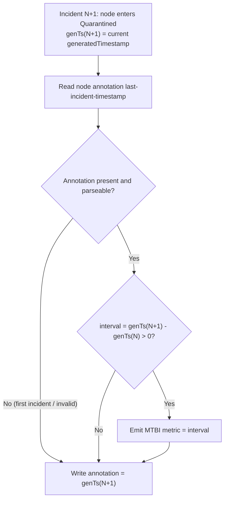

# ADR-044: Breakfix MTBI Metric

## Context

NVSentinel measures how long it takes to repair a faulty node (MTTR /
remediation duration) and counts how many times each node is quarantined
(`fault_quarantine_nodes_quarantined_total{node}`), but it has no visibility into
the *time between* failures — how long a node typically runs healthy before
breaking again. Operators cannot today answer: "How long do nodes typically run
between failures?", "What is the distribution (median / p90) of healthy uptime
between incidents?", or "Is the fleet's time-between-failures trending down?"

### Definition

MTBI is defined as below:

```
MTBI = generatedTimestamp(incident N+1) − generatedTimestamp(incident N)
```

## Decision

Emit a per-incident interval histogram `fault_quarantine_node_mtbi_seconds`
from fault-quarantine, computed at quarantine time. The previous
incident's `generatedTimestamp` is carried forward via an **annotation-piggyback**:
a dedicated node annotation written in the annotation patch fault-quarantine
already applies at the `Quarantined` transition.

## Design

To expose the interval distribution, emit one histogram observation per
incident. The interval is computed at the moment a node is quarantined, using a
dedicated node annotation as the carry-forward for the previous incident's
`generatedTimestamp`.

### Mechanism (annotation-piggyback at quarantine)

- **Annotation key:** `nvsentinel.nvidia.com/last-incident-timestamp`, declared as
  a `const` in `fault-quarantine/pkg/common` alongside the existing quarantine
  annotation keys.
- **Value:** the incident's `generatedTimestamp` serialized as **RFC3339Nano in
  UTC**
- **Written:** only at the `Quarantined` transition, folded into the annotation
  patch fault-quarantine already applies (the `annotationsMap` passed to
  `QuarantineNodeAndSetAnnotations`). No extra API call.
- **Read:** at the start of each new quarantine, from the node object already
  fetched during reconcile. This requires adding the new key to the allowlist in
  `getNodeQuarantineAnnotations`, otherwise the value is
  filtered out before the quarantine path ever sees it.
- **Lifecycle:** excluded from every annotation-removal list, so it persists across
  cycles and is overwritten on the next quarantine. This relies on the k8s client
  patch helpers (`UnQuarantineNodeAndRemoveAnnotations`,
  `HandleManualUncordonCleanup`, `HandleManualUntaintCleanup`) removing only the
  explicitly-listed keys rather than wholesale-stripping nvsentinel annotations.



### Metric

| Field | Value |
|---|---|
| Name | `fault_quarantine_node_mtbi_seconds` |
| Type | Histogram |
| Buckets | `ExponentialBucketsRange(900, 2592000, 14)` — 14 buckets from 15 minutes to 30 days (~1 month), ~1.78× growth per bucket |
| Description | Fault-to-fault interval between consecutive incidents on a node: `generatedTimestamp(N+1) − generatedTimestamp(N)`. Emitted at quarantine start when a prior incident annotation exists and the interval is positive. |

### Queries
Few example grafana queries:

```promql
# p90 MTBI by cluster (seconds)
histogram_quantile(
  0.90,
  sum by (cluster, le) (
    rate(fault_quarantine_node_mtbi_seconds_bucket{env="prod"}[$__range])
  )
)

# p90 MTBI by csp (seconds)
histogram_quantile(
  0.90,
  sum by (csp, le) (
    rate(fault_quarantine_node_mtbi_seconds_bucket{env="prod"}[$__range])
  )
)

```

### Pros

- **No extra I/O** — no per-incident DB query and no extra API round trip: the
  previous timestamp is read from the node already fetched during reconcile and
  written within the annotation patch quarantine already applies. No datastore lookup.
- **Robust to restarts, manual actions, and reprovision** — state lives on the
  node and is touched only at the `Quarantined` transition, so pod restarts and
  manual uncordon/untaint never interfere; a fresh node has no annotation and is
  correctly treated as a first incident.
- **Self-correcting** — a corrupted/overwritten annotation affects at most one
  interval and heals on the next incident.

### Cons

- **Externally mutable state** — node annotation is externally
  mutable (an operator/controller overwriting it corrupts a single interval;
  see self-correcting above).

## Implementation

1. **`fault-quarantine/pkg/common/common.go`** — add a const for the annotation
   key, e.g. `NodeLastIncidentTimestampAnnotationKey = "nvsentinel.nvidia.com/last-incident-timestamp"`.
2. **`fault-quarantine/pkg/metrics/metrics.go`** — add `NodeMTBISeconds`
   (`Histogram`, buckets `ExponentialBucketsRange(900, 2592000, 14)`
   — 15 minutes to 30 days).
3. **`fault-quarantine/pkg/reconciler/reconciler.go`** —
   - **Read allowlist:** add `NodeLastIncidentTimestampAnnotationKey` to the
     `quarantineKeys` list in `getNodeQuarantineAnnotations`. Without this the key
     is filtered out of the `annotations` map and MTBI never emits.
   - **Observe + write:** in the fresh `Quarantined` path, pass the event (for
     `generatedTimestamp`) and the prior `annotations` into the annotation-building
     step. `prepareAnnotations` currently takes only
     `(ctx, taintsToBeApplied, labelsMap, isCordoned)`, so either extend its
     signature or perform the read/observe/write in `applyQuarantine` where the
     event is in scope. Logic:
     - if the prior annotation is present, parseable (RFC3339Nano), and
       `interval = genTs(N+1) − genTs(N) > 0`, observe the histogram;
     - always write the current `generatedTimestamp` into the annotation map that
       is handed to `QuarantineNodeAndSetAnnotations`;
     - skip emission (but still write) on first incident, unparseable value,
       missing/zero `generatedTimestamp`, or non-positive interval.
   - Do **not** add the key to any annotation-removal list.
4. **`docs/METRICS.md`** — document `fault_quarantine_node_mtbi_seconds`.

### Edge cases

| Scenario | Handling |
|---|---|
| First incident on a node | Annotation absent → skip emission, write current `generatedTimestamp` |
| Unparseable / corrupted annotation | Skip emission, overwrite with current `generatedTimestamp` (self-heals next incident) |
| Non-positive interval (clock skew, out-of-order events, manual/force quarantine) | Skip emission, still overwrite annotation |
| Compound events in one cycle | Recorded as `AlreadyQuarantined`; the quarantine annotation patch runs only on the `Quarantined` transition |
| Manual uncordon between incidents | No effect — annotation is written/read only at quarantine |
| Pod restart | No effect — state lives on the node |
| Node reprovisioned | Fresh node has no annotation → treated as first incident |

### Testing

- First incident: annotation absent → no observation, annotation written.
- Second incident: valid prior annotation → one observation equal to the interval.
- Non-positive interval (N+1 ≤ N): no observation, annotation overwritten.
- Unparseable prior annotation: no observation, annotation overwritten.
- Missing/zero `generatedTimestamp`: no observation, no write.
- Pod restart mid-cycle: state on node intact, next quarantine emits correctly.
- Manual uncordon/untaint between incidents: annotation untouched, interval still
  measured at next quarantine.
- Annotation survives an unquarantine cycle (not in any removal list).


## Alternatives Considered

### Per-incident datastore query at quarantine
Query the previous `Quarantined` document for the node (`FindOne` by
`healthevent.nodename`, sort `createdAt` desc) and compute the interval.

**Rejected** as the primary mechanism because: it adds a DB round trip per
incident and depends on a compound index over
`(nodename, nodequarantined, createdAt)` to avoid scans. The annotation-piggyback
achieves the same result with no extra I/O and no index dependency.

## References

- [METRICS.md](../METRICS.md)
- [`fault-quarantine/pkg/metrics/metrics.go`](../../fault-quarantine/pkg/metrics/metrics.go) — `TotalNodesQuarantined`, remediation-duration histograms
- [`fault-quarantine/pkg/reconciler/reconciler.go`](../../fault-quarantine/pkg/reconciler/reconciler.go) — `updateQuarantineMetrics`, `prepareAnnotations`, `Quarantined` transition, annotation removal lists
- [`data-models/protobufs/health_event.proto`](../../data-models/protobufs/health_event.proto) — `generatedTimestamp`, `nodeQuarantined`
