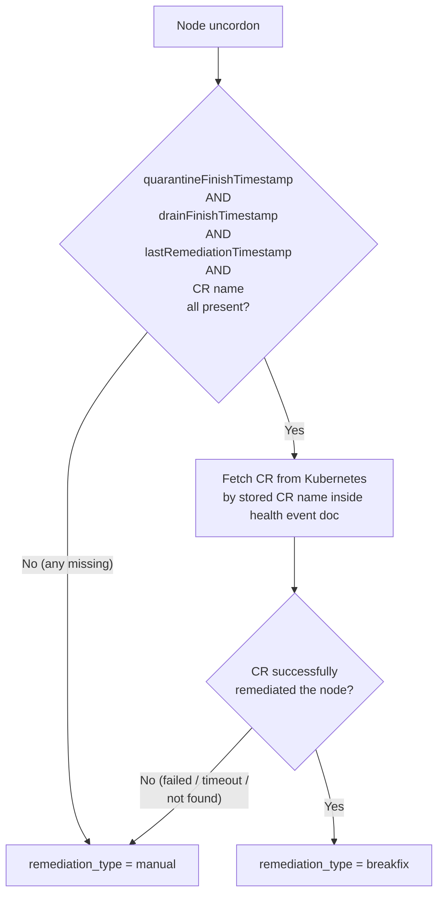

# ADR-044: Observability — Identify Manual vs Breakfix Remediation in MTTR Metrics

## Context

The `fault_quarantine_node_remediation_duration_excluding_drain_seconds` histogram is used on Grafana dashboards to track MTTR (Mean Time To Repair) excluding drain time. On CSP environments (AWS, Azure etc), this metric shows inflated values because some nodes are remediated by **manual operator intervention** rather than by the automated breakfix pipeline. A manually-remediated node often sits cordoned for hours before an operator acts, and that long idle time is currently bucketed into the same histogram as genuine automated remediations.

Beyond manual uncordon, manual intervention can also happen mid-pipeline (e.g. the pipeline issues a RebootNode CR that fails or times out, and an operator then manually reboots the node). In these cases the node still ends up `UnQuarantined` via a healthy event, so it is indistinguishable from a fully automated remediation today — and its long duration inflates MTTR.

## Decision

Add a `remediation_type` label (`breakfix` vs `manual`) to the remediation duration histograms. At node uncordon, classify the remediation by checking the pipeline stage markers on the health event document and the live status of the remediation CR. A remediation counts as `breakfix` only when every pipeline stage completed and the pipeline-created CR succeeded; otherwise it is `manual`.

fault-remediation persists the remediation CR name on the health event document; fault-quarantine reads it at uncordon and fetches the live Janitor CR to determine success. This tracks the **specific pipeline CR**, making the classification robust to retry scenarios where an operator creates a second CR after the pipeline CR fails.

### Classification rules

```
Step 1: Check the health event document for all of:
          - quarantineFinishTimestamp
          - drainFinishTimestamp
          - lastRemediationTimestamp
          - remediation CR name
        If ANY is missing
          -> remediation_type = "manual"  (stop)

Step 2: Fetch the referenced CR from Kubernetes and check its status.
        If the CR did NOT successfully remediate the node
        (failed, timed out, not found)
          -> remediation_type = "manual"  (stop)

Step 3: All timestamps + CR name present AND CR succeeded
          -> remediation_type = "breakfix"
```



## Implementation

### Data sources

Available today on the health event document (already re-fetched at uncordon by `emitRemediationDurationFromDocIDs`):

- `quarantineFinishTimestamp` — set by fault-quarantine at quarantine completion
- `drainFinishTimestamp` — set by node-drainer at drain completion
- `lastRemediationTimestamp` — set by fault-remediation at CR creation

New: the remediation CR name (`maintenance-{nodeName}-{healthEventID}`) is not stored on the health event today. fault-remediation knows it at CR creation and has datastore access, so it writes it into `HealthEventStatus`.

The CR outcome is known only on the Janitor CR status conditions (fault-remediation skips the event after CR creation and never observes success/failure). fault-quarantine therefore reads the live CR at uncordon.

### 1. `data-models/protobufs/health_event.proto`

Add a field to `HealthEventStatus` to carry the remediation CR name:

```proto
message HealthEventStatus {
  string nodeQuarantined = 1;
  google.protobuf.Timestamp quarantineFinishTimestamp = 2;
  OperationStatus userPodsEvictionStatus = 3;
  google.protobuf.Timestamp drainFinishTimestamp = 4;
  google.protobuf.BoolValue faultRemediated = 5;
  google.protobuf.Timestamp lastRemediationTimestamp = 6;
  map<string, string> spanIds = 7;
  string remediationCRName = 8;   // new: "maintenance-{node}-{healthEventID}"
}
```

Regenerate Go bindings and add the field to the datastore abstraction (`store-client/pkg/datastore/types.go`) and the MongoDB/PostgreSQL update paths.

### 2. `fault-remediation/pkg/reconciler/reconciler.go`

In `updateNodeRemediatedStatus` (where `faultRemediated` + `lastRemediationTimestamp` are written), also set `remediationCRName` from the created CR name returned by `performRemediation` / `CreateMaintenanceResource`.

### 3. `fault-quarantine` — new RBAC

fault-quarantine needs read access to Janitor CRDs to fetch CR status:

```go
// +kubebuilder:rbac:groups=janitor.dgxc.nvidia.com,resources=gpuresets;rebootnodes;terminatenodes,verbs=get;list
```

### 4. `fault-quarantine/pkg/eventwatcher/event_watcher.go`

`EmitRemediationDuration` gains a `remediationType` parameter:

```go
func EmitRemediationDuration(nodeName string, genTs time.Time, qft, dft *time.Time, remediationType string) {
    now := time.Now()
    if duration := now.Sub(genTs).Seconds(); duration > 0 {
        metrics.NodeRemediationDurationSeconds.WithLabelValues(remediationType).Observe(duration)
    }
    if qft != nil && dft != nil {
        drainDuration := dft.Sub(*qft).Seconds()
        endToEnd := now.Sub(genTs).Seconds()
        if durationExcludingDrain := endToEnd - drainDuration; durationExcludingDrain > 0 {
            metrics.NodeRemediationDurationExcludingDrainSeconds.WithLabelValues(remediationType).Observe(durationExcludingDrain)
        }
    }
}
```

Add a classifier implementing the rules above:

```go
const (
    RemediationTypeBreakfix = "breakfix"
    RemediationTypeManual   = "manual"
)

func (w *Watcher) classifyRemediation(ctx context.Context, doc *remediationDoc) string {
    // Step 1: all pipeline stage markers + CR name must be present
    if doc.HealthEventStatus.QuarantineFinishTimestamp == nil ||
        doc.HealthEventStatus.DrainFinishTimestamp == nil ||
        doc.HealthEventStatus.LastRemediationTimestamp == nil ||
        doc.HealthEventStatus.RemediationCRName == "" {
        return RemediationTypeManual
    }

    // Step 2: fetch the referenced CR and check success
    if !w.crSucceeded(ctx, doc.HealthEventStatus.RemediationCRName, doc.HealthEvent.NodeName) {
        return RemediationTypeManual
    }

    // Step 3: full automated pipeline confirmed
    return RemediationTypeBreakfix
}
```

`crSucceeded` does a `GET` on the Janitor CR (by name + action type) and inspects its completion conditions:
- RebootNode: `NodeReady` condition `status=True` → success
- GPUReset: `Complete` condition `status=True` with success reason → success
- CR not found or failed/timeout → not success

The `remediationDoc` struct (used by `emitRemediationDurationFromDocIDs`) is extended to unmarshal `lastRemediationTimestamp` and `remediationCRName`.

Both existing call sites pass the classified type:
- `emitRemediationDurationFromDocIDs` (auto path) → call `classifyRemediation` per doc
- `emitCancelledRemediationDuration` (manual uncordon/untaint path) → always `RemediationTypeManual`

### 5. `fault-quarantine/pkg/metrics/metrics.go`

Convert the two histograms to `HistogramVec` with a `remediation_type` label:

```go
NodeRemediationDurationSeconds = promauto.NewHistogramVec(
    prometheus.HistogramOpts{
        Name:    "fault_quarantine_node_remediation_duration_seconds",
        Buckets: prometheus.ExponentialBuckets(10, 1.5, 27),
    },
    []string{"remediation_type"},
)

NodeRemediationDurationExcludingDrainSeconds = promauto.NewHistogramVec(
    prometheus.HistogramOpts{
        Name:    "fault_quarantine_node_remediation_duration_excluding_drain_seconds",
        Buckets: prometheus.ExponentialBuckets(10, 1.5, 19),
    },
    []string{"remediation_type"},
)
```

### 6. `docs/METRICS.md`

Update the two metric rows to document the new `remediation_type` label (`breakfix`, `manual`).

### Grafana query

```promql
# P50 automated (breakfix) MTTR excluding drain, in hours
histogram_quantile(0.50,
  sum by (le) (
    rate(fault_quarantine_node_remediation_duration_excluding_drain_seconds_bucket{remediation_type="breakfix"}[30d])
  )
) / 3600

# Breakfix vs manual side by side (shows how much manual was inflating the number)
histogram_quantile(0.50,
  sum by (le, remediation_type) (
    rate(fault_quarantine_node_remediation_duration_excluding_drain_seconds_bucket[30d])
  )
) / 3600
```

### Classification outcomes

| Scenario | `remediation_type` |
|---|---|
| Full automated pipeline, CR succeeded | `breakfix` |
| Manual uncordon/untaint (node informer → `Cancelled`) | `manual` |
| Pipeline CR failed/timeout, operator manually rebooted | `manual` (CR name present, CR status not success) |
| Pipeline CR failed, operator created a 2nd CR that succeeded | `manual` (stored CR name points to the failed pipeline CR) |
| No CR ever issued (spontaneous recovery / early manual reboot) | `manual` (CR name absent) |
| Drain skipped / `drainFinishTimestamp` absent | `manual` (timestamp missing) |

## Rationale

- The three pipeline timestamps are already fetched at uncordon, so the only new persisted data is the CR name — a minimal addition for fault-remediation, which already updates the same status document.
- Reading the **live CR status** uses the source of truth for the outcome (CR conditions), rather than relying on `faultRemediated`, which is set at CR creation and does not reflect janitor success/failure.
- Storing the **specific pipeline CR name** in the DB makes the classification correct even when an operator creates a second CR after the pipeline CR fails — fault-quarantine always evaluates the pipeline CR's outcome.
- Adding a label to the existing metric (rather than a new metric) keeps dashboards and recording rules simple: filter by `remediation_type="breakfix"` for accurate automated MTTR.

## Consequences

### Positive
- Dashboards can report accurate automated MTTR by filtering `remediation_type="breakfix/manual"`.
- Manual interventions become measurable (count and duration), useful for operational insight on CSPs.

### Negative
- An extra `GET` per CR on the uncordon path.

## Alternatives Considered

### Janitor writes CR outcome to a node annotation
Janitor (the only component that knows the true CR outcome) writes `nvsentinel.nvidia.com/last-janitor-action-status` on the node at CR terminal state; fault-quarantine reads it at uncordon.

**Rejected** because: in the retry scenario (pipeline CR fails, manual CR succeeds), the manual CR's success overwrites the pipeline CR's failure, misclassifying a manual recovery as `breakfix`. It also requires annotation-clearing lifecycle logic in fault-quarantine. Additionally, it requires janitor to distinguish whether a CR was created manually or by the breakfix pipeline (so it can attribute the outcome correctly), which adds extra logic to every janitor controller. The DB approach tracks the specific pipeline CR and avoids all of these issues, at the cost of a proto change and new RBAC.

## References

- [METRICS.md](../METRICS.md)
- [`fault-quarantine/pkg/eventwatcher/event_watcher.go`](../../fault-quarantine/pkg/eventwatcher/event_watcher.go) — `EmitRemediationDuration`
- [`fault-remediation/pkg/reconciler/reconciler.go`](../../fault-remediation/pkg/reconciler/reconciler.go) — `updateNodeRemediatedStatus`
- [`data-models/protobufs/health_event.proto`](../../data-models/protobufs/health_event.proto) — `HealthEventStatus`
