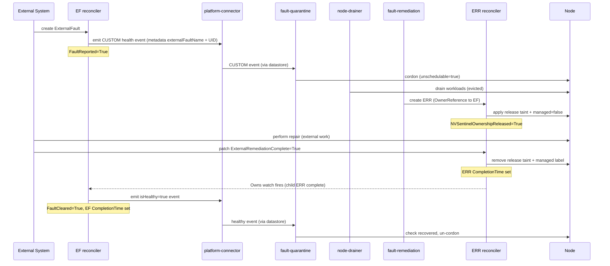
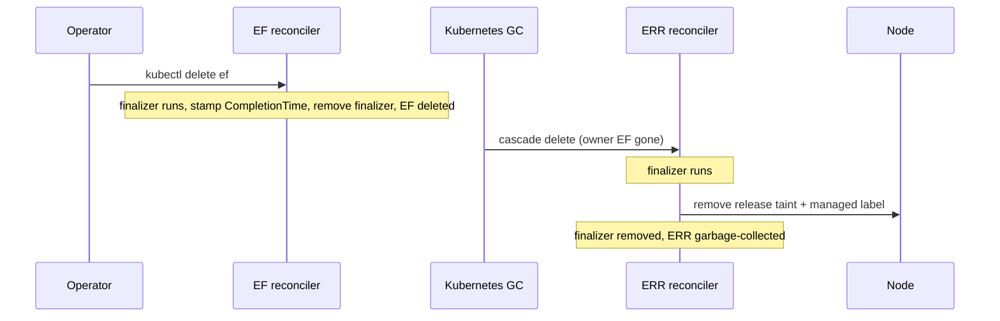

# ADR-049: API — ExternalFault (EF)

## Context

[ADR-040](040-external-remediation-request.md) introduced the `ExternalRemediationRequest` (ERR) — the **exit door** from NVSentinel node ownership. When NVSentinel detects a fault it cannot remediate itself, it creates an ERR, releases the node to an external system, and waits for that system to signal completion.

ADR-040 covers the NVSentinel-initiated direction. It does not cover the reverse: an external system that *proactively* needs a node drained before it can begin work. In that case NVSentinel does not generate a fault; the external system has received a signal from outside the cluster — a CSP maintenance notification, a hardware-monitoring alert, an external event source — and needs NVSentinel to prepare the node on its behalf.

Without a formal entry point for this direction, external automation must side-step NVSentinel (cordoning nodes directly, fighting over taints) or rely on custom integrations that duplicate NVSentinel's quarantine and drain logic. Both outcomes undermine the ownership model established by ADR-040.

## Decision

Introduce a new CRD, `ExternalFault` (EF), in the existing `nvsentinel.dgxc.nvidia.com` API group. EF is the **entry door** into NVSentinel ownership transfer from an external system:

- Created by an external system or human operator when it determines a node must be drained and released before external repair work can begin.
- The EF reconciler emits the health event from `spec.healthEvent` to the platform-connector **as authored** — the creator chooses `recommendedAction`, and the pipeline routes it to the matching remediation (a `CUSTOM` / `external-remediation` event produces an ERR; `RESTART_VM` produces a RebootNode; etc.). Provided the pipeline is configured to act on the event (see [Pipeline dependencies](#pipeline-dependencies)), this drives the normal NVSentinel flow: quarantine (cordon), drain, and creation of the appropriate maintenance CR by `fault-remediation`.
- The maintenance CR created from an EF-triggered event carries an `OwnerReference` pointing to the parent EF, linking the two objects for the lifetime of the remediation. That CR can be any janitor maintenance kind (RebootNode, TerminateNode, GPUReset, ExternalRemediationRequest) depending on the event's action.
- The EF reconciler watches its owned child maintenance CR and uses the child reaching its terminal state (`Status.CompletionTime` — the signal shared by all janitor maintenance CRs) as the internal trigger to clear the fault; it does **not** surface the child's state as an EF condition. The external system never clears faults in NVSentinel: a node is only un-quarantined when the source that raised the fatal health event submits a matching `isHealthy=true` event. EF *is* that source, so when the child completes it emits a second health event — a plain `isHealthy=true` event for the same node/check — to retract the fault it raised, and sets `FaultCleared=True` once that clearing event is submitted.
- `CompletionTime` is set on the EF when `FaultCleared=True` (the clearing event was submitted) or on operator-delete (force close).

EF is the general **entry door** for injecting an externally-originated health event as a first-class, tracked Kubernetes object. The external-remediation (ERR) handoff is the canonical case — EF is the inbound counterpart to ERR's outbound "NVSentinel is releasing this node" — but EF is not limited to it.

Human operators follow the same path as automated systems: creating an EF CR is the sanctioned mechanism for requesting a node drain before manual intervention.

## ExternalFault Reconciler

Where the EF reconciler is hosted is a distinct, open decision. It is unusual among NVSentinel controllers because it needs three capabilities that no single existing component provides together:

1. **A controller-runtime manager + validating webhook** — to reconcile the EF CRD (finalizers, status, `Owns(&ExternalRemediationRequest{})`) and to enforce admission checks (duplicate-node, `nodeName` immutability, node existence).
2. **A health-event emitter** — a `healthpub.Publisher` over the platform-connector's node-local socket, to submit both the opening event and the closing `isHealthy=true` event.
3. **Proximity to the child maintenance CRs** it watches — the `Owns`-watch reacts to the owned child's `Status.CompletionTime`, and those CRs (RebootNode/TerminateNode/GPUReset/ERR) and their reconcilers live in janitor.

No component has all three, so each option grafts on what it lacks. The [Implementation](#implementation) section below is written against **Option 1**.

### Option 1 — janitor (reference implementation)

Host the EF reconciler in `janitor`, alongside the ERR reconciler and the shared validating-webhook server.

- **Pros:** janitor is already a controller-runtime manager with a webhook server, and the maintenance-CR reconcilers whose children the EF watches (RebootNode/TerminateNode/GPUReset/ERR) all live here, so capabilities (1) and (3) come for free. Smallest change.
- **Cons:** janitor emits no health events today; EF makes it an emitter, adding the platform-connector socket mount and a `healthpub` client (see [Health-event emission](#health-event-emission-janitor--platform-connector)). That is a new outbound dependency for a component that previously spoke only to the Kubernetes API.

### Option 2 — csp-health-monitor

Host the EF reconciler in `csp-health-monitor` (or another health monitor).

- **Pros:** health monitors are native emitters — `csp-health-monitor` already mounts the platform-connector socket and holds a `healthpub.Publisher`, so capability (2) is free. It also already detects CSP maintenance signals (AWS/GCP), the canonical EF trigger, so the component that observes external faults would also own their lifecycle — a good fit with EF's "synthetic monitor" framing.
- **Cons:** `csp-health-monitor` is a poll/emit loop, **not** a controller-runtime app — no manager, no CRD reconcilers, no webhook server, and no leader election (it runs as a multi-replica Deployment). Hosting EF here means grafting on the entire controller-runtime + webhook stack (capability 1). It also splits the EF↔ERR pair across components: `csp-health-monitor` would import janitor's CRD types and `Owns`-watch a janitor-owned CRD, and the EF webhook would either need a new server here or stay behind in janitor.

### Option 3 — standalone component

Introduce a dedicated component (e.g. an `external-fault-controller`) that owns the EF reconciler, its webhook, and its emitter — optionally owning the ERR reconciler as well, making it the single home for the bilateral handoff API.

- **Pros:** cleanest bounded context. EF and ERR are the two halves of one handoff; owning both in one binary makes the `Owns`-watch and the shared webhook trivial and keeps the handoff logic in one place. No capability is grafted onto a component whose role it doesn't fit.
- **Cons:** the largest lift — a new component (image, chart, RBAC, webhook certs, leader election, deployment) to build and operate. Realizing the full benefit means relocating the ERR reconciler out of janitor (ADR-040 already ships it there), a migration in its own right. If EF alone moves and ERR stays, this collapses toward Option 1's split without Option 1's low cost.

Option 1 is the least-change path and the shape the rest of this ADR describes; Option 3 is the cleanest long-term structure but the largest investment. This choice is deferred to team review.

## Implementation

### Module layout

```text
data-models/
├── protobufs/
│   └── external_fault.proto               (new)
└── pkg/protos/
    └── external_fault.pb.go               (generated)

distros/kubernetes/nvsentinel/charts/janitor/
├── crds/
│   └── external_fault.crd.yaml            (generated by protoc-gen-crd)
└── templates/
    ├── deployment.yaml                    (extended — platform-connector socket mount + flag)
    ├── clusterrole.yaml                   (extended — externalfaults RBAC)
    └── webhook.yaml                       (extended — EF validating webhook)

janitor/
├── api/v1alpha1/
│   ├── external_fault_register.go         (new — scheme registration + wrapper type)
│   ├── external_fault_json.go             (new — protojson marshal for spec/status)
│   └── external_remediation_register.go   (extended — registers EF into the shared group scheme)
├── pkg/controller/
│   └── externalfault_controller.go        (new — EF reconciler)
├── pkg/webhook/v1alpha1/
│   └── janitor_webhook.go                 (extended — EF validator added)
└── main.go                                (extended — EF controller + platform-connector emitter + EF TTL)
```

### CRD schema

The CRD is proto-generated, matching the ERR pattern:

```proto
message ExternalFaultSpec {
  // healthEvent describes the fault the external system is raising. The EF
  // reconciler re-emits this event into the NVSentinel pipeline as authored
  // (the creator's recommendedAction stands) so the normal quarantine → drain
  // → remediation flow fires for whichever action the event names.
  HealthEvent healthEvent = 1;
}

message ExternalFaultStatus {
  repeated Condition conditions = 1;

  // completionTime is set when the EF reconciler is done — FaultCleared=True
  // (successful repair and node return) or on operator-delete. Matches the
  // CompletionTime semantics used by ERR and the other janitor CRDs.
  google.protobuf.Timestamp completionTime = 2;
}

message ExternalFault {
  option (protoc_gen_crd.k8s_crd) = {
    api_group: "nvsentinel.dgxc.nvidia.com",
    kind: "ExternalFault",
    plural: "externalfaults",
    singular: "externalfault",
    short_names: ["ef"],
    categories: ["nvsentinel"],
    scope: ST_CLUSTER
  };
  ExternalFaultSpec spec = 1;
  ExternalFaultStatus status = 2;
}
```

### Example

```yaml
apiVersion: nvsentinel.dgxc.nvidia.com/v1
kind: ExternalFault
metadata:
  name: csp-maintenance-ip-10-0-31-7
spec:
  healthEvent:
    agent: external-system
    checkName: csp-scheduled-maintenance
    componentClass: node
    customRecommendedAction: external-remediation
    entitiesImpacted:
      - entityType: Node
        entityValue: ip-10-0-31-7.us-west-2.compute.internal
    errorCode:
      - CSP-MAINT-AWS-EBS-RETIRE
    generatedTimestamp: "2026-05-13T02:00:00Z"
    id: he-mst-c6d92aa1-2f6e-4e8b-9e3d-b75f86b1aaaa
    isFatal: false
    isHealthy: false
    message: "AWS scheduled maintenance 2026-05-13T03:00Z; node must be drained."
    metadata:
      cluster: nvcf-dgxc-k8s-aws-usw2-prod
      cspEventId: evt-0a9bc8e74e2c2c10c
      source: aws-health
    nodeName: ip-10-0-31-7.us-west-2.compute.internal
    recommendedAction: CUSTOM
    version: 1
status:
  conditions:
    - lastTransitionTime: "2026-05-13T02:00:01Z"
      message: >-
        Submitted CUSTOM health event he-mst-c6d92aa1 to platform-connector
        on node ip-10-0-31-7.us-west-2.compute.internal.
      observedGeneration: 1
      reason: HealthEventEmitted
      status: "True"
      type: FaultReported
    - lastTransitionTime: "2026-05-13T02:00:01Z"
      message: Fault active; clearing health event not yet emitted.
      observedGeneration: 1
      reason: FaultActive
      status: "False"
      type: FaultCleared
```

### Status conditions

| Condition | Initial | Terminal values | Meaning |
|---|---|---|---|
| `FaultReported` | `Unknown (Initializing)` | `True (HealthEventEmitted)` | Health event successfully submitted to platform-connector. |
| `FaultCleared` | `False (FaultActive)` | `True` | The EF reconciler submitted the clearing (`isHealthy=true`) health event that retracts the fault it raised, letting the normal quarantine-recovery path un-cordon the node. Emitted once the owned child maintenance CR reaches its terminal state (`Status.CompletionTime`). |

The EF surfaces only these two conditions. It deliberately does **not** mirror the child's status — that state lives on the child CR, and not every EF necessarily produces one. Until `FaultCleared=True`, the EF is simply "open," regardless of whether a child is in progress, has failed, or was never created.

`CompletionTime` is stamped by the EF reconciler when `FaultCleared=True` or on the operator-delete path.

### EF reconciler state machine

**Init** (first reconcile — neither finalizer nor initial conditions present):
1. Add cleanup finalizer.
2. Seed initial conditions: `FaultReported=Unknown`, `FaultCleared=False (FaultActive)`.
3. Emit the health event from `spec.healthEvent` to the platform-connector **as authored** — the creator's `recommendedAction` (and `customRecommendedAction`, if any) are passed through unchanged. Inject the EF's name **and UID** into `healthEvent.metadata["externalFaultName"]` / `["externalFaultUID"]` so `fault-remediation` can link the child maintenance CR back to *this* EF (see [OwnerReference design](#ownerreference-design)).
4. On success: set `FaultReported=True (HealthEventEmitted)`. Reconcile returns; next trigger is the child maintenance CR appearing.
5. On failure: return error; controller-runtime requeues with backoff.
6. The opening emit is gated on `FaultReported != True`, not on the one-time Init entry — so after the conditions are seeded, a failed or not-yet-attempted emission is retried on the next reconcile rather than being stranded between states.

**Open / awaiting clear** (`FaultReported=True`, `FaultCleared=False`):
- Idle. The controller watches its owned maintenance CRs — `Owns()` is registered for every janitor maintenance kind (`RebootNode`, `TerminateNode`, `GPUReset`, `ExternalRemediationRequest`) in `SetupWithManager` — so a reconcile fires when `fault-remediation` creates the child with an `OwnerReference` to this EF, whatever its type. If no child is ever created — e.g. the emitted event matches no remediation action — the EF simply stays open here until an operator deletes it.
- Owned child sets `Status.CompletionTime` (the terminal signal shared by all janitor maintenance CRs) → emit the clearing health event: a plain `isHealthy=true` event carrying the same `agent`/`checkName`/`nodeName` as the original with `recommendedAction=NONE` (it must clear the check, not trigger a second remediation). On successful emit → set `FaultCleared=True` → stamp the EF's `CompletionTime`. Reconciler is done. On emit failure → return error; controller-runtime requeues and retries, exactly like the opening emit — `FaultCleared` stays unset until it succeeds.
- If the child never reaches `CompletionTime`, the EF stays open. This subsumes the ERR failure case: an ERR sets `CompletionTime` only on `ExternalRemediationComplete=True`, so a failed external repair (`Complete=False`) leaves the EF open with no clearing event — the fault stands. The child's failure detail lives on the child, not the EF; the EF closes only when a child completes or an operator deletes it.

**Operator delete** (DeletionTimestamp set):
1. If a child CR exists and `FaultCleared` has not been set to `True`, record an operator-delete close metric.
2. Stamp `CompletionTime`.
3. Remove the cleanup finalizer. Kubernetes GC cascades the OwnerReference deletion to the child CR (see *OwnerReference design* below).

Operator-delete is a deliberate **force-close**: it does **not** emit the clearing `isHealthy=true` event. If the EF was still open, the synthetic fault is therefore *not* retracted and the node stays cordoned — deleting an open EF means abandoning the drain request, and the node is left cordoned for manual attention (open EFs are filterable right up to deletion). One race is tolerated by design: an opening event still in flight can create a child maintenance CR *after* the EF is gone; that CR carries an `OwnerReference` to a UID that no longer exists, so Kubernetes GC deletes it on discovery — and the child's own finalizer scrubs any node state it applied — rather than leaving an orphan.

### OwnerReference design

`fault-remediation` creates a maintenance CR (the kind depends on the event's `recommendedAction`) when it processes an EF-originated event. When the health event carries `metadata["externalFaultName"]` and `metadata["externalFaultUID"]`, `fault-remediation`:

1. Looks up the named EF and verifies its `uid` matches `externalFaultUID`. A name-only match is not enough: an EF can be deleted and recreated with the same name, and a queued or replayed event must not attach its child to a *different* object that happens to reuse the name. On a UID mismatch — or if the EF is not found — it does **not** create an unowned CR; it fails closed and retries under the normal reconcile backoff.
2. Adds an `OwnerReference` on the new maintenance CR pointing to the EF (regardless of the CR's kind):

```yaml
ownerReferences:
  - apiVersion: nvsentinel.dgxc.nvidia.com/v1
    kind: ExternalFault
    name: <ef-name>
    uid: <ef-uid>
    controller: true
    blockOwnerDeletion: false   # the child handles its own node cleanup via finalizer
```

`blockOwnerDeletion: false` means deleting an EF does not block on the child being deleted first. Kubernetes GC enqueues the child for deletion independently, and the child's own cleanup finalizer removes any node state it applied before it is garbage-collected, regardless of EF lifecycle. (For an ERR child that means the release taint and `managed=false` label, per ADR-040.)

The EF reconciler registers `Owns()` for each janitor maintenance kind (`RebootNode`, `TerminateNode`, `GPUReset`, `ExternalRemediationRequest`) in `SetupWithManager`, installing a field indexer on `metadata.ownerReferences` so EF reconciles fire when its owned child changes state — including when the child sets `Status.CompletionTime`.

The link between EF and child rides on `metadata["externalFaultName"]` + `["externalFaultUID"]`, **not** on the health-event `id`. The platform-connector/datastore assigns its own identifier to the event as it is persisted, so the `id` on the EF's `spec.healthEvent` is not stable downstream — `fault-remediation` sees the datastore's id, not the one the EF submitted. The name is the human-readable handle and the UID disambiguates a delete-and-recreate, so the pair is the stable, EF-controlled linkage.

### No node lock

The EF reconciler does not acquire the cross-controller node-level lock (`NodeLock` / coordination Lease). The maintenance-CR reconciler (e.g. the ERR reconciler, per ADR-040) holds the lock for the node's active remediation lifetime. The EF reconciler's role is health-event emission; the resulting child CR takes ownership of the lock from that point.

### Health-event emission (janitor ↔ platform-connector)

The janitor process does not emit health events today; EF adds this capability. The EF reconciler publishes health events to the platform-connector over the node-local Unix domain socket (`healthpub.Publisher` → `PlatformConnector.HealthEventOccurredV1`) — the same ingress path the health monitors use. EF emits twice over the fault's lifetime: the opening event that raises the fault (`FaultReported`, carrying the creator's `recommendedAction`), and the `isHealthy=true` clearing event that retracts it (`FaultCleared`). It acts as the synthetic health monitor for external-origin faults, which no real monitor observes. Emission requires additions to the janitor deployment that the reconciler alone does not provide:

- **Socket mount.** The janitor pod mounts the platform-connector's node-local socket via `hostPath` (`/var/run/nvsentinel`), exactly as the Deployment-type monitors (e.g. `csp-health-monitor`) do. The platform-connector runs as a per-node DaemonSet, so a socket is present on whatever node the (single) janitor pod is scheduled to — co-location is guaranteed.
- **gRPC client.** A lazy `PlatformConnectorClient` (`grpc.NewClient`) wrapped by `healthpub.Publisher`. Lazy dialing means janitor start-up never blocks on the socket; if the platform-connector is briefly unavailable, `Emit` fails, `FaultReported` stays `Unknown`, and the reconciler requeues.
- **RBAC.** No new RBAC for emission itself (the gRPC call is not a Kubernetes API call), but the reconciler needs `externalfaults` (+ `/status`, `/finalizers`) and `get;list;watch` on every maintenance kind it may own — `rebootnodes`, `terminatenodes`, `gpuresets`, `externalremediationrequests`.

### Pipeline dependencies

EF only *emits* a health event; whether that event flows through quarantine → drain → remediation depends on the rest of the pipeline being configured to act on it. Because the creator chooses `recommendedAction`, how much is already wired depends on the action:

1. **A `fault-quarantine` ruleset that matches the EF-emitted event.** `fault-quarantine` cordons only events matching one of its rulesets; a generic external-origin event (e.g. a CSP-maintenance event) matches none of the default agent/check-specific rulesets and is skipped, so no cordon/drain occurs. The EF-emitted event must carry fields that match an existing ruleset, or a dedicated ruleset for EF-originated events must be added. This applies whatever the action.
2. **A `fault-remediation` action that produces the child CR.** For built-in actions (`RESTART_VM` → RebootNode, `TERMINATE_NODE` → TerminateNode, …) the action templates **already exist**, so EF works against them today; only the `CUSTOM` / `external-remediation` path additionally needs the not-yet-built action that renders an `ExternalRemediationRequest`. Independently of that, `fault-remediation` must be extended to stamp the EF `OwnerReference` (matching `metadata["externalFaultName"]` + `["externalFaultUID"]` on **both**) on **whatever** CR it creates from an EF-originated event, and to be **idempotent on re-publish**: because the EF re-emits its opening event on retry and the datastore assigns each event its own id, the producer must not create a second CR for a node that already has an active one.

The quarantine-ruleset dependency is a sequencing requirement for any EF; the ERR-producing action is only required for the `CUSTOM` handoff case; the OwnerReference-stamping extension is required for all cases.

### Validating admission webhook

Added to the existing `janitor_webhook.go` validator chain:

| Check | On create | On update |
|---|---|---|
| `spec.healthEvent.nodeName` is non-empty | ✓ | ✓ |
| `spec.healthEvent.isHealthy` is `false` (an opening event must *raise* a fault, not clear one) | ✓ | ✓ |
| Node named by `nodeName` exists in the cluster | ✓ | — |
| `spec.healthEvent` is immutable (the whole event is frozen after creation) | — | ✓ |
| No other active EF for the same node (`CompletionTime == nil`) | ✓ | — |

**Why the whole health event is frozen, not just `nodeName`.** The clearing event the reconciler emits reuses the original `agent`/`checkName`/`nodeName` so fault-quarantine's "check recovered" logic matches the fault EF opened. If any of those fields could drift after the opening emit, the clearing event would target a different check and silently fail to un-cordon the node. Freezing `spec.healthEvent` on update keeps open and close addressing the same fault. Rejecting `isHealthy=true` closes the other gap: a "healthy" opening event would set `FaultReported=True` without ever raising a fault.

**The duplicate-EF check is a best-effort early rejection, not a race guarantee.** It queries EFs by `spec.healthEvent.nodeName` via an informer-backed lister — the same non-transactional pattern the sibling RebootNode/TerminateNode/ERR webhooks use — and rejects a create when an active EF already exists, pointing the caller at it. Two concurrent creates can still both observe "no active EF" and both pass; the single-active-EF invariant is ultimately upheld by the reconciler and producer converging (a duplicate opening event for a node that is already `FaultReported=True` must be treated idempotently downstream — see [Pipeline dependencies](#pipeline-dependencies)), not by admission alone.

### RBAC

EF reconciler (in `janitor` binary):

```text
# kubebuilder:rbac:groups=nvsentinel.dgxc.nvidia.com,resources=externalfaults,verbs=get;list;watch;update;patch;delete
# kubebuilder:rbac:groups=nvsentinel.dgxc.nvidia.com,resources=externalfaults/status,verbs=get;update;patch
# kubebuilder:rbac:groups=nvsentinel.dgxc.nvidia.com,resources=externalfaults/finalizers,verbs=update
# kubebuilder:rbac:groups=nvsentinel.dgxc.nvidia.com,resources=externalremediationrequests,verbs=get;list;watch
# kubebuilder:rbac:groups=janitor.dgxc.nvidia.com,resources=rebootnodes;terminatenodes;gpuresets,verbs=get;list;watch
```

`fault-remediation` (new permissions required for EF integration):

```text
# kubebuilder:rbac:groups=nvsentinel.dgxc.nvidia.com,resources=externalfaults,verbs=get;list;watch
```

No new node-level RBAC is needed; EF does not touch nodes directly.

### Sequence: EF-initiated fault (happy path — external-remediation example)

This shows the `CUSTOM` / external-remediation case, where the child is an ERR. Other actions follow the same EF open/close shape with a different child (e.g. a RebootNode that runs and sets its own `CompletionTime`); the EF's clearing emit is triggered generically by the owned child reaching `CompletionTime`.



### Sequence: EF operator delete (cancellation)



## Rationale

**Single entry point for external-initiated handoff.** Without EF, an external system either creates its own node drain logic (duplicating NVSentinel's quarantine/drain/managed-label chain) or side-steps NVSentinel entirely. EF reuses the entire existing NVSentinel pipeline with a single health event emission.

**Reusing the existing health-event flow.** EF emits the same event payload that NVSentinel-detected faults produce, so it reuses the existing quarantine/drain/remediation machinery rather than duplicating it — and because the creator picks `recommendedAction`, EF can drive any remediation the pipeline already knows how to run, not just the ERR handoff. It does *not* follow that the pipeline reacts out of the box: `fault-quarantine` only cordons events matching one of its rulesets, and `fault-remediation` only produces a CR for a configured action. Those must be wired for the EF path (see [Pipeline dependencies](#pipeline-dependencies)), plus the OwnerReference-stamping extension that links the child back to the EF.

**OwnerReference with `blockOwnerDeletion: false`.** Each maintenance CR's cleanup finalizer already guarantees node cleanup regardless of how its lifecycle ends (e.g. ERR's, per ADR-040). Cascading EF deletion to the child via GC preserves that guarantee without requiring the EF reconciler to orchestrate the child's deletion itself.

**No node lock on EF.** The EF reconciler's sole in-cluster side effect is emitting a health event. All node mutations are performed by downstream reconcilers (fault-quarantine, ERR reconciler) that already participate in the cross-controller node lock protocol. Adding a lock to EF would be redundant and would block on nodes that are not yet claimed.

**Webhook rejects duplicate active EFs (best-effort).** A second EF for the same node would create a second health event, a second quarantine session, and potentially a second ERR. Admission rejects the common case cheaply, but the lister is not transactional, so it is an early guard rather than a hard guarantee — the authoritative single-active-EF invariant comes from idempotent downstream handling (dedup on node + name/UID), not the webhook alone.

## Consequences

**Positive:**
- External systems and human operators have a single, well-defined entry point for requesting node drain and ownership transfer.
- The full NVSentinel quarantine/drain pipeline fires for EF-initiated faults, ensuring workloads are safely evicted before external repair begins.
- EF and ERR together form a symmetric, observable API: both exist as Kubernetes objects with `CompletionTime` and structured conditions, auditable via `kubectl` and standard Kubernetes tooling.
- The existing TTL reconciler (ADR-037) can manage EF object lifecycle after completion, the same as it does for RebootNode, TerminateNode, GPUReset, and ERR.

**Negative / tradeoffs:**
- The EF path depends on pipeline wiring that does not exist purely for EF: a `fault-quarantine` ruleset that matches EF-emitted events, and a `fault-remediation` extension that stamps the EF `OwnerReference` (from `metadata["externalFaultName"]` + `["externalFaultUID"]`) on whatever child CR it creates. For built-in actions the CR templates already exist; only the `CUSTOM`/external-remediation case additionally needs the not-yet-built ERR-producing action. These must land with, or before, EF (see [Pipeline dependencies](#pipeline-dependencies)).
- The janitor gains a new outbound dependency — it must reach the platform-connector's node-local socket to emit — where before it only spoke to the Kubernetes API. See [Health-event emission](#health-event-emission-janitor--platform-connector).
- The webhook's duplicate-node check requires an informer-backed lister at admission time (same approach the ERR webhook uses), so no new infrastructure is needed — but it is a best-effort guard, not a transactional uniqueness constraint (see the *Validating admission webhook* section).
- An EF whose remediation fails, stalls, or never produces a child CR simply stays open (`FaultReported=True`, not cleared) until an operator deletes it; NVSentinel does not auto-recover. The remediation's success/failure detail lives on the child CR, not the EF — the EF is intentionally binary (submitted / cleared).

## Alternatives Considered

**EF reconciler directly creates the ERR (skipping the health event).** This is simpler in the short term but bypasses the quarantine/drain pipeline entirely. The external system would be responsible for ensuring the node is drained before the ERR is created. This violates the ADR-040 principle that every ERR's node has passed through NVSentinel's quarantine and drain before ownership is transferred.

**EF as a label or annotation on an existing object.** Placing the entry signal on the Node object itself is simpler but not observable as a first-class Kubernetes resource, not auditable via standard tools, and not compatible with the TTL cleanup pattern.

**ERR created directly by the external system (no EF).** The external system could create an ERR directly. This would skip quarantine/drain entirely, violating the invariant that every ERR node has been drained. The EF → health event → quarantine → drain → ERR chain is the only path that enforces this invariant.

## Testing

- Unit tests for EF reconciler covering all condition transitions: FaultReported=Unknown → True (opening emit), clearing-event emission triggered by the owned child reaching `CompletionTime` (including retry when the clearing emit fails), FaultCleared=True, no-clear when the child never completes or never appears, CompletionTime stamping, deletion path.
- Webhook unit tests: empty nodeName rejected, non-existent nodeName rejected, `isHealthy=true` opening event rejected, `spec.healthEvent` immutable on update (any field change rejected), duplicate active EF for same node rejected.
- E2E (`tests/external_fault_test.go`, build tag `arm64_group`):
  - Happy path (external-remediation): EF created → node quarantined/drained → ERR appears with OwnerReference → ERR ExternalRemediationComplete=True (ERR CompletionTime set) → EF emits the `isHealthy=true` clearing event → EF FaultCleared=True → node un-cordoned.
  - Non-CUSTOM action: EF created with `recommendedAction=RESTART_VM` → RebootNode child appears with OwnerReference → RebootNode CompletionTime set → EF emits clearing event → FaultCleared=True (validates the child-agnostic clear trigger).
  - Failure path: child ERR reports ExternalRemediationComplete=False → EF emits no clearing event and stays open, node stays cordoned; operator delete closes the EF.
  - Cancellation: operator deletes EF → ERR GC'd → node cleanup via ERR finalizer confirmed.
  - Duplicate rejection: second EF for same active node is rejected at admission.

## References

- [ADR-040: External Remediation Request](040-external-remediation-request.md) — the outbound handoff API this ADR complements.
- [ADR-036: Custom Remediation Actions](036-custom-remediation-actions.md) — defines the `CUSTOM` recommended action path EF uses.
- [ADR-009: Fault Remediation Triggering](009-fault-remediation-triggering.md) — the fault-remediation pipeline EF's health event flows through.
- [ADR-037: Janitor CR TTL Cleanup](037-janitor-cr-ttl-cleanup.md) — TTL cleanup applies to EF after `CompletionTime` is set.
