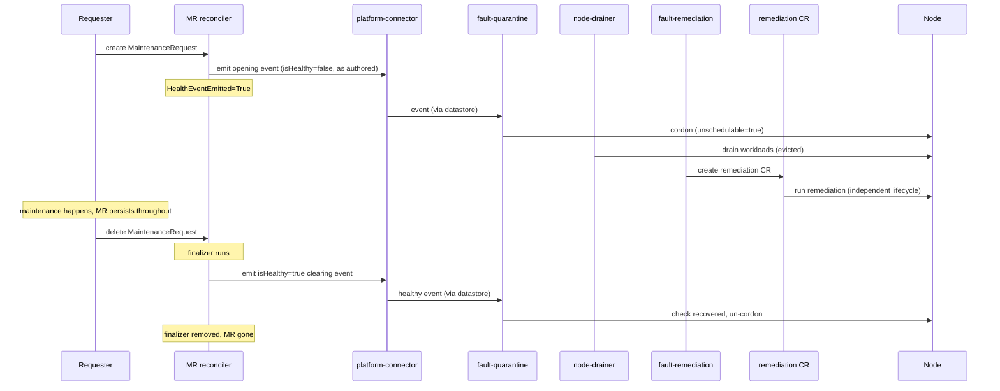

# ADR-049: API — MaintenanceRequest (MR)

## Context

[ADR-040](040-external-remediation-request.md) introduced the `ExternalRemediationRequest` (ERR) — the **exit door** from NVSentinel node ownership. When NVSentinel detects a fault it cannot remediate itself, it creates an ERR, releases the node to an external system, and waits for that system to signal completion.

ADR-040 does not cover the reverse: an external system that knows **maintenance is coming** for a node — a CSP maintenance notification, a planned hardware repair, an operator-scheduled intervention — and needs NVSentinel to prepare the node (cordon, drain) before the maintenance begins. NVSentinel has no fault of its own here; the signal originates outside the cluster.

Without a formal entry point, external automation must side-step NVSentinel (cordoning nodes directly, fighting over taints) or duplicate its quarantine and drain logic. Both undermine the ownership model established by ADR-040.

## Decision

Introduce a new CRD, `MaintenanceRequest` (MR), in the existing `nvsentinel.dgxc.nvidia.com` API group. MR is the **entry door**: an external system or human operator creates an MR to tell NVSentinel *"maintenance is incoming for this node — prepare it."*

- Created with a `healthEvent` describing the preparation NVSentinel should perform, and a `startTime` recording when the maintenance window opens.
- On create, the MR's `healthEvent` is emitted **as authored** — the creator chooses `recommendedAction`, and the pipeline routes it to the matching remediation (`CUSTOM` / `external-remediation` produces an ERR; `RESTART_VM` produces a RebootNode; etc.). Given the pipeline wiring in [Pipeline dependencies](#pipeline-dependencies), this drives the normal flow: quarantine (cordon), drain, and creation of the appropriate maintenance CR by `fault-remediation`.
- The MR then **persists until the entity that created it deletes it**. NVSentinel does not track the maintenance to completion; the MR's existence is the statement "this node is under maintenance."
- **Deletion is the clear.** Deleting the MR emits a matching `isHealthy=true` event that retracts the fault it raised, letting the normal quarantine-recovery path un-cordon the node.

MR is the inbound counterpart to ERR's outbound "NVSentinel is releasing this node." The external-remediation handoff is the canonical case, but MR drives any remediation the pipeline already supports.

## Open decision: what emits the MR's health events

The CRD is settled. **Where the emit-on-create / emit-on-delete logic lives is not.** Whatever hosts it needs a controller-runtime manager (to watch the CRD, and for a finalizer-based clear, to manage finalizers and status) *and* a health-event emitter (`healthpub.Publisher` over the platform-connector's node-local socket).

Two components are ruled out: **janitor** is a controller-runtime manager with a webhook server but emits no health events and node-maintenance coordination is not its remit; **csp-health-monitor** is a native emitter but a poll/emit loop with no manager, webhook server, or leader election.

The [Implementation](#implementation) section is written against **Option A**.

**Option A — a new `lifecycle-manager` component.** A dedicated home for controllers coordinating node lifecycle transitions: a controller-runtime manager with its own validating-webhook server, a platform-connector emitter, and a purpose-built MR reconciler.

**Option B — a `kubernetes-object-monitor` (KOM) policy.** KOM is already a controller-runtime manager that watches any configured GVK via TOML policy, evaluates CEL `predicate` and `nodeAssociation` expressions against the object, and publishes a health event on transition — **unhealthy when the object starts matching, healthy when it stops matching or is deleted**. That is precisely MR's open/close model, already built:

```toml
[[policies]]
name = "maintenance-request-reboot"
enabled = true
[policies.resource]
group = "nvsentinel.dgxc.nvidia.com"
version = "v1"
kind = "MaintenanceRequest"
[policies.predicate]
expression = 'resource.spec.action == "reboot"'
[policies.nodeAssociation]
expression = 'resource.spec.healthEvent.nodeName'
[policies.healthEvent]
componentClass    = "node"
isFatal           = false
message           = "Maintenance requested: node reboot"
recommendedAction = "RESTART_VM"
```

| | Option A (`lifecycle-manager`) | Option B (KOM policy) |
|---|---|---|
| New component / reconciler code | Yes | No — policy config only |
| Clear on delete | Finalizer-guaranteed, retried until submitted | Best-effort; on publish failure KOM logs, drops match state, and the clear is lost |
| Per-request event content | Yes — emitted as authored | No — `HealthEventSpec` is static TOML, and it has no `metadata` map |
| New fault type using an existing action | Pure API call, no config | New policy + release, unless it fits an existing one |
| Status on the MR | `HealthEventEmitted` condition | None — KOM writes no status to watched objects |
| Constrains what requesters can inject | No | Yes — the policy set is an operator-controlled gate |
| Survives restarts | Yes | Yes — match state is persisted in node annotations |

The per-request-content gap is closable with a contained KOM enhancement — sourcing event fields from the watched object (e.g. `fromField = "spec.healthEvent"`) — which would make Option B equivalent to Option A apart from the finalizer and status. The plumbing already carries the unstructured object to the evaluator.

## Implementation

Written against **Option A**; see [What changes under Option B](#what-changes-under-option-b) for the delta.

### Module layout

```text
data-models/
├── protobufs/maintenance_request.proto     (new)
└── pkg/protos/maintenance_request.pb.go    (generated)

distros/kubernetes/nvsentinel/charts/lifecycle-manager/     (new chart)
├── crds/maintenance_request.crd.yaml       (generated by protoc-gen-crd)
└── templates/                              (deployment + socket mount, clusterrole, webhook)

lifecycle-manager/                          (new component)
├── api/v1alpha1/                           (scheme registration, protojson marshal)
├── pkg/controller/maintenancerequest_controller.go
├── pkg/webhook/v1alpha1/maintenance_request_webhook.go
└── main.go                                 (manager + platform-connector emitter wiring)
```

### CRD schema

Proto-generated via `protoc-gen-crd`, matching the ERR pattern:

```proto
message MaintenanceRequestSpec {
  // healthEvent describes the preparation NVSentinel should perform. It is
  // re-emitted into the pipeline as authored (the creator's recommendedAction
  // stands) so the normal quarantine → drain → remediation flow fires for
  // whichever action the event names.
  HealthEvent healthEvent = 1;

  // startTime is when the maintenance window opens. Recorded for observability
  // and future scheduling; the node is prepared on creation today.
  google.protobuf.Timestamp startTime = 2;
}

message MaintenanceRequestStatus {
  // No completionTime: the MR is deleted to clear the fault, not retained.
  repeated Condition conditions = 1;
}

message MaintenanceRequest {
  option (protoc_gen_crd.k8s_crd) = {
    api_group: "nvsentinel.dgxc.nvidia.com",
    kind: "MaintenanceRequest",
    plural: "maintenancerequests",
    singular: "maintenancerequest",
    short_names: ["mr"],
    categories: ["nvsentinel"],
    scope: ST_CLUSTER,
    additional_columns: [
      {name: "Node",      type: CT_STRING, json_path: ".spec.healthEvent.nodeName"},
      {name: "StartTime", type: CT_STRING, format: CF_DATE, json_path: ".spec.startTime"}
    ]
  };
  MaintenanceRequestSpec spec = 1;
  MaintenanceRequestStatus status = 2;
}
```

### Example

```yaml
apiVersion: nvsentinel.dgxc.nvidia.com/v1
kind: MaintenanceRequest
metadata:
  name: csp-maintenance-ip-10-0-31-7
spec:
  startTime: "2026-05-13T03:00:00Z"
  healthEvent:
    agent: external-system
    checkName: csp-scheduled-maintenance
    componentClass: node
    recommendedAction: CUSTOM
    customRecommendedAction: external-remediation
    errorCode:
      - CSP-MAINT-AWS-EBS-RETIRE
    isFatal: false
    isHealthy: false
    message: "AWS scheduled maintenance 2026-05-13T03:00Z; node must be drained."
    metadata:
      cspEventId: evt-0a9bc8e74e2c2c10c
      source: aws-health
    nodeName: ip-10-0-31-7.us-west-2.compute.internal
    generatedTimestamp: "2026-05-13T02:00:00Z"
    id: he-mst-c6d92aa1-2f6e-4e8b-9e3d-b75f86b1aaaa
    version: 1
status:
  conditions:
    - type: HealthEventEmitted
      status: "True"
      reason: Emitted
      message: Submitted health event to platform-connector.
      lastTransitionTime: "2026-05-13T02:00:01Z"
      observedGeneration: 1
```

### Status conditions

| Condition | Initial | Terminal | Meaning |
|---|---|---|---|
| `HealthEventEmitted` | `Unknown (Initializing)` | `True (Emitted)` | The opening health event was successfully submitted to the platform-connector. |

One condition and no `completionTime` — the MR's lifecycle is *present = active, absent = cleared*, so there is no "cleared" state on a living object to track.

### MR reconciler state machine

**Init** (neither finalizer nor initial condition present):
1. Add the cleanup finalizer and seed `HealthEventEmitted=Unknown`.
2. Emit `spec.healthEvent` as authored, stamping the MR's name and UID into `healthEvent.metadata["maintenanceRequestName"]` / `["maintenanceRequestUID"]`. That metadata is **observability only** — it lets an operator trace a remediation back to the MR that triggered it; nothing consumes it and no other component changes for it.
3. On success set `HealthEventEmitted=True`; on failure return an error and requeue. The emit is gated on `HealthEventEmitted != True`, so a failed emission is retried rather than stranded.

**Open** (`HealthEventEmitted=True`): idle. The reconciler takes no further action and does **not** watch the remediation it triggered. The MR stays here until the requester deletes it.

**Finalizer** (DeletionTimestamp set):
1. If the opening event was emitted, emit the clearing event: `isHealthy=true` with the same `agent`/`checkName`/`nodeName` and `recommendedAction=NONE` (it must clear the check, not trigger a second remediation). If the opening event was never emitted, skip — there is no fault to retract.
2. On success remove the finalizer; on failure return an error and retry, so the MR is not removed until the clear has been submitted.

For this first iteration NVSentinel performs **no automatic cleanup** — the requester deletes the MR when it wants the node marked healthy again. Auto-deleting on remediation completion is deliberately deferred (see [Alternatives Considered](#alternatives-considered)).

MR and the remediation it triggers are otherwise fully decoupled: no owner-reference, label, or watch links them. The remediation CR runs its own lifecycle and is cleaned up by its own reconciler / TTL (ADR-040 for ERR, ADR-037 for the others).

### Validating admission webhook

| Check | On create | On update |
|---|---|---|
| `spec.healthEvent.nodeName` is non-empty | ✓ | ✓ |
| `spec.healthEvent.isHealthy` is `false` | ✓ | ✓ |
| Node named by `nodeName` exists | ✓ | — |
| `spec.healthEvent` is immutable | — | ✓ |
| No other MaintenanceRequest for the same node | ✓ | — |

The whole event is frozen, not just `nodeName`, because the clearing event reuses the original `agent`/`checkName`/`nodeName` to match the fault the MR opened — if those could drift, the clear would target a different check and silently fail to un-cordon. Rejecting `isHealthy=true` closes the other gap: a "healthy" opening event would mark the MR emitted without ever raising a fault.

The duplicate check is a best-effort early rejection, not a race guarantee: it uses an informer-backed lister, so two concurrent creates can both observe "no MR" and pass. The single-active invariant ultimately rests on idempotent downstream handling, not admission.

### RBAC

```text
# kubebuilder:rbac:groups=nvsentinel.dgxc.nvidia.com,resources=maintenancerequests,verbs=get;list;watch;update;patch
# kubebuilder:rbac:groups=nvsentinel.dgxc.nvidia.com,resources=maintenancerequests/status,verbs=get;update;patch
# kubebuilder:rbac:groups=nvsentinel.dgxc.nvidia.com,resources=maintenancerequests/finalizers,verbs=update
# kubebuilder:rbac:groups=core,resources=nodes,verbs=get;list;watch
```

No access to janitor's maintenance CRs is needed — the reconciler does not watch them. `nodes` is read-only, for the webhook's node-existence check. No other component needs new permissions.

### Sequence: MR lifecycle

Shown for the `CUSTOM` / external-remediation case; other actions follow the same shape with a different remediation CR.



## What changes under Option B

The CRD, the validation checks, and the pipeline behaviour are unchanged. There is no finalizer, no `HealthEventEmitted` condition, and no new component — so *Module layout*, *Status conditions*, *RBAC*, and the finalizer step of the state machine do not apply. Validation moves to CRD `x-kubernetes-validations` CEL rules, which cover non-empty `nodeName`, `isHealthy == false`, and `spec.healthEvent` immutability; only node-existence and the duplicate check need a webhook. Unless KOM gains object-sourced event fields, `spec.healthEvent` would shrink to a discriminator (e.g. `spec.action`) plus `nodeName` and `startTime`, with the event shape living in policy config.

## Pipeline dependencies

MR only *emits* an event; whether it flows through quarantine → drain → remediation depends on the pipeline being configured to act on it:

1. **A `fault-quarantine` ruleset that matches the MR-emitted event.** `fault-quarantine` cordons only events matching one of its rulesets, so a generic external-origin event matches none of the default agent/check-specific rulesets and is skipped — no cordon, no drain. A dedicated ruleset for MR-originated events (matched on the emitter's `agent`, say) covers every MR in one place. This is the only hard prerequisite, and it applies whatever the action.
2. **A `fault-remediation` action for the chosen `recommendedAction`.** Built-in actions (`RESTART_VM` → RebootNode, `TERMINATE_NODE` → TerminateNode, …) already have templates, so MR works against them today; only the `CUSTOM` / `external-remediation` path needs the not-yet-built action that renders an ERR. `fault-remediation` should also be **idempotent on re-publish** — the MR re-emits on retry and the datastore assigns each event its own id, so the producer must not create a second CR for a node that already has an active one.

Because the MR does not associate itself with the remediation it triggers, no association-label propagation or other cross-component plumbing is required.

## Consequences

**Positive:**
- Very small first iteration: two emissions, one condition, one finalizer — no cross-CRD watches, owner-references, or GC coupling, and no new code paths in any other component.
- Simple lifecycle (*present = active, absent = cleared*) with exactly one place the clear can happen, no matter who deletes the MR or why.
- Drives any pipeline-supported remediation, not just the ERR handoff.
- The requester controls when the node is returned — correct when the external maintenance window, not the in-cluster remediation, determines "done."

**Negative / tradeoffs:**
- **A forgotten MR leaves a node cordoned indefinitely.** Nothing reclaims it, so MRs become an operational surface that needs monitoring (e.g. alert on MRs well past their `startTime`). This is the main cost of dropping automatic cleanup.
- Deleting an MR always emits the clear, even if the remediation it triggered is still in flight — the node un-cordons while that remediation continues independently.
- MRs are not retained after completion, so there is no built-in historical record of completed maintenance.
- Under Option A, a new component to build and operate. Either way the emitter takes on an outbound dependency on the platform-connector socket.
- Requires a `fault-quarantine` ruleset matching MR-emitted events (and, for the `CUSTOM` case, the not-yet-built ERR-producing action) to land with or before MR.

## Alternatives Considered

**Where the emit logic lives** is an [open decision](#open-decision-what-emits-the-mrs-health-events), recorded above rather than settled here.

**Auto-delete the MR when the triggered remediation completes (deferred, not rejected).** The reconciler would watch janitor's maintenance CRs, associate one back to its MR, and delete the MR when it sets `Status.CompletionTime` — closing the loop without requiring the requester to act, and removing the forgotten-MR failure mode. Deferred because it costs cross-CRD watches, an association mechanism the pipeline must propagate, and read RBAC on janitor's CRs — and because "the remediation completed" is not always "the maintenance is over"; for an external repair the requester is the authority. The most likely follow-up once the basic flow is proven.

**Clear via a status condition + separate emit path.** An earlier model derived a "cleared" condition and emitted the clear on a distinct trigger, keeping the object after completion. Deletion-as-clear collapses that into one finalizer path and removes the retained-object machinery.

**MR reconciler directly creates the remediation CR, skipping the health event.** Simpler short-term but bypasses quarantine/drain entirely, making the creator responsible for draining first — violating the ADR-040 principle that every node handed to a remediation has passed through NVSentinel's quarantine and drain.

**MR as a label or annotation on the Node.** Simpler, but not observable as a first-class resource, not auditable via standard tooling, and it requires granting external systems `patch` on Nodes — a far broader privilege than `create` on one CRD.

## Testing

- **Reconciler unit tests:** opening emit (condition transitions + retry on failure); the finalizer emitting the clear on delete, including retry on failure and that the finalizer is not removed until the clear succeeds; skipping the clear when the opening event was never emitted; and the clearing event reusing the original `agent`/`checkName`/`nodeName` with `isHealthy=true` / `recommendedAction=NONE`.
- **Webhook unit tests:** one per row of the validation table.
- **E2E** (`tests/maintenance_request_test.go`):
  - Happy path: MR created → node quarantined/drained → ERR produced → MR deleted → node un-cordoned.
  - Action-agnostic: same with `recommendedAction=RESTART_VM` producing a RebootNode.
  - MR persists: the MR is not removed on its own while the remediation completes; the node stays cordoned until it is deleted.
  - Duplicate rejection: a second MR for the same node is rejected at admission.

## References

- [ADR-040: External Remediation Request](040-external-remediation-request.md) — the outbound handoff API this ADR complements.
- [ADR-036: Custom Remediation Actions](036-custom-remediation-actions.md) — defines the `CUSTOM` recommended-action path MR uses for the ERR case.
- [ADR-009: Fault Remediation Triggering](009-fault-remediation-triggering.md) — the pipeline the MR's health event flows through.
