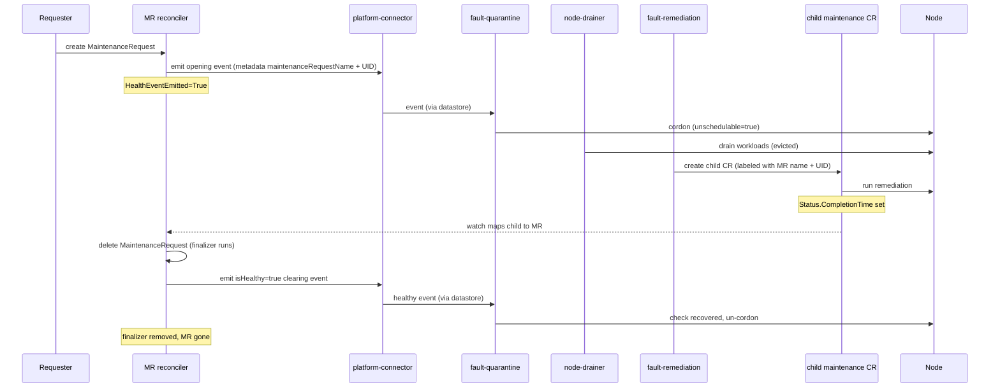
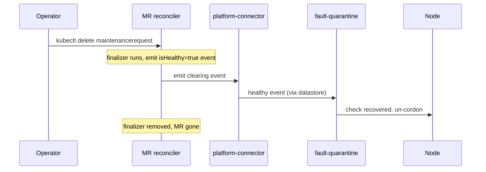

# ADR-049: API — MaintenanceRequest (MR)

## Context

[ADR-040](040-external-remediation-request.md) introduced the `ExternalRemediationRequest` (ERR) — the **exit door** from NVSentinel node ownership. When NVSentinel detects a fault it cannot remediate itself, it creates an ERR, releases the node to an external system, and waits for that system to signal completion.

ADR-040 covers the NVSentinel-initiated direction. It does not cover the reverse: an external system that knows **maintenance is coming** for a node — a CSP maintenance notification, a planned hardware repair, an operator-scheduled intervention — and needs NVSentinel to prepare the node (cordon, drain) before the maintenance begins. NVSentinel has no fault of its own here; the signal originates outside the cluster.

Without a formal entry point, external automation must side-step NVSentinel (cordoning nodes directly, fighting over taints) or duplicate its quarantine and drain logic. Both outcomes undermine the ownership model established by ADR-040.

## Decision

Introduce a new CRD, `MaintenanceRequest` (MR), in the existing `nvsentinel.dgxc.nvidia.com` API group. MR is the **entry door**: an external system or human operator creates an MR to tell NVSentinel *"maintenance is incoming for this node — prepare it."*

- Created with a `healthEvent` describing the preparation NVSentinel should perform, and a `startTime` recording when the maintenance window opens.
- On create, the MR reconciler emits the `healthEvent` **as authored** — the creator chooses `recommendedAction`, and the pipeline routes it to the matching remediation (`CUSTOM` / `external-remediation` produces an ERR; `RESTART_VM` produces a RebootNode; etc.). Provided the pipeline is configured to act on the event (see [Pipeline dependencies](#pipeline-dependencies)), this drives the normal NVSentinel flow: quarantine (cordon), drain, and creation of the appropriate maintenance CR by `fault-remediation`.
- The MR reconciler watches the resulting child maintenance CR (associated by a label the pipeline stamps). When the child reaches its terminal state (`Status.CompletionTime` — the signal shared by all janitor maintenance CRs), the reconciler **deletes the MR**.
- Deleting the MR — automatically on completion, or manually by an operator at any time — runs the MR's finalizer, which emits a matching `isHealthy=true` health event to **retract the fault** it raised, letting the normal quarantine-recovery path un-cordon the node. **Deletion is the clear.**

MR is the general entry door for signaling incoming node maintenance as a first-class, tracked Kubernetes object. It is the inbound counterpart to ERR's outbound "NVSentinel is releasing this node"; the external-remediation (ERR) handoff is the canonical case, but MR is not limited to it.

## Component: lifecycle-manager

The MR reconciler needs three capabilities together, and no existing component provides them:

1. **A controller-runtime manager + validating webhook** — to reconcile the CRD (finalizer, status, watching child CRs) and enforce admission checks.
2. **A health-event emitter** — a `healthpub.Publisher` over the platform-connector's node-local socket, to submit the opening event and the clearing event.
3. **Read access to janitor's maintenance CRs** — to observe the child reaching `CompletionTime`.

Neither existing candidate is a natural home:

- **janitor** is a controller-runtime manager with a webhook server, but it emits no health events today and node-maintenance *coordination* is not its remit — hosting MR would graft an emitter and a foreign responsibility onto a pure Kubernetes-API controller.
- **csp-health-monitor** is a native emitter but a poll/emit loop, **not** a controller-runtime app — no manager, no webhook server, no leader election.

So MR is hosted in a **new component, `lifecycle-manager`** — a dedicated home for controllers that coordinate node lifecycle transitions. It is built as a controller-runtime manager from the start, with its own validating-webhook server, a platform-connector emitter, and read access to the maintenance CRs it watches. This keeps the maintenance-coordination logic in one place instead of grafting it onto a component whose role it does not fit.

## Implementation

### Module layout

```text
data-models/
├── protobufs/
│   └── maintenance_request.proto          (new)
└── pkg/protos/
    └── maintenance_request.pb.go          (generated)

distros/kubernetes/nvsentinel/charts/lifecycle-manager/     (new chart)
├── crds/
│   └── maintenance_request.crd.yaml       (generated by protoc-gen-crd)
└── templates/
    ├── deployment.yaml                    (manager + platform-connector socket mount)
    ├── clusterrole.yaml                   (maintenancerequests + read on janitor maintenance CRs)
    └── webhook.yaml                       (MR validating webhook)

lifecycle-manager/                         (new component)
├── api/v1alpha1/
│   ├── maintenance_request_register.go    (scheme registration + wrapper type)
│   └── maintenance_request_json.go        (protojson marshal for spec/status)
├── pkg/controller/
│   └── maintenancerequest_controller.go   (MR reconciler)
├── pkg/webhook/v1alpha1/
│   └── maintenance_request_webhook.go     (MR validator)
└── main.go                                (manager + platform-connector emitter wiring)
```

### CRD schema

The CRD is proto-generated (via `protoc-gen-crd`), matching the ERR pattern:

```proto
message MaintenanceRequestSpec {
  // healthEvent describes the preparation NVSentinel should perform for the
  // incoming maintenance. The MR reconciler re-emits this event into the
  // pipeline as authored (the creator's recommendedAction stands) so the
  // normal quarantine → drain → remediation flow fires for whichever action
  // the event names.
  HealthEvent healthEvent = 1;

  // startTime is when the maintenance window opens. Recorded for observability
  // and future scheduling; the reconciler prepares the node on creation today.
  // (Deferring preparation until close to startTime is future work.)
  google.protobuf.Timestamp startTime = 2;
}

message MaintenanceRequestStatus {
  // conditions carry the MR's observable state. There is no completionTime —
  // the MR is deleted to clear the fault, not retained (see the state machine).
  repeated Condition conditions = 1;
}

message MaintenanceRequest {
  option (protoc_gen_crd.k8s_crd) = {
    api_group: "nvsentinel.dgxc.nvidia.com",
    kind: "MaintenanceRequest",
    plural: "maintenancerequests",
    singular: "maintenancerequest",
    short_names: ["mr"],
    categories: ["nvsentinel"],
    scope: ST_CLUSTER,
    additional_columns: [
      {name: "Node",      type: CT_STRING, json_path: ".spec.healthEvent.nodeName"},
      {name: "StartTime", type: CT_STRING, format: CF_DATE, json_path: ".spec.startTime"}
    ]
  };
  MaintenanceRequestSpec spec = 1;
  MaintenanceRequestStatus status = 2;
}
```

### Example

```yaml
apiVersion: nvsentinel.dgxc.nvidia.com/v1
kind: MaintenanceRequest
metadata:
  name: csp-maintenance-ip-10-0-31-7
spec:
  startTime: "2026-05-13T03:00:00Z"
  healthEvent:
    agent: external-system
    checkName: csp-scheduled-maintenance
    componentClass: node
    customRecommendedAction: external-remediation
    entitiesImpacted:
      - entityType: Node
        entityValue: ip-10-0-31-7.us-west-2.compute.internal
    errorCode:
      - CSP-MAINT-AWS-EBS-RETIRE
    generatedTimestamp: "2026-05-13T02:00:00Z"
    id: he-mst-c6d92aa1-2f6e-4e8b-9e3d-b75f86b1aaaa
    isFatal: false
    isHealthy: false
    message: "AWS scheduled maintenance 2026-05-13T03:00Z; node must be drained."
    metadata:
      cluster: nvcf-dgxc-k8s-aws-usw2-prod
      cspEventId: evt-0a9bc8e74e2c2c10c
      source: aws-health
    nodeName: ip-10-0-31-7.us-west-2.compute.internal
    recommendedAction: CUSTOM
    version: 1
status:
  conditions:
    - lastTransitionTime: "2026-05-13T02:00:01Z"
      message: >-
        Submitted health event he-mst-c6d92aa1 to platform-connector
        on node ip-10-0-31-7.us-west-2.compute.internal.
      observedGeneration: 1
      reason: Emitted
      status: "True"
      type: HealthEventEmitted
```

### Status conditions

| Condition | Initial | Terminal values | Meaning |
|---|---|---|---|
| `HealthEventEmitted` | `Unknown (Initializing)` | `True (Emitted)` | The opening health event was successfully submitted to the platform-connector. |

The MR carries a single condition and **no `completionTime`**. Its lifecycle is *present = maintenance active, absent = cleared*: the MR exists while the fault it raised is active and is **deleted** to clear it, so there is no "cleared" state on a living object to track.

### MR reconciler state machine

**Init** (first reconcile — neither finalizer nor initial condition present):
1. Add cleanup finalizer.
2. Seed `HealthEventEmitted=Unknown`.
3. Emit the health event from `spec.healthEvent` to the platform-connector **as authored** — the creator's `recommendedAction`/`customRecommendedAction` are passed through unchanged. Inject the MR's name and UID into `healthEvent.metadata["maintenanceRequestName"]` / `["maintenanceRequestUID"]` so `fault-remediation` can associate the child CR with this MR.
4. On success: set `HealthEventEmitted=True`. On failure: return error; controller-runtime requeues with backoff. The opening emit is gated on `HealthEventEmitted != True`, so a failed emission is retried rather than stranded.

**Watching** (`HealthEventEmitted=True`):
- Idle. The controller watches janitor's maintenance CRs (`RebootNode`, `TerminateNode`, `GPUReset`, `ExternalRemediationRequest`) and maps a child back to its MR by the association label (see *Associating the child with its MR*). When the mapped child sets `Status.CompletionTime`, the reconciler **deletes this MR** — which runs the finalizer below. If no child is ever created (e.g. the emitted event matches no remediation action), the MR stays here until an operator deletes it.

**Finalizer** (DeletionTimestamp set — reached via the reconciler's own delete on completion, *or* an operator delete at any time):
1. If the opening event was emitted (`HealthEventEmitted=True`), emit the clearing health event: a plain `isHealthy=true` event carrying the same `agent`/`checkName`/`nodeName` as the original with `recommendedAction=NONE` (it must clear the check, not trigger a second remediation).
2. On successful emit → remove the cleanup finalizer → the MR is removed. On emit failure → return error; the finalizer stays and controller-runtime retries.

This is the **single clearing path**: auto-completion and operator-delete both flow through the finalizer, so there is no separate "when do we emit the clear" logic. (Deliberate simplification: deleting an MR emits the clear even if a child remediation is still in flight — see [Consequences](#consequences).)

### Health-event emission (lifecycle-manager ↔ platform-connector)

`lifecycle-manager` publishes health events to the platform-connector over the node-local Unix domain socket (`healthpub.Publisher` → `PlatformConnector.HealthEventOccurredV1`) — the same ingress path the health monitors use. It emits twice over an MR's lifetime: the opening event that raises the fault (on create), and the `isHealthy=true` clearing event that retracts it (on delete). It is the synthetic health monitor for the external-origin fault, which no real monitor observes. This requires:

- **Socket mount.** The pod mounts the platform-connector's node-local socket via `hostPath` (`/var/run/nvsentinel`), exactly as the Deployment-type monitors (e.g. `csp-health-monitor`) do. The platform-connector runs as a per-node DaemonSet, so a socket is present on whatever node the (single, leader-elected) `lifecycle-manager` pod is scheduled to — co-location is guaranteed.
- **gRPC client.** A lazy `PlatformConnectorClient` (`grpc.NewClient`) wrapped by `healthpub.Publisher`. Lazy dialing means start-up never blocks on the socket; if the platform-connector is briefly unavailable, `Emit` fails, `HealthEventEmitted` stays `Unknown` (opening) or the finalizer stays (clearing), and the reconciler requeues.

### Associating the child with its MR

Instead of an `OwnerReference`, `fault-remediation` copies `metadata["maintenanceRequestName"]` and `metadata["maintenanceRequestUID"]` from the health event onto a **label** on whatever child CR it creates. The MR reconciler `Watches()` the maintenance CR types with a map function that resolves a child back to its MR by that label, and requires **both** name and UID to match — a name-only match could attach a stale child to an MR that was deleted and recreated with the same name. When the mapped child sets `Status.CompletionTime`, the reconciler deletes the MR.

There is deliberately **no owner-reference and no GC cascade**. Deleting the MR does not delete the child; the child completes and is cleaned up by its own reconciler / TTL (per ADR-040 for ERR, ADR-037 for the others). MR and child lifecycles are independent — the MR only *observes* the child's completion.

### No node lock

The MR reconciler does not acquire the cross-controller node-level lock (`NodeLock` / coordination Lease). The maintenance-CR reconciler (e.g. the ERR reconciler, per ADR-040) holds the lock for the node's active remediation lifetime. The MR reconciler's side effects are health-event emission and its own deletion; the child CR takes ownership of the lock from creation.

### Validating admission webhook

`lifecycle-manager` runs its own validating-webhook server:

| Check | On create | On update |
|---|---|---|
| `spec.healthEvent.nodeName` is non-empty | ✓ | ✓ |
| `spec.healthEvent.isHealthy` is `false` (an opening event must *raise* a fault, not clear one) | ✓ | ✓ |
| Node named by `nodeName` exists in the cluster | ✓ | — |
| `spec.healthEvent` is immutable (the whole event is frozen after creation) | — | ✓ |
| No other MaintenanceRequest for the same node | ✓ | — |

**Why the whole health event is frozen, not just `nodeName`.** The clearing event the finalizer emits reuses the original `agent`/`checkName`/`nodeName` so fault-quarantine's "check recovered" logic matches the fault the MR opened. If any of those could drift after the opening emit, the clearing event would target a different check and silently fail to un-cordon the node. Rejecting `isHealthy=true` closes the other gap: a "healthy" opening event would set `HealthEventEmitted=True` without ever raising a fault.

**The duplicate check is a best-effort early rejection, not a race guarantee.** Because MRs are deleted to clear, any MR for a node is active, so the check is simply "no other MR for this node," queried via an informer-backed lister. Two concurrent creates can still both observe "no MR" and both pass; the single-active invariant is ultimately upheld by idempotent downstream handling (dedup on node + name/UID — see [Pipeline dependencies](#pipeline-dependencies)), not by admission alone.

### RBAC

`lifecycle-manager`:

```text
# kubebuilder:rbac:groups=nvsentinel.dgxc.nvidia.com,resources=maintenancerequests,verbs=get;list;watch;update;patch;delete
# kubebuilder:rbac:groups=nvsentinel.dgxc.nvidia.com,resources=maintenancerequests/status,verbs=get;update;patch
# kubebuilder:rbac:groups=nvsentinel.dgxc.nvidia.com,resources=maintenancerequests/finalizers,verbs=update
# kubebuilder:rbac:groups=nvsentinel.dgxc.nvidia.com,resources=externalremediationrequests,verbs=get;list;watch
# kubebuilder:rbac:groups=janitor.dgxc.nvidia.com,resources=rebootnodes;terminatenodes;gpuresets,verbs=get;list;watch
# kubebuilder:rbac:groups=core,resources=nodes,verbs=get;list;watch
```

`fault-remediation` (new permission required for MR integration):

```text
# kubebuilder:rbac:groups=nvsentinel.dgxc.nvidia.com,resources=maintenancerequests,verbs=get;list;watch
```

### Sequence: MR happy path (auto-clear on completion)

This shows the `CUSTOM` / external-remediation case, where the child is an ERR. Other actions follow the same MR open/close shape with a different child (e.g. a RebootNode that runs and sets its own `CompletionTime`); the MR's auto-delete is triggered generically by the mapped child reaching `CompletionTime`.



### Sequence: MR operator delete



## Pipeline dependencies

MR only *emits* a health event; whether that event flows through quarantine → drain → remediation depends on the rest of the pipeline being configured to act on it. Because the creator chooses `recommendedAction`, how much is already wired depends on the action:

1. **A `fault-quarantine` ruleset that matches the MR-emitted event.** `fault-quarantine` cordons only events matching one of its rulesets; a generic external-origin event (e.g. a CSP-maintenance event) matches none of the default agent/check-specific rulesets and is skipped, so no cordon/drain occurs. The MR-emitted event must carry fields that match an existing ruleset, or a dedicated ruleset for MR-originated events must be added. This applies whatever the action.
2. **A `fault-remediation` action + association-label propagation.** For built-in actions (`RESTART_VM` → RebootNode, `TERMINATE_NODE` → TerminateNode, …) the action templates **already exist**, so MR works against them today; only the `CUSTOM` / `external-remediation` path additionally needs the not-yet-built action that renders an `ExternalRemediationRequest`. Independently, `fault-remediation` must be extended to copy `metadata["maintenanceRequestName"]` + `["maintenanceRequestUID"]` onto a **label** on whatever child CR it creates (so the MR reconciler can watch and associate it), and to be **idempotent on re-publish**: because the MR re-emits its opening event on retry and the datastore assigns each event its own id, the producer must not create a second CR for a node that already has an active one.

The quarantine-ruleset dependency is a sequencing requirement for any MR; the ERR-producing action is only required for the `CUSTOM` case; the association-label propagation is required for all cases.

## Rationale

**Single entry point for incoming maintenance.** Without MR, an external system either builds its own node-drain logic (duplicating NVSentinel's quarantine/drain chain) or side-steps NVSentinel entirely. MR reuses the whole existing pipeline with a single health-event emission.

**Reusing the existing health-event flow.** MR emits the same event payload NVSentinel-detected faults produce, so it reuses the existing quarantine/drain/remediation machinery rather than duplicating it — and because the creator picks `recommendedAction`, MR can drive any remediation the pipeline already knows how to run, not just the ERR handoff.

**Deletion-as-clear (in the finalizer).** Both ways an MR ends — the reconciler auto-deleting it on child completion, and an operator deleting it — converge on the same finalizer, which emits the clearing event. One code path, one place the clear can happen. This deliberately drops the earlier per-condition "when to clear" logic; finer coordination can be layered back on later.

**No owner-reference.** MR and child lifecycles are decoupled: the MR observes the child's completion via a label-based watch, and deleting the MR clears the fault without disturbing an in-flight or already-completed child (each maintenance CR owns its own cleanup). This removes the GC-cascade and `blockOwnerDeletion` machinery entirely.

**A dedicated component.** MR needs controller-runtime + a webhook + an emitter + read access to the maintenance CRs; grafting all of that onto janitor (a pure API controller) or csp-health-monitor (a poll/emit loop) fits neither. `lifecycle-manager` is a clean home.

**No node lock on MR.** The MR reconciler's only node-affecting side effect is emitting health events; all node mutations are performed by the downstream reconcilers that already participate in the node-lock protocol.

## Consequences

**Positive:**
- Simple lifecycle: *present = active, absent = cleared*, with a single clearing path.
- General entry door — MR drives any pipeline-supported remediation, not just the ERR handoff.
- No owner-reference / GC coupling between MR and its child.
- A dedicated component keeps maintenance-coordination logic out of components whose role it does not fit.

**Negative / tradeoffs:**
- Deleting an MR always emits the clear, even if a child remediation is still in flight — the node un-cordons while the child continues its own lifecycle independently. This is a deliberate simplification; coordinating deletion with in-flight children (waiting for the child, or refusing to clear early) is future work.
- MRs are **not retained** after completion (deleted to clear), so there is no built-in historical record of completed maintenance — deferred.
- New component to build and operate (image, chart, RBAC, webhook certs, leader election, deployment), plus an outbound dependency on the platform-connector socket.
- The MR path depends on pipeline wiring that does not exist purely for MR: a `fault-quarantine` ruleset that matches MR-emitted events, and `fault-remediation` association-label propagation on whatever child CR it creates (only the `CUSTOM` case additionally needs the not-yet-built ERR-producing action). These must land with, or before, MR.
- The webhook's duplicate and node-existence checks use an informer-backed lister — a best-effort guard, not a transactional uniqueness constraint.

## Alternatives Considered

**Host the reconciler in janitor or csp-health-monitor.** Covered in [Component: lifecycle-manager](#component-lifecycle-manager) — neither fits without grafting on a capability (an emitter, or a whole controller-runtime + webhook stack) it lacks.

**Clear via a status condition + separate emit path (the earlier model).** The MR would watch its child, derive a "cleared" condition, and emit the clear on a distinct trigger, keeping the object around after completion. Deletion-as-clear collapses that into one finalizer path and removes the retained-object and owner-reference machinery.

**MR reconciler directly creates the child CR (skipping the health event).** Simpler short-term but bypasses the quarantine/drain pipeline entirely; the creator would be responsible for draining the node first. This violates the ADR-040 principle that every node handed to a remediation has passed through NVSentinel's quarantine and drain.

**MR as a label or annotation on the Node.** Placing the signal on the Node object is simpler but not observable as a first-class Kubernetes resource, not auditable via standard tooling, and not independently addressable.

## Testing

- Unit tests for the MR reconciler: opening emit (`HealthEventEmitted` transitions + retry on failure), the child watch mapping a completed child (any maintenance kind) back to its MR and auto-deleting it, the finalizer emitting the clearing event on delete (both auto and operator paths, including retry when the clearing emit fails), and skipping the clear when the opening event was never emitted.
- Webhook unit tests: empty nodeName rejected, non-existent nodeName rejected, `isHealthy=true` opening event rejected, `spec.healthEvent` immutable on update, duplicate MR for the same node rejected.
- E2E (`tests/maintenance_request_test.go`):
  - Happy path (external-remediation): MR created → node quarantined/drained → ERR appears (labeled) → ERR `CompletionTime` set → MR auto-deleted → clearing event emitted → node un-cordoned.
  - Non-CUSTOM action: MR created with `recommendedAction=RESTART_VM` → RebootNode child appears → RebootNode `CompletionTime` set → MR auto-deleted → node un-cordoned (validates the child-agnostic completion trigger).
  - Operator delete: `kubectl delete` an open MR → clearing event emitted → node un-cordoned.
  - Duplicate rejection: second MR for the same node is rejected at admission.

## References

- [ADR-040: External Remediation Request](040-external-remediation-request.md) — the outbound handoff API this ADR complements.
- [ADR-036: Custom Remediation Actions](036-custom-remediation-actions.md) — defines the `CUSTOM` recommended-action path MR uses for the ERR case.
- [ADR-009: Fault Remediation Triggering](009-fault-remediation-triggering.md) — the fault-remediation pipeline the MR's health event flows through.
