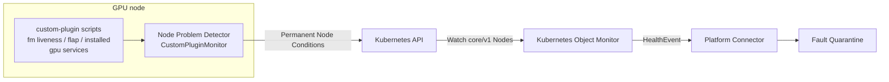

# ADR-050: Monitoring — GPU System Services via NPD Custom Plugins

- **Status:** Proposed
- **Date:** 2026-03-20 (revised 2026-09-09; re-homed onto the ADR-053 NPD
  integration path)
- **Author:** dmvevents
- **Reviewers:** XRFXLP, lalitadithya, deesharma24

## Context

NVSentinel has no monitoring of the *systemd unit layer* on GPU nodes. The
existing monitors observe adjacent layers:

- `gpu-health-monitor` polls DCGM via `pydcgm` for per-GPU device telemetry
  (PCIe, NVLink, thermal). With DCGM 4.5.2 its health watches also surface the
  per-GPU **fabric probe state** (`DCGM_FR_FABRIC_PROBE_STATE`: registration
  NotStarted / InProgress / Failed). It does not observe host process state:
  the fabric field is a **latched registration outcome**, not daemon liveness —
  issue #883's Node 1 showed `fabric.state` still reporting the pre-death value
  while `nvidia-fabricmanager` had been dead for 2.5 weeks, and the DCGM status
  enum has no value meaning "FM is not running".
- `syslog-health-monitor` tails journald/kernel logs for XID/SXID,
  fallen-off-bus, NIC errors, and GPU-reset events. It owns the journal-parsing
  machinery but does not observe systemd unit state.

Neither monitor can tell whether `nvidia-fabricmanager` is *running*, is
crash-looping under `Restart=`, or whether `nvidia-persistenced` is up. On
NVSwitch platforms a Fabric Manager that dies **after** registration completed
silently degrades multi-GPU workloads while the latched DCGM fabric state and
every log-level check still report healthy.

[ADR-053](053-npd-checks-integration.md) has since settled how NVSentinel
consumes node-level host checks: node-problem-detector (NPD) publishes
permanent Node Conditions, Kubernetes Object Monitor (KOM) watches
`core/v1/Node` with per-condition policies, and matching conditions become
HealthEvents on the existing platform-connector path. NVSentinel does **not**
install or configure NPD — several CSPs preinstall it, each slightly
differently — so anything NPD-side ships as documentation and reference
configuration that the operator applies to their own NPD deployment.

This ADR defines the systemd-layer checks as an extension of that path:
NPD `CustomPluginMonitor` configuration for the GPU-critical host services,
plus the opt-in KOM policies that turn the resulting conditions into
remediation-bearing HealthEvents. Earlier revisions of this ADR proposed a
dedicated in-tree monitor DaemonSet; that component is withdrawn in favor of
the shared NPD/KOM machinery.

## Problem Statement

Service-level health signals fall into two buckets relative to what NVSentinel
already collects:

1. **Already covered** — per-GPU device health and, since DCGM 4.5.2, per-GPU
   fabric registration/probe state are owned by `gpu-health-monitor`;
   journald/kernel log signals are owned by `syslog-health-monitor`.

2. **Not covered by any monitor** — systemd unit state: Fabric Manager process
   liveness and crash-loop (flap) behavior, and GPU-support service lifecycle
   (e.g. `nvidia-persistenced`). These require active host probing.

The design goal is to add the second bucket without re-collecting the first,
and — per ADR-053 — without introducing a new collection pipeline when the
NPD → KOM → HealthEvent path already exists for exactly this class of
node-local host check.

## Decision

Deliver GPU system-service monitoring as three documentation-and-configuration
artifacts, with no new NVSentinel component:

1. **NPD `CustomPluginMonitor` configuration** (documented; applied by the
   operator to their NPD install): plugin scripts probing systemd for the
   GPU-critical services, publishing four permanent Node Conditions.
2. **Opt-in KOM policies** following the ADR-053 pattern
   (`values-npd-remediation.yaml`): one policy per condition, carrying this
   ADR's taxonomy — fatality, error code, and per-condition recommended
   action.
3. **Operator documentation** covering script installation, NPD monitor
   configuration on the common deployment shapes (DaemonSet and host service,
   including preinstalled-NPD variants), and enabling the KOM policies.

Because the checks are active probes (unlike ADR-053's `SystemLogMonitor`
rules), a healthy observation clears its condition: the latching caveat noted
in ADR-053 does not apply to these checks.

## Check inventory

| Check | Description | NPD monitor | Type | Rationale | Action |
| --- | --- | --- | --- | --- | --- |
| `FabricManagerDown` | `nvidia-fabricmanager` unit is loaded but not `active`. On NVSwitch platforms a dead FM stops NVLink error-recovery coordination and new fabric registrations while DCGM's latched fabric state still reads healthy. | `CustomPluginMonitor` | Permanent | The systemd liveness gap is the core signal no existing monitor sees (issue #883). | `RESTART_BM` |
| `FabricManagerFlapping` | FM is crash-looping: the restarts observed inside a sliding window reach a threshold. Detected via systemd `NRestarts` deltas with reset disambiguation (below); reported independently of instantaneous `ActiveState`, which a crash-looping unit reads as `active` at most probe instants. | `CustomPluginMonitor` | Permanent | A flap condition tied to instantaneous liveness would be masked by whichever state the probe caught. | `RESTART_BM` |
| `FabricManagerNotInstalled` | The `nvidia-fabricmanager` unit is absent (`LoadState=not-found`) on a platform where the operator declared it required. Distinguishes misconfiguration from "disabled on purpose". | `CustomPluginMonitor` | Permanent | A silently missing FM on an NVSwitch platform hides exactly the failure class these checks exist for. | `CONTACT_SUPPORT` |
| `<Service>Down` (e.g. `NvidiaPersistencedDown`) | A configured GPU-support service is loaded but not `active`. **One condition type per service**: NPD binds each permanent rule to exactly one condition by type, so a shared condition would let one service's result overwrite another's status. The reference configuration ships `NvidiaPersistencedDown`; additional services follow the same naming pattern with their own rule, condition, and KOM policy. | `CustomPluginMonitor` | Permanent | Support-service lifecycle has no DCGM watch. | `CONTACT_SUPPORT` |

Platform applicability replaces the earlier in-monitor `fm-presence` flag with
configuration presence: operators of NVSwitch fleets install the
`FabricManagerNotInstalled` check (the `required` semantics); PCIe-only fleets
simply omit it, and the liveness check skips a `not-found` unit rather than
reporting it down (`auto`); omitting the FM checks entirely is `disabled`.

## Implementation

### Plugin script contracts

Scripts follow the NPD custom-plugin protocol: exit `0` healthy, `1`
unhealthy, any other value unknown; the message on stdout becomes the
condition message.

- **`check_fm_active.sh`** — `systemctl show nvidia-fabricmanager
  --property=LoadState,ActiveState,SubState`. `LoadState=not-found` exits `0`
  (not applicable on this host); `ActiveState=active` exits `0`; otherwise
  exits `1` with the sub-state in the message. A probe failure (systemd/D-Bus
  unreachable, timeout) exits with the unknown status — "could not observe" is
  not evidence of "down".
- **`check_fm_flapping.sh`** — reads `NRestarts` and
  `ExecMainStartTimestamp`, keeps its baseline and restart-window samples in a
  state file on the **host's** `/run` (tmpfs: state is boot-scoped by
  construction, and a crash loop spanning node reboots is out of scope here —
  cross-boot recurrence belongs to fault-management's
  recurrence-after-remediation escalation). The state-file contract is part of
  the operator documentation and applies per NPD deployment shape:
  - **Host-service NPD:** the script writes
    `/run/nvsentinel-npd/fm-flap.state` directly.
  - **DaemonSet NPD:** the pod MUST hostPath-mount the host's
    `/run/nvsentinel-npd` at the same path — a pod-local `/run` would reset
    the baseline on every pod replacement, silently weakening flap detection
    without a node reboot. If an operator chooses not to mount it, the
    boot-scoped guarantee explicitly degrades to pod-scoped and the
    documentation says so.
  - The state directory is `root:root` mode `0700`; updates are atomic
    (write temp file + `rename`); an unreadable or invalid state file is
    treated as a fresh baseline (re-baseline, no phantom restart
    observations).

  `NRestarts` is not monotonic and a decrease is not itself a restart:
  `systemctl reset-failed` flushes the counter without restarting the process.
  On a decrease the script re-baselines, and records a restart observation
  only when `ExecMainStartTimestamp` changed across the reset; a pure counter
  flush records nothing. Exits `1` while the windowed count is at or above the
  threshold (defaults: 3 restarts within 600 s), `0` once the window drains.
- **`check_fm_installed.sh`** — exits `1` when `LoadState=not-found`, `0`
  otherwise. Only installed by operators declaring FM required.
- **`check_gpu_service.sh <unit>`** — the liveness contract of
  `check_fm_active.sh`, parameterized; one NPD rule per configured service.

The scripts require the same host visibility NPD's own service checks use
(access to systemd via D-Bus or `systemctl`); the documentation records the
requirement for both host-service and DaemonSet NPD deployments rather than
prescribing one privilege model, since the operator owns the NPD install.

To keep UNKNOWN distinct from DOWN under NPD's exit-code protocol, each script
bounds its own probes (e.g. `systemctl` with an internal timeout **shorter
than** the rule's `timeout`): a wedged probe then reports as the script's own
deliberate exit — unknown when the service could not be observed — rather
than as an NPD plugin timeout, and a genuinely stopped service always reports
as unhealthy within one interval.

### Reference NPD configuration

The complete `CustomPluginMonitor` configuration ships in the operator
documentation, which also pins the NPD release the reference was validated
against (the exit-status and permanent-condition contract used here is per
NPD's `custom_plugin_monitor` documentation and predates the current release
line). Every permanent rule references a condition declared in `conditions`
with its healthy default — NPD rejects a configuration that omits this.
Abbreviated to one service for readability; each additional GPU service adds
one condition, one rule, and one KOM policy under the same pattern:

```json
{
  "plugin": "custom",
  "pluginConfig": {
    "invoke_interval": "30s",
    "timeout": "15s",
    "max_output_length": 120,
    "concurrency": 1
  },
  "source": "nvsentinel-gpu-services",
  "metricsReporting": false,
  "conditions": [
    { "type": "FabricManagerDown", "reason": "FabricManagerActive", "message": "nvidia-fabricmanager is active" },
    { "type": "FabricManagerFlapping", "reason": "FabricManagerStable", "message": "nvidia-fabricmanager restart rate is normal" },
    { "type": "FabricManagerNotInstalled", "reason": "FabricManagerInstalled", "message": "nvidia-fabricmanager unit is present" },
    { "type": "NvidiaPersistencedDown", "reason": "NvidiaPersistencedActive", "message": "nvidia-persistenced is active" }
  ],
  "rules": [
    { "type": "permanent", "condition": "FabricManagerDown", "reason": "FabricManagerNotActive", "path": "/etc/npd-plugins/check_fm_active.sh", "timeout": "12s" },
    { "type": "permanent", "condition": "FabricManagerFlapping", "reason": "FabricManagerFlapping", "path": "/etc/npd-plugins/check_fm_flapping.sh", "timeout": "12s" },
    { "type": "permanent", "condition": "FabricManagerNotInstalled", "reason": "FabricManagerUnitNotFound", "path": "/etc/npd-plugins/check_fm_installed.sh", "timeout": "12s" },
    { "type": "permanent", "condition": "NvidiaPersistencedDown", "reason": "NvidiaPersistencedNotActive", "path": "/etc/npd-plugins/check_gpu_service.sh", "args": ["nvidia-persistenced"], "timeout": "12s" }
  ]
}
```

The `FabricManagerNotInstalled` condition and rule are included only by
operators declaring FM required (see platform applicability above).

### Architecture



### KOM policies

Provided as opt-in values in the ADR-053 pattern, excluded from defaults for
the same reason: NVSentinel does not own the NPD install, and an operator may
already have different ownership or remediation rules for these conditions.
Each policy watches `core/v1/Node`, matches its condition at
`status == "True"` with the expected reason, and keeps identity fields stable
between unhealthy and healthy HealthEvents.

The `FabricManagerDown` policy:

```yaml
- name: NPDFabricManagerDown
  enabled: true
  resource:
    group: ""
    version: v1
    kind: Node
  predicate:
    expression: |
      resource.status.conditions.exists(c,
        c.type == "FabricManagerDown" &&
        c.status == "True" &&
        c.reason == "FabricManagerNotActive")
  healthEvent:
    componentClass: Node
    isFatal: true
    message: "NPD reported nvidia-fabricmanager is not running"
    recommendedAction: RESTART_BM
    errorCode:
      - NPD_FABRIC_MANAGER_NOT_RUNNING
```

The remaining three follow the same shape with their own reasons, codes, and
actions: `NPDFabricManagerFlapping` (fatal, `RESTART_BM`,
`NPD_FABRIC_MANAGER_FLAPPING`, reason `FabricManagerFlapping`),
`NPDFabricManagerNotInstalled` (fatal, `CONTACT_SUPPORT` — there is no unit to
restart, and a reboot will not install one;
`NPD_FABRIC_MANAGER_NOT_INSTALLED`, reason `FabricManagerUnitNotFound`), and
`NPDNvidiaPersistencedDown` (non-fatal, `CONTACT_SUPPORT`,
`NPD_NVIDIA_PERSISTENCED_NOT_RUNNING`, reason `NvidiaPersistencedNotActive`) —
one policy per per-service condition, matching the check inventory.

**Recovery semantics and their limits.** A KOM predicate matches only
`status == "True"` with the expected reason; anything else — including an
`Unknown` condition after a plugin timeout, or the condition reset that
follows an NPD restart — reads as the predicate not matching, which KOM
reports as the healthy transition. Two consequences, stated deliberately:

- The plugin scripts minimize the `Unknown` window by bounding their own
  probes (above), so a down service reports as `True` again within one
  `invoke_interval` even after a transient unknown or an NPD restart — the
  false-recovery window is bounded by the probe interval, unlike the
  log-matched ADR-053 rules, which cannot re-detect at all.
- Within that window the ADR-053 mitigations apply verbatim: do not restart
  NPD mid-remediation, and do not treat a post-restart or post-unknown
  `False`/absent condition as proof of recovery. Making KOM itself
  distinguish `Unknown` from `False` (three-state condition handling) would
  harden every ADR-053 check equally; it is a platform-level follow-up, not
  re-specified per check here.

## Signal Ownership

| Signal | Source | Owner |
|--------|--------|-------|
| PCIe / NVLink / thermal / clock | DCGM health watches via `pydcgm` | `gpu-health-monitor` |
| DCGM host-engine connectivity | `pydcgm` connect | `gpu-health-monitor` |
| NVSwitch fabric registration / probe state | `DCGM_FR_FABRIC_PROBE_STATE` (DCGM ≥ 4.5.2) | `gpu-health-monitor` |
| XID / SXID and journal-pattern signals | journald/kernel log parsing | `syslog-health-monitor` |
| Filesystem / platform-hardware conditions | upstream default NPD rules | NPD + KOM (ADR-053) |
| FM liveness, flap, presence; GPU service lifecycle | NPD custom plugins (this ADR) | NPD + KOM (operator-applied config) |

## Remediation classification: restart-fixable vs. hardware-return

Operational experience on NVSwitch platforms (NVL72/36) shows Fabric Manager
faults span two remediation classes: some clear with a service restart or node
reboot, while NVSwitch hardware faults have required returning entire racks. A
single node-local probe cannot make that distinction, and this ADR does not
pretend it can:

- **`recommendedAction` is the safe first try, not a verdict.** `RESTART_BM`
  on FM-down/flapping means the cheapest step with a real chance of clearing
  the fault; it does not assert the fault is software.
- **Classification is cross-signal and belongs downstream.** NVSwitch/SXID
  hardware errors arrive via `syslog-health-monitor`, fabric-probe failures
  via `gpu-health-monitor`, and unit-lifecycle conditions via this path;
  `health-events-analyzer` / fault-management see all three plus remediation
  history. FM-down recurring shortly after an executed `RESTART_BM` should
  escalate to `CONTACT_SUPPORT` rather than loop reboots, and FM faults
  correlated with NVSwitch/SXID errors on the same node should escalate
  directly.

## Rationale

- Reuses the ADR-053 pipeline end to end: no new collector, DaemonSet,
  privileged pod, transport, or transition cache — KOM already owns the Node
  watch, deduplication, and health-event publishing.
- The reviewed detection semantics survive intact in the plugin contracts:
  presence-as-configuration replaces the tri-state flag, the
  reset-vs-restart rule and boot-scoped window carry over verbatim, and
  UNKNOWN (probe failure) stays distinct from DOWN via the NPD exit-code
  protocol.
- Active custom-plugin probes clear their conditions on recovery, avoiding
  the `SystemLogMonitor` latching documented in ADR-053.
- One collection path per signal is preserved (ownership table above).

## Consequences

### Positive

- Systemd-layer coverage for GPU-critical services with zero new NVSentinel
  components to build, ship, or operate.
- Operators on CSP-preinstalled NPD reuse their existing NPD deployment.
- Per-condition remediation mapping (`RESTART_BM` vs `CONTACT_SUPPORT`)
  arrives through the same opt-in values mechanism as ADR-053.

### Negative

- Not out-of-the-box: the operator must apply the NPD configuration and
  enable the KOM policies; fleets without NPD must deploy it first.
- Node Conditions carry only reason/message — the richer per-check metadata
  of the earlier in-tree design (e.g. `n_restarts`, `sub_state`) is reduced
  to the condition message text.
- The flap window's state file is a per-host contract the documentation must
  specify precisely (location under `/run`, format, boot-scoped lifetime).
- NPD restarts clear these conditions; as with ADR-053, a post-restart
  `False` is not proof of recovery, though the next probe cycle re-detects a
  still-broken service (bounded by the plugin interval, unlike the
  log-matched rules).

## References

- [ADR-053: Monitoring — Integrate Default NPD Node Conditions](053-npd-checks-integration.md)
- [Node Problem Detector](https://github.com/kubernetes/node-problem-detector)
- [Kubernetes Object Monitor configuration](../configuration/kubernetes-object-monitor.md)
- Issue #883 — NVSentinel not detecting fabric health on H100s
