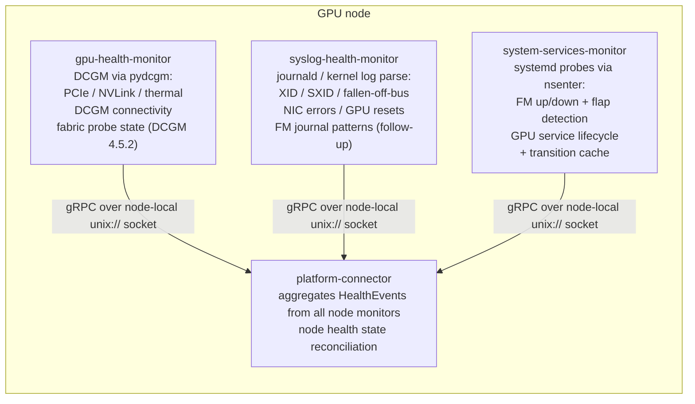

# ADR-050: System Services Monitor — Scope and Event Taxonomy

- **Status:** Proposed
- **Date:** 2026-03-20 (revised 2026-08-27)
- **Author:** dmvevents
- **Reviewers:** XRFXLP, lalitadithya

## Context

NVSentinel has no monitoring of the *systemd unit layer* on GPU nodes. The
existing monitors observe adjacent layers:

- `gpu-health-monitor` polls DCGM via `pydcgm` for per-GPU device telemetry
  (PCIe, NVLink, thermal). With DCGM 4.5.2 its health watches also surface the
  per-GPU **fabric probe state** (`DCGM_FR_FABRIC_PROBE_STATE`: registration
  NotStarted / InProgress / Failed). It does not observe host process state:
  the fabric field is a **latched registration outcome**, not daemon liveness —
  issue #883's Node 1 showed `fabric.state` still reporting the pre-death value
  while `nvidia-fabricmanager` had been dead for 2.5 weeks, and the DCGM status
  enum has no value meaning "FM is not running".
- `syslog-health-monitor` tails journald/kernel logs for XID/SXID,
  fallen-off-bus, NIC errors, and GPU-reset events. It owns the journal-parsing
  machinery (filtering, dedup) but does not observe systemd unit state.

Neither monitor can tell whether `nvidia-fabricmanager` is *running*, is
crash-looping under `Restart=`, or whether `nvidia-persistenced` is up. On
NVSwitch platforms a Fabric Manager that dies **after** registration completed
silently degrades multi-GPU workloads (no NVLink error-recovery coordination,
no servicing of new registrations) while the latched DCGM fabric state and
every log-level check still report healthy — the failure is in the *service
layer*, which nothing currently watches.

`system-services-monitor` fills exactly that gap: a node-local monitor for
systemd-unit health of GPU-critical services. This ADR defines its scope, the
boundaries against `gpu-health-monitor` and `syslog-health-monitor`, and the
health-event taxonomy it emits.

## Problem Statement

Service-level health signals fall into two buckets relative to what NVSentinel
already collects:

1. **Already covered** — per-GPU device health (PCIe, NVLink, clock throttling)
   and, since DCGM 4.5.2, per-GPU fabric **registration/probe state** are owned
   by `gpu-health-monitor` through DCGM health watches; journald/kernel log
   signals (XID/SXID, NIC errors, GPU resets) are owned by
   `syslog-health-monitor`.

2. **Not covered by any monitor** — systemd unit state: Fabric Manager process
   liveness and crash-loop (flap) behavior, and GPU-support service lifecycle
   (e.g. `nvidia-persistenced`). These require active systemd probing that does
   not fit a passive DCGM polling loop or a journal tail.

The design goal is to add the second bucket **without** re-collecting the first.
Re-scraping DCGM-visible signals would create a second collection path for the
same underlying data, with divergent polling intervals, thresholds, and event
semantics, and would split the source of truth for GPU device health.

## Options Evaluated

### Option A: One monitor collects everything (DCGM re-scrape)

A single new monitor collects FM service health *and* re-derives PCIe/NVLink/clock
telemetry by scraping the DCGM exporter over HTTP.

| Advantage | Disadvantage |
|-----------|-------------|
| Single component for all fabric-related checks | Re-implements DCGM polling already in `gpu-health-monitor` |
| No changes to `gpu-health-monitor` | HTTP-scraped metrics are derived; `pydcgm` is authoritative |
| | Divergent thresholds and event semantics |
| | Redundant DCGM client code |

**Assessment:** Not recommended. Creates duplication and a source-of-truth conflict.

### Option B: Scope split — device health stays in DCGM path, services get a focused monitor

Keep DCGM-visible checks in `gpu-health-monitor` via `pydcgm`. Add
`system-services-monitor` scoped only to non-DCGM service health.

| Advantage | Disadvantage |
|-----------|-------------|
| Aligns device checks with the existing DCGM-based monitor | Needs a clear event taxonomy across monitors |
| Avoids HTTP-scraping duplication | |
| Keeps the new monitor focused on what DCGM cannot see | |
| Reuses the existing health-event envelope and gRPC transport | |

**Assessment:** Recommended.

### Option C: Fold service checks into `gpu-health-monitor`

Add FM systemd checks and fabric-state probes into `gpu-health-monitor`.

| Advantage | Disadvantage |
|-----------|-------------|
| Single binary for all node health | Active probes (`systemctl`, `nvidia-smi`) risk stalling the DCGM polling loop |
| | Mixes passive telemetry with active service probing |
| | `gpu-health-monitor` is not designed for host-level daemon state |

**Assessment:** Not recommended. Architectural mismatch.

## Recommendation

Adopt **Option B: Scope split**.

### Device-health signals stay in `gpu-health-monitor`

DCGM-visible signals — PCIe link health (`DCGM_HEALTH_WATCH_PCIE`), NVLink fabric
(`DCGM_HEALTH_WATCH_NVLINK`), and thermal/clock throttling
(`DCGM_HEALTH_WATCH_THERMAL`) — remain owned by `gpu-health-monitor` via the
existing `pydcgm` path and are explicitly **out of scope** for
`system-services-monitor`. "Future degradation-detection work" on these signals
means additional policy or processing built *on top of* the existing DCGM health
watches, tracked in `gpu-health-monitor`; it does **not** mean re-implementing or
re-scraping those watches here. `system-services-monitor` adds no DCGM watches and
opens no DCGM client. DCGM service health itself (the `nv-hostengine` process) is
also excluded, because `gpu-health-monitor` already reports it as
`GpuDcgmConnectivityFailure`.

### Service-health signals go to `system-services-monitor`

`system-services-monitor` is scoped to what neither DCGM nor the journal can
see — the systemd unit layer:

- Whether `nvidia-fabricmanager` is running or crash-looping (`NRestarts` flap
  detection)
- Whether GPU-support services (e.g. `nvidia-persistenced`) are up

These require active systemd probing that does not belong in a passive DCGM
polling loop or a journal tail.

### Signals delegated to the existing monitors

Two signals that earlier drafts placed here are delegated to the monitors that
already own the relevant machinery, keeping exactly one collection path per
signal:

- **Per-GPU fabric registration/probe state** (NotStarted / stuck InProgress /
  Failed) is DCGM-visible as of 4.5.2: `gpu-health-monitor` enables all health
  watches and maps `DCGM_FR_FABRIC_PROBE_STATE` in `dcgmerrorsmapping.csv`, and
  its Dockerfile already pins DCGM 4.5.2. Re-probing the same NVML field via
  `nvidia-smi` here would duplicate that watch.
- **Fabric Manager journal-error patterns** (NVSwitch errors, initialization
  failures, timeouts) belong in `syslog-health-monitor`, which already owns
  journald tailing, filtering, and dedup — its scope has grown the same way for
  NIC errors and GPU-reset detection. Adding those FM patterns there is a small
  follow-up to that module; a second journal reader in this monitor would
  duplicate its machinery.

## Signal Ownership

| Signal | Source | Owner |
|--------|--------|-------|
| PCIe link downtraining | `DCGM_HEALTH_WATCH_PCIE` via `pydcgm` | `gpu-health-monitor` |
| NVLink degradation | `DCGM_HEALTH_WATCH_NVLINK` via `pydcgm` | `gpu-health-monitor` |
| GPU clock / thermal throttling | `DCGM_HEALTH_WATCH_THERMAL` via `pydcgm` | `gpu-health-monitor` |
| DCGM host-engine connectivity | `pydcgm` connect | `gpu-health-monitor` |
| NVSwitch fabric registration / probe state | `DCGM_FR_FABRIC_PROBE_STATE` health watch (DCGM ≥ 4.5.2) | `gpu-health-monitor` |
| XID / SXID errors | journald/kernel log parsing | `syslog-health-monitor` |
| Fabric Manager journal-error patterns | journald pattern scan (follow-up patterns) | `syslog-health-monitor` |
| Fabric Manager up/down | `nsenter` → `systemctl show` (`ActiveState`/`SubState`) | `system-services-monitor` |
| Fabric Manager flapping | `systemctl show NRestarts` + restart-window tracking | `system-services-monitor` |
| GPU service lifecycle (`nvidia-persistenced`) | `nsenter` → `systemctl show` | `system-services-monitor` |

## Detection Mechanism

`system-services-monitor` runs a polling loop (`--poll-interval`, default 30s) that
executes host probes via `nsenter -t 1 -m --` into PID 1's mount namespace. There
is **no HTTP health endpoint** — `nvidia-fabricmanager` does not expose one — so
detection is unit-state and query based:

- **Fabric Manager service state:** `systemctl show nvidia-fabricmanager
  --property=LoadState,ActiveState,SubState,MainPID,ExecMainStartTimestamp`. The
  service is considered up when `ActiveState == "active"`. `NRestarts` is
  queried in a separate `systemctl show` call for compatibility with older
  systemd that omits it from combined property lists.
- **Flap detection:** each new restart (delta in `NRestarts`) is timestamped into a
  per-service deque; the service is "flapping" when the number of restarts inside
  the window (`--flap-window`, default 600s) reaches the threshold
  (`--flap-threshold`, default 3). `NRestarts` is not monotonic — it resets on
  `systemctl reset-failed`, unit re-creation, and reboot — and a decrease is
  **not** itself evidence of a restart: `systemctl reset-failed` flushes the
  counter without restarting the process. A decrease therefore re-baselines
  tracking, and a restart observation is recorded only when
  `ExecMainStartTimestamp` changed across the reset (the main process really
  did restart — unit re-creation, reboot, crash-then-reset). A pure counter
  flush on a running service records nothing, while a service whose crashes
  cause reboots still does not go dark to flap detection.
- **GPU service lifecycle:** the same `systemctl show` probe for each service in the
  configured list (default `nvidia-persistenced`).

Every host probe is bounded (`systemctl show` runs with a 10 s timeout). A
probe that fails or times out yields **unknown** state — the monitor logs the
failure and increments the check-error counter
(`fabric_monitor_check_errors_total{check_name}`) but emits no HealthEvent, because
"the probe could not observe the service" is not evidence that the service is
down. A hung systemd or D-Bus therefore costs at most one bounded check, and
cannot wedge the polling loop into false `*_NOT_RUNNING` reporting.

Applicability is checked before health: `LoadState` is queried alongside
`ActiveState`. What a missing unit (`LoadState=not-found`) *means* is
platform-dependent — on a PCIe-only node it is "disabled on purpose", while on
an NVSwitch platform it is a misconfiguration that would otherwise silently
hide exactly the failure class this monitor exists to catch. Fabric Manager
presence is therefore an explicit tri-state (`--fm-presence`, env
`FM_PRESENCE`, chart value `fabricManager.presence`):

- `auto` (default): `LoadState=not-found` is treated as "not applicable on
  this platform" and skipped — no `*_NOT_RUNNING` event.
- `required`: `LoadState=not-found` is a misconfiguration and emits a fatal
  `FABRIC_MANAGER_NOT_INSTALLED` event with `CONTACT_SUPPORT` — deliberately
  not `RESTART_BM`, because there is no unit to restart and a reboot will not
  install one. Operators of NVSwitch fleets SHOULD set `required`.
- `disabled`: the FM check never runs, regardless of unit presence.

The generic GPU-service list keeps plain `auto` semantics: that list is shared
fleet-wide configuration, and a listed-but-absent optional support service is
not evidence of misconfiguration. Only Fabric Manager — the daemon whose
absence breaks NVSwitch platforms — carries the tri-state.

A boot grace period (`--boot-grace-period`, default 300s) suppresses unhealthy
alerts during node startup for all service checks.
Suppression happens at result generation: a suppressed failure produces no
`CheckResult`, so it never reserves or commits a transition-cache entry (see
Cached State). When the grace period expires the condition is re-evaluated from
scratch; a still-unhealthy service is then an unseen key (or a
healthy-to-unhealthy transition) and emits normally.

### FM readiness (Phase 1)

Fabric Manager is considered ready when it is **systemd `active`** and not
flapping. Registration-progress health is observed by `gpu-health-monitor`'s
DCGM fabric-probe watch (see *Signals delegated*), so the two monitors jointly
cover "the daemon is alive" and "registration succeeded". An explicit local
API/socket responsiveness probe is deferred as a future refinement, not a
Phase-1 prerequisite, because the systemd unit exposes no health endpoint.

## Architecture



Transport from a monitor to `platform-connector` is gRPC over a **node-local Unix
domain socket** (`grpc.insecure_channel("unix://<socket>")`), not a network
connection, so no TLS is required on this hop. (The gRPC-TLS decision in
ADR-030 applies to the janitor-controller ↔ janitor-provider path, which is a
different, potentially cross-namespace connection, and is out of scope here.)

Skipping TLS does not mean the socket is open to arbitrary local clients.
Authorization on this hop is filesystem access control, stated here as
enforceable requirements rather than an assumption: the socket directory
(`/var/run/nvsentinel`) MUST be owned `root:root` with mode `0750` or
stricter, the socket file MUST NOT be group- or world-writable, and the
directory MUST be mounted only into the NVSentinel DaemonSets (no other
workload mounts that hostPath). Under those invariants, connecting to the
socket — and therefore injecting a forged `HealthEvent` — requires root (or an
equivalently privileged pod) on the node, a principal that could already forge
any node-local signal directly. These are deployment invariants the chart owns
and a reviewer can verify in the DaemonSet spec, not properties the monitor
re-checks at runtime. Server-side peer authorization (e.g. an `SO_PEERCRED`
check in `platform-connector` before accepting remediation-triggering events)
would harden every monitor on this hop equally; it is a
`platform-connector`-level item shared by all existing monitors, not a
per-monitor concern, and is deliberately not re-specified here.

## Event Model

`system-services-monitor` reuses the existing `HealthEvent` envelope — no new
transport model is required. Every event sets a coarse `checkName` for the
category and carries the specific condition in `errorCode`.

| Condition | `checkName` | `errorCode` | `isFatal` | `recommendedAction` |
|-----------|-------------|-------------|-----------|---------------------|
| FM not running | `FabricManagerServiceDown` | `FABRIC_MANAGER_NOT_RUNNING` | true | `RESTART_BM` |
| FM crash-looping | `FabricManagerFlapping` | `FABRIC_MANAGER_FLAPPING` | true | `RESTART_BM` |
| FM expected but not installed (`--fm-presence=required` only) | `FabricManagerNotInstalled` | `FABRIC_MANAGER_NOT_INSTALLED` | true | `CONTACT_SUPPORT` |
| GPU support service down | `GpuServiceDown` | `GPU_SERVICE_NOT_RUNNING` | false | `CONTACT_SUPPORT` |

Flapping is its own `checkName`, not an enrichment code on a "down" event: a
crash-looping service under `Restart=` reads `active` at most poll instants,
so a flap condition tied to `FabricManagerServiceDown` would be masked by
whichever instantaneous state the poll happened to catch. `FabricManagerFlapping`
emits when the restart threshold is crossed — regardless of the instantaneous
`ActiveState` — and recovers independently once the window drains. Each
`checkName` is its own transition-state machine in the entity cache, so a
crash-looping FM typically raises `FabricManagerFlapping` (stable while the
loop persists) alongside an oscillating `FabricManagerServiceDown`, and
remediation keyed on either fires without racing the other's recovery.

The table above is the **complete Phase-1 taxonomy**, deliberately small:

- The fabric-state codes of earlier drafts (`FM_NOT_STARTED` /
  `FM_REGISTRATION_STUCK` / `FM_FABRIC_ERROR`) are removed — that signal is
  owned by `gpu-health-monitor`'s DCGM 4.5.2 fabric-probe watch (see *Signals
  delegated*), which already maps `DCGM_FR_FABRIC_PROBE_STATE` through
  `dcgmerrorsmapping.csv`.
- The `JOURNAL_*` codes of earlier drafts are removed — journal-pattern
  detection belongs to `syslog-health-monitor` (see *Signals delegated*), and
  events from this monitor carry systemd evidence only (`sub_state`,
  `n_restarts`); the flap condition is carried by the `FabricManagerFlapping`
  event itself, not duplicated as metadata on other events.
- There is deliberately no `FM_UNRESPONSIVE` code. A dedicated responsiveness
  probe — and with it a distinct unresponsive code, its detection threshold,
  and its `HealthEvent` mapping — is deferred together with the local
  API/socket probe described under *FM readiness (Phase 1)*; it must be added
  to this table before any implementation emits it.

### Remediation classification: restart-fixable vs. hardware-return

Operational experience on NVSwitch platforms (NVL72/36) shows Fabric Manager
faults span two very different remediation classes: some clear with a service
restart or node reboot (config/driver mismatch after an upgrade, transient
init races), while others — NVSwitch hardware faults — have required returning
entire racks. A node-local poller cannot make that distinction from one
observation, and this ADR does not pretend it can:

- **`recommendedAction` is the safe *first* try, not a verdict.**
  `RESTART_BM` on FM-down/flapping means "restart the service / reboot the
  node is the cheapest step with a real chance of clearing this"; it does not
  assert the fault is software.
- **Classification is cross-signal and belongs downstream.** The signals that
  separate the two classes arrive on different paths: NVSwitch/SXID hardware
  errors via `syslog-health-monitor`, fabric-probe failures via
  `gpu-health-monitor`, and unit-lifecycle evidence (`n_restarts`, flapping,
  `sub_state`) via this monitor. `health-events-analyzer` /
  fault-management — which see all three streams plus remediation history —
  are where "restart-fixable" hardens into "hardware-return":
  - FM-down that **recurs after a remediation** (the node re-enters
    `FabricManagerServiceDown` shortly after a `RESTART_BM` was executed)
    should escalate to `CONTACT_SUPPORT` rather than loop reboots.
  - FM-down or flapping **correlated with NVSwitch/SXID hardware errors** from
    `syslog-health-monitor` on the same node should escalate directly.
- **This monitor's obligation is evidence, not policy:** transition-only
  events with absolute state, `n_restarts`/`sub_state` metadata, the
  `FabricManagerFlapping` condition, and timestamps — exactly the inputs
  recurrence- and correlation-based escalation needs. Encoding the escalation rules is fault-management policy
  and is out of scope here.

### HealthEvent schema

Events populate the shared `HealthEvent` protobuf. Fields set by this monitor:

| Field | Type | Value |
|-------|------|-------|
| `version` | int | `1` |
| `agent` | string | `"system-services-monitor"` |
| `componentClass` | string | `"INFRASTRUCTURE"` |
| `checkName` | string | category (table above) |
| `isFatal` | bool | per condition (table above) |
| `isHealthy` | bool | `false` on failure, `true` on recovery |
| `message` | string | human-readable detail |
| `recommendedAction` | enum `RecommendedAction` | `RESTART_BM` (fatal) / `CONTACT_SUPPORT` (non-fatal) / `NONE` (healthy) |
| `errorCode` | repeated string | condition codes (table above) |
| `entitiesImpacted` | repeated `Entity` | `{entityType, entityValue}` — `NODE:<node>` (all Phase-1 checks are node-scoped) |
| `metadata` | map<string,string> | check-specific context |
| `generatedTimestamp` | Timestamp | event time |
| `nodeName` | string | node the monitor runs on |
| `processingStrategy` | enum `ProcessingStrategy` | `EXECUTE_REMEDIATION` (default) or `STORE_ONLY` |

Example — Fabric Manager down (fatal, node-scoped):

```json
{
  "version": 1,
  "agent": "system-services-monitor",
  "componentClass": "INFRASTRUCTURE",
  "checkName": "FabricManagerServiceDown",
  "isFatal": true,
  "isHealthy": false,
  "message": "Fabric Manager is failed on gpu-node-07",
  "recommendedAction": "RESTART_BM",
  "errorCode": ["FABRIC_MANAGER_NOT_RUNNING"],
  "entitiesImpacted": [{"entityType": "NODE", "entityValue": "gpu-node-07"}],
  "metadata": {"sub_state": "failed", "n_restarts": "4"},
  "nodeName": "gpu-node-07",
  "processingStrategy": "EXECUTE_REMEDIATION"
}
```

Example — GPU support service down (non-fatal, node-scoped):

```json
{
  "version": 1,
  "agent": "system-services-monitor",
  "componentClass": "INFRASTRUCTURE",
  "checkName": "GpuServiceDown",
  "isFatal": false,
  "isHealthy": false,
  "message": "Service nvidia-persistenced is dead on gpu-node-07",
  "recommendedAction": "CONTACT_SUPPORT",
  "errorCode": ["GPU_SERVICE_NOT_RUNNING"],
  "entitiesImpacted": [{"entityType": "NODE", "entityValue": "gpu-node-07"}],
  "metadata": {"service_name": "nvidia-persistenced", "sub_state": "dead"},
  "nodeName": "gpu-node-07",
  "processingStrategy": "EXECUTE_REMEDIATION"
}
```

## Cached State

`system-services-monitor` emits **state transitions only**, not per-cycle events.
The event processor keeps an in-memory `entity_cache` so an unchanged condition is
not re-sent every poll interval.

- **Key:** `"<checkName>|<entityType>:<entityValue>[|svc:<service_name>]"`,
  built from the impacted entities sorted by `(entityType, entityValue)` so
  key construction is order-independent (e.g.
  `FabricManagerServiceDown|NODE:gpu-node-07`). Checks that cover **multiple
  instances per entity** append the instance identity: `GpuServiceDown` probes
  every service in the configurable list against the same NODE entity, so its
  key includes `metadata["service_name"]`
  (`GpuServiceDown|NODE:gpu-node-07|svc:nvidia-persistenced`) — without it,
  two different services down on one node would collide on a single cache
  entry and suppress or overwrite each other's transitions.
- **Value:** `CachedEntityState(is_fatal, is_healthy, error_codes)` — the last
  emitted state for that key, where `error_codes` is the normalized (sorted,
  de-duplicated) condition-code set. An event is sent when the key is unseen or
  any of the three fields differs from the cached value, so a code-only
  change within one `checkName` emits a new event even though the
  fatal/healthy flags are unchanged. (With flapping split into its own
  `checkName`, the Phase-1 checks each carry a single code today; the
  code-set comparison stays in the contract so future multi-code checks
  inherit it.)
  Normalization keeps the comparison order-independent for equivalent code sets.
- **Concurrency:** the read-decide-write sequence is guarded by a
  `threading.Lock`. Callbacks fire on a `ThreadPoolExecutor`, so without the lock
  two overlapping callbacks could observe the same stale entry and both emit while
  one blocks in the gRPC send. Under the lock, the new state is *reserved* into the
  cache immediately (before the send) so a concurrent callback skips the duplicate.
- **Rollback:** the gRPC send retries with backoff — up to 5 attempts, each with
  a 10 s per-attempt deadline, with exponential inter-attempt sleeps (2 s
  initial, ×1.5, capped at 15 s). Worst case is therefore ~66 s: up to 50 s of
  attempt deadlines plus ~16 s of backoff sleeps. If the send ultimately fails or raises, the
  reserved cache entries are rolled back (popped) so the next poll cycle
  re-attempts those events. Both the rollback **and the success-path commit**
  are **generation-safe**: each reservation object is its own token, and either
  path first verifies the cache still holds *its* reservation for the key
  before acting. A failed older send only pops an entry that is still its own
  reservation, and a slow older send that completes after a newer overlapping
  callback replaced the entry MUST NOT commit its now-stale state over the
  newer one — in both cases the newer state is preserved. The cache is only
  committed as the authoritative last-sent state after a successful send whose
  reservation token still matches.
- **Lifetime:** in-memory for the life of the process; there is no persistence, so
  the cache is empty on restart and the first post-restart cycle re-establishes
  current state.

### Ordering and idempotency

The rollback machinery above protects the monitor's *local* record of what was
sent. This section states the end-to-end delivery contract it sits inside, so
the guarantees and non-guarantees are explicit rather than implied:

- **Delivery is at-least-once.** `HealthEventOccurredV1` enqueues server-side
  before returning, so a call that times out on the client may still have been
  accepted; the monitor's retry (and the next-cycle re-emission after a
  rollback) can then deliver the same transition again. The monitor does not
  attempt exactly-once and consumers MUST NOT assume it.
- **Duplicates are identifiable by a stable dedup key.** A transition's
  identity is `(nodeName, checkName, sorted entitiesImpacted, instance
  identity — service_name where applicable, normalized errorCode set,
  isFatal, isHealthy)` — the same tuple the entity cache keys on. Because the cache suppresses identical consecutive transitions at the
  source, the monitor never *intentionally* emits the same tuple twice in a
  row for an entity: any identical consecutive pair observed downstream is a
  transport-level retry duplicate and is safe to drop. Applying a duplicate is
  also harmless by construction — transitions carry absolute state
  (`isFatal`/`isHealthy`/codes), not increments. The `HealthEvent.id` proto
  field is the natural carrier for this key if connector-side deduplication is
  enabled (it is off by default today); populating it is an implementation
  follow-up, not assumed by this design.
- **Per-entity emission order is monotone at the source.** Callback dispatch
  is serialized (single-worker executor, submission order == execution order),
  and one cycle's transitions travel in one RPC, so this monitor never emits a
  newer transition for an entity before an older one. Reordering *after*
  acceptance — concurrent RPCs from other monitors, connector-internal
  queueing — is outside this monitor's control. Transitions carry
  `generatedTimestamp`; a consumer that needs strict per-entity ordering
  SHOULD reject a transition older than the newest it has applied for the same
  `(checkName, entity)` key (stale-generation rejection).
- **Non-goal, stated deliberately:** enforcing ordering or idempotency inside
  `HealthEventOccurredV1`/platform-connector (stable-ID dedup, per-entity
  sequence numbers) would harden every monitor on this hop equally; like the
  socket peer-authorization item above, it is a platform-connector-level
  concern shared by all existing monitors and is not re-specified per-monitor
  here. This design's obligation is to make such enforcement *possible* — the
  dedup key, absolute-state transitions, and source-side ordering above are
  exactly the inputs it needs.

### False-positive mitigations

- **Boot grace period** (default 300s): suppress unhealthy alerts during node
  startup.
- **Flap detection**: only flag Fabric Manager as flapping when restarts within the
  configurable window exceed the threshold, rather than on any single restart.

## Scope

In scope for `system-services-monitor`:

- Fabric Manager systemd health (`ActiveState`/`SubState`, `LoadState` gating)
- Fabric Manager flap detection (`NRestarts` window tracking)
- GPU support-service lifecycle (`nvidia-persistenced`)
- gRPC client (Unix domain socket), state caching, structured logging, CLI

Out of scope (owned elsewhere):

- PCIe, NVLink, thermal/clock telemetry — `gpu-health-monitor` (DCGM watches)
- Per-GPU fabric registration/probe state — `gpu-health-monitor`
  (`DCGM_FR_FABRIC_PROBE_STATE`, DCGM ≥ 4.5.2)
- DCGM host-engine connectivity — `gpu-health-monitor` (`GpuDcgmConnectivityFailure`)
- XID / SXID kernel events and journal-pattern detection (including the
  Fabric Manager journal patterns) — `syslog-health-monitor`
- Restart-vs-hardware-return escalation policy — `health-events-analyzer` /
  fault-management (see *Remediation classification*)

### Integration testing

- Device-level faults handled only by `gpu-health-monitor`
- Journal/kernel-log signals handled only by `syslog-health-monitor`
- Systemd service-level faults handled only by `system-services-monitor`
- No two monitors emit events for the same *signal* (one collection path per
  signal). Within this monitor, one root cause may intentionally raise
  multiple **distinct conditions** — a crash-looping FM raises
  `FabricManagerFlapping` (restart rate) alongside an oscillating
  `FabricManagerServiceDown` (instantaneous liveness); these are different
  conditions with independent recovery, not duplicate events for one
  condition, and each is deduplicated under its own check name
- State-cache deduplication verified (transition-only emission)
- HealthEvent schema compatibility over gRPC

## Consequences

### Positive
- Adds systemd-layer monitoring that no existing monitor provides
- Exactly one collection path per signal: no overlap or source-of-truth
  conflict with DCGM device/fabric health or with journal parsing
- Keeps `system-services-monitor` minimal (systemd probes only — no DCGM
  client, no `nvidia-smi`, no journal reader)
- Preserves consistent event semantics across monitors
- Explicit, testable ownership boundary against `gpu-health-monitor` and
  `syslog-health-monitor`

### Negative
- Adds a third node-local monitor DaemonSet to operate
- Requires the event taxonomy above to stay in sync with remediation policy in
  `platform-connector`
- Fabric-probe coverage depends on `gpu-health-monitor` running DCGM ≥ 4.5.2
  (already pinned in its Dockerfile)
- The Fabric Manager journal patterns require a small follow-up in
  `syslog-health-monitor` before journal-level FM detection exists anywhere
