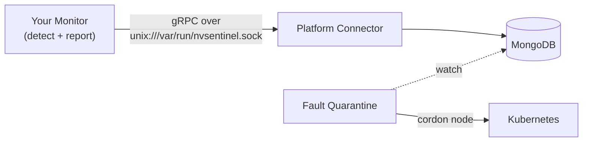

# Tutorial: Writing a New Health Monitor

This tutorial walks you through building a brand-new NVSentinel **health monitor**
from an empty directory to a deployed, remediation-triggering component — without
needing any GPU hardware.

By the end you will have:

- A working Go health monitor that detects a fault and reports it to NVSentinel.
- A container image for it.
- A Helm subchart that deploys it and an enable flag (`global.<yourMonitor>.enabled`).
- A fault-quarantine rule that acts on its events.
- Unit tests and the production-grade publishing path.

> **Who is this for?** Developers new to NVSentinel. You need to know basic Go and
> Kubernetes. You do **not** need to understand NVSentinel internals first — this
> document explains everything you need as you go.

> **Just want the AI to do it?** Jump to [Appendix C: One-shot AI prompt](#appendix-c-one-shot-ai-prompt).

---

## 1. What a health monitor is (the 2-minute version)

NVSentinel detects faults on cluster nodes and remediates them (cordon → drain →
break-fix). The thing that *detects* a fault is a **health monitor**.

A health monitor is just a standalone process that:

1. Observes something (GPU via DCGM, kernel logs, a cloud API, a file in `/proc`, …).
2. Decides whether a node/component is healthy or not.
3. Sends a **`HealthEvent`** to the **platform-connector** over a local **gRPC Unix
   domain socket**.

Everything downstream (persisting to MongoDB, cordoning, draining, remediation) is
handled by NVSentinel core modules. **Your monitor only has to detect and report.**



Key consequences of this design:

- Your monitor **never talks to the Kubernetes API** to cordon/drain. It only emits events.
- The transport is a **Unix socket on the node**, shared via a `hostPath` volume.
- The contract is a single gRPC method and a single message type. That's all you implement.

---

## 2. The contract (the only API you must speak)

The contract lives in [`data-models/protobufs/health_event.proto`](../../data-models/protobufs/health_event.proto).
Go types are generated into the package `github.com/nvidia/nvsentinel/data-models/pkg/protos`.

There is exactly **one RPC**:

```protobuf
service PlatformConnector {
  rpc HealthEventOccurredV1(HealthEvents) returns (google.protobuf.Empty) {}
}

message HealthEvents {
  uint32 version = 1;             // set to 1
  repeated HealthEvent events = 2;
}
```

You send a batch (`HealthEvents`) containing one or more `HealthEvent`s.

### The `HealthEvent` message

| Field | Type | Required? | Notes |
|-------|------|-----------|-------|
| `version` | uint32 | yes | Set to `1`. |
| `agent` | string | yes | Your monitor's name, e.g. `"demo-health-monitor"`. Remediation rules match on this. |
| `componentClass` | string | yes | Logical component, e.g. `"GPU"`, `"NIC"`, `"Node"`. |
| `checkName` | string | yes | The specific check, e.g. `"DemoHealthCheck"`. |
| `isHealthy` | bool | yes | `true` = recovery/clear; `false` = a fault. |
| `isFatal` | bool | yes | `true` means "serious enough to act on". Quarantine rules typically require `isFatal == true`. |
| `message` | string | recommended | Human-readable description. |
| `nodeName` | string | yes (node faults) | The affected node. Usually from the `NODE_NAME` env (downward API). |
| `recommendedAction` | enum | recommended | See [Appendix A](#appendix-a-recommendedaction-values). Use `NONE` for healthy events. |
| `customRecommendedAction` | string | optional | Used with `recommendedAction = CUSTOM` to name a custom remediation action. |
| `generatedTimestamp` | Timestamp | yes | `timestamppb.Now()`. |
| `processingStrategy` | enum | yes | `EXECUTE_REMEDIATION` (act on it) or `STORE_ONLY` (observe only). |
| `entitiesImpacted` | repeated Entity | optional | Sub-components affected, e.g. `{entityType:"GPU", entityValue:"3"}`. |
| `errorCode` | repeated string | optional | Vendor/error codes. |
| `metadata` | map<string,string> | optional | Free-form key/values. |
| `quarantineOverrides` / `drainOverrides` | BehaviourOverrides | optional | `{force, skip}` to override default cordon/drain behaviour. |
| `id` | string | optional | Leave empty; platform-connector assigns one. |

The two enums you care about:

```protobuf
enum ProcessingStrategy {
  UNSPECIFIED = 0;          // normalized to EXECUTE_REMEDIATION by platform-connector
  EXECUTE_REMEDIATION = 1;  // normal: downstream modules may cordon/drain/remediate
  STORE_ONLY = 2;           // observability-only: persisted/exported, never mutates the cluster
}
```

`RecommendedAction` is enumerated in [Appendix A](#appendix-a-recommendedaction-values).

### The golden rules

1. **`agent` is your identity.** Remediation rules are written against it. Pick a stable, unique name.
2. **Emit on state transitions, not every poll.** Send an unhealthy event when a fault
   appears and a healthy event when it clears. Don't spam an identical event every tick.
3. **A healthy event clears the condition.** Send `isHealthy=true`, `recommendedAction=NONE`
   when things recover.
4. **`isFatal=true` is what triggers action.** Informational events can be `isFatal=false`.

---

## 3. Choose your workload model

Two shapes, pick based on what you observe:

| Model | Use when | K8s kind | Example monitors |
|-------|----------|----------|------------------|
| **Per-node poller** | You read node-local state (`/proc`, `/sys`, DCGM, journald) | **DaemonSet** | gpu-, syslog-, nic-health-monitor |
| **Cluster watcher** | You watch the K8s API or an external/cloud API | **Deployment** | kubernetes-object-monitor, slurm-drain-monitor, csp-health-monitor |

This tutorial builds a **per-node poller** (a DaemonSet) because it's the most common
and the simplest to reason about. The differences for a Deployment are noted in
[section 9](#9-variant-cluster-watcher-deployment).

Our worked example: a **`demo-health-monitor`** that reports a node unhealthy whenever a
*trigger file* is present, and healthy again once it's removed. You flip the fault on and
off by creating or deleting a file — nothing to actually break — so it's ideal for
learning the flow and runs on any laptop.

---

## 4. Scaffold the module

All monitors live under `health-monitors/<name>/`. Create the directory and Go module:

```bash
cd health-monitors
mkdir demo-health-monitor
cd demo-health-monitor
go mod init github.com/nvidia/nvsentinel/health-monitors/demo-health-monitor
```

Create `go.mod` with the two local replace directives every monitor uses (the module
path is resolved locally, not from a registry):

```go
module github.com/nvidia/nvsentinel/health-monitors/demo-health-monitor

go 1.26.0

toolchain go1.26.3

require (
	github.com/nvidia/nvsentinel/data-models v0.0.0
	google.golang.org/grpc v1.81.1
	google.golang.org/protobuf v1.36.12-0.20260120151049-f2248ac996af
)

// data-models lives in the repo; resolve it locally.
replace github.com/nvidia/nvsentinel/data-models => ../../data-models
```

> We add `commons` (for the production publisher) in [section 8](#8-level-up-to-production-grade).
> For the first working version we only need `data-models`.

---

## 5. Write the monitor

Create `main.go`. The structure is: parse config from env → dial the socket → poll →
build an event on each state change → send it.

```go
// Copyright (c) 2026, NVIDIA CORPORATION. All rights reserved.
// Licensed under the Apache License, Version 2.0.

package main

import (
	"context"
	"fmt"
	"log/slog"
	"os"
	"os/signal"
	"strconv"
	"syscall"
	"time"

	"google.golang.org/grpc"
	"google.golang.org/grpc/credentials/insecure"
	"google.golang.org/protobuf/types/known/timestamppb"

	pb "github.com/nvidia/nvsentinel/data-models/pkg/protos"
)

const (
	agentName      = "demo-health-monitor"
	componentClass = "Node"
	checkName      = "DemoHealthCheck"
)

func main() {
	if err := run(); err != nil {
		slog.Error("fatal error", "error", err)
		os.Exit(1)
	}
}

func run() error {
	// --- Configuration from environment ---
	nodeName := os.Getenv("NODE_NAME")
	if nodeName == "" {
		return fmt.Errorf("NODE_NAME env var must be set")
	}
	// triggerFile is our stand-in for "something is wrong on this node".
	// Create the file to simulate a fault; delete it to clear the fault.
	triggerFile := envOrDefault("TRIGGER_FILE", "/host/run/nvsentinel-demo-trigger")
	socketPath := envOrDefault("SOCKET_PATH", "/var/run/nvsentinel.sock")

	pollSeconds, err := strconv.Atoi(envOrDefault("POLL_INTERVAL_SECONDS", "10"))
	if err != nil {
		return fmt.Errorf("invalid POLL_INTERVAL_SECONDS: %w", err)
	}

	ctx, stop := signal.NotifyContext(context.Background(), os.Interrupt, syscall.SIGTERM)
	defer stop()

	// --- Connect to platform-connector over the Unix socket ---
	target := "unix://" + socketPath
	conn, err := grpc.NewClient(target, grpc.WithTransportCredentials(insecure.NewCredentials()))
	if err != nil {
		return fmt.Errorf("dial %s: %w", target, err)
	}
	defer conn.Close()
	client := pb.NewPlatformConnectorClient(conn)

	slog.Info("starting", "agent", agentName, "node", nodeName,
		"triggerFile", triggerFile, "socket", socketPath)

	// --- Poll loop (edge-triggered: only send on health changes) ---
	ticker := time.NewTicker(time.Duration(pollSeconds) * time.Second)
	defer ticker.Stop()

	var lastHealthy *bool
	for {
		select {
		case <-ctx.Done():
			slog.Info("shutting down")
			return nil
		case <-ticker.C:
			// Healthy when the trigger file is absent; unhealthy when present.
			healthy := !fileExists(triggerFile)
			slog.Info("demo check", "triggerFile", triggerFile, "healthy", healthy)

			// Only emit when health state flips.
			if lastHealthy != nil && *lastHealthy == healthy {
				continue
			}

			event := buildEvent(nodeName, healthy)
			if _, err := client.HealthEventOccurredV1(ctx, &pb.HealthEvents{
				Version: 1,
				Events:  []*pb.HealthEvent{event},
			}); err != nil {
				slog.Error("failed to send health event", "error", err)
				continue // do NOT advance lastHealthy; retry next tick
			}

			slog.Info("sent health event", "healthy", healthy)
			lastHealthy = &healthy
		}
	}
}

// fileExists reports whether path exists.
func fileExists(path string) bool {
	_, err := os.Stat(path)
	return err == nil
}

func buildEvent(nodeName string, healthy bool) *pb.HealthEvent {
	event := &pb.HealthEvent{
		Version:            1,
		Agent:              agentName,
		ComponentClass:     componentClass,
		CheckName:          checkName,
		NodeName:           nodeName,
		GeneratedTimestamp: timestamppb.Now(),
		ProcessingStrategy: pb.ProcessingStrategy_EXECUTE_REMEDIATION,
		IsHealthy:          healthy,
		IsFatal:            !healthy,
	}
	if healthy {
		event.Message = "Demo fault cleared: trigger file removed"
		event.RecommendedAction = pb.RecommendedAction_NONE
	} else {
		event.Message = "Demo fault active: trigger file present"
		event.RecommendedAction = pb.RecommendedAction_CONTACT_SUPPORT
	}
	return event
}

func envOrDefault(key, fallback string) string {
	if v := os.Getenv(key); v != "" {
		return v
	}
	return fallback
}
```

Tidy and build:

```bash
go mod tidy
go build ./...
```

That's a complete, contract-correct health monitor. Everything else is packaging,
deployment, and hardening.

---

## 6. Run and verify end-to-end (no GPU)

NVSentinel's canonical local dev loop is **[Tilt](https://tilt.dev)** on a
[`ctlptl`](https://github.com/tilt-dev/ctlptl)-managed KIND cluster: it builds every
component from source with `ko`, deploys the full pipeline via the umbrella Helm chart,
**live-reloads on save**, and gives you a dashboard with per-service logs. This is how you
verify your monitor end-to-end. No GPU hardware is required.

> **Prerequisites:** `docker`, `kind`, `ctlptl`, `tilt`, `helm`, `kubectl`, `ko`, `go`.

> **Prerequisite — a healthy, already-running NVSentinel Tilt stack.** End-to-end
> verification exercises the *full pipeline* (platform-connector → fault-quarantine →
> node-drainer, backed by MongoDB and cert-manager), not just your monitor. Set up the Tilt
> environment first by following
> **[“1. Local Development with Tilt” in `DEVELOPMENT.md`](../../DEVELOPMENT.md#1-local-development-with-tilt)**
> — that is the canonical guide for the dev cluster and Tilt loop. Bringing that pipeline up
> is the heavy, environment-sensitive part (image pulls, cert-manager, and on some hosts
> kernel `inotify` limits — see the troubleshooting note below).
> **Bring the Tilt stack up once and leave it running *before* you verify your monitor**, and
> confirm the core resources (`platform-connectors`, `fault-quarantine`, `node-drainer`,
> `mongodb`) are green *first* — otherwise a failed verification just means an unhealthy
> cluster, not a broken monitor. The bring-up commands are in step 4 below.

Tilt deploys your monitor from the **umbrella Helm chart**, so first finish the subchart
and wiring in [section 10](#10-package-as-a-helm-subchart) (the `Chart.yaml` dependency
and the `global.demoHealthMonitor.enabled` flag). Then add Tilt build wiring:

**1. Add a `Tiltfile`** at `health-monitors/demo-health-monitor/Tiltfile`. It just tells
Tilt how to build the image — note the image name **must match** `image.repository` in
your subchart's `values.yaml`:

```python
custom_build(
    'ghcr.io/nvidia/nvsentinel/demo-health-monitor',
    '../../scripts/ko-tilt-build.sh . $EXPECTED_REF',
    deps=['./', '../../commons', '../../data-models'],
    skips_local_docker=True,
)
```

**2. Register it in the root [`tilt/Tiltfile`](../../tilt/Tiltfile)** next to the other
health monitors, and (optionally) order it after the platform-connector:

```python
include('../health-monitors/demo-health-monitor/Tiltfile')
# ... further down, with the other k8s_resource() calls:
k8s_resource('demo-health-monitor', resource_deps=['platform-connectors'])
```

**3. Enable your monitor in the Tilt values.** The cleanest way (no tracked-file edits)
is to put the flag in your own file and point Tilt at it — the root Tiltfile appends
`NVSENTINEL_VALUES_FILE` last so it overrides everything:

```bash
cat > /tmp/my-monitor.values.yaml <<'YAML'
global:
  demoHealthMonitor:
    enabled: true
YAML
export NVSENTINEL_VALUES_FILE=/tmp/my-monitor.values.yaml
```

(Or just set `global.demoHealthMonitor.enabled: true` in
[`distros/kubernetes/nvsentinel/values-tilt.yaml`](../../distros/kubernetes/nvsentinel/values-tilt.yaml).)

**4. Bring up the cluster + stack (the prerequisite — do this once, keep it running).**
This is the Tilt setup described in
[“1. Local Development with Tilt” in `DEVELOPMENT.md`](../../DEVELOPMENT.md#1-local-development-with-tilt);
refer there for the full options. Run these from the **repo root** (the directory with the
top-level `Makefile`, `.ctlptl.yaml`, and `tilt/`). Keep it light by skipping the fake GPU
nodes:

```bash
cd <repo-root>   # the NVSentinel repository root
make cluster-create                       # ctlptl KIND cluster "kind-nvsentinel" + local registry
NUM_GPU_NODES=0 SKIP_KWOK_NODES_IN_TILT=1 make tilt-up   # tilt up -f tilt/Tiltfile
```

Open the Tilt UI at **http://localhost:10350** and **wait until the core pipeline
(`platform-connectors`, `fault-quarantine`, `node-drainer`, `mongodb`) is green before
verifying** — that is the prerequisite from the top of this section. Your
`demo-health-monitor` should then go green too. Leave Tilt running: editing `main.go`
rebuilds + redeploys automatically — that's the live-reload loop.

> **Troubleshooting the bring-up (environment, not your monitor).** If cluster components
> crash-loop with `failed to create fsnotify watcher: too many open files`, the host's
> `inotify` limits are too low for a KIND-in-Docker stack of this size. Raise them on the
> **host** (not inside the containers) and recreate the cluster:
>
> ```bash
> sudo sysctl -w fs.inotify.max_user_instances=1024 fs.inotify.max_user_watches=1048576
> ```
>
> See the [KIND known-issues page](https://kind.sigs.k8s.io/docs/user/known-issues/#pod-errors-due-to-too-many-open-files).
> Get the pipeline healthy *first* so monitor failures aren't masked by an unhealthy cluster.

Then jump to [Trigger and verify](#trigger-and-verify) below.

> Tear down with `make dev-env-clean` (Tilt down + cluster delete), or `make tilt-down`
> to stop Tilt but keep the cluster.

### Trigger and verify

> Assumes the [prerequisite](#6-run-and-verify-end-to-end-no-gpu) is met: the cluster is up
> and the core pipeline (`platform-connectors`, `fault-quarantine`, `node-drainer`,
> `mongodb`) **and** your monitor are all healthy. Check with
> `kubectl get pods -n nvsentinel` before triggering.

The monitor starts healthy (no trigger file). Create the file on a **worker node** to
simulate a fault — the worker node is a Docker container (`kind-nvsentinel-worker` on the
Tilt cluster):

```bash
docker exec kind-nvsentinel-worker touch /run/nvsentinel-demo-trigger
```

Within one poll interval the fault propagates (watch logs in the Tilt UI, or via
`kubectl`):

```bash
# 1. Monitor detected the trigger file and sent an unhealthy event.
kubectl logs -l app.kubernetes.io/name=demo-health-monitor -n nvsentinel

# 2. Platform-connector accepted it.
kubectl logs -l app.kubernetes.io/name=platform-connectors -n nvsentinel --tail=30

# 3. fault-quarantine matched your rule and cordoned the node. Requires the rule to be
#    wired into your Tilt values; see section 10 for the rule.
kubectl logs -n nvsentinel deploy/fault-quarantine --tail=40 | grep -iE 'ruleset|cordon'
kubectl get nodes   # the worker shows SchedulingDisabled
```

You should see fault-quarantine log `Handling event for ruleset` (with your ruleset name)
followed by `Cordoning node` and the node's status flipping to `SchedulingDisabled`.

Clear the fault — the monitor emits a healthy event on the next poll:

```bash
docker exec kind-nvsentinel-worker rm -f /run/nvsentinel-demo-trigger
kubectl logs -l app.kubernetes.io/name=demo-health-monitor -n nvsentinel   # "fault cleared"
```

> If nothing arrives at the platform-connector, the usual cause is the socket mount.
> See [`docs/runbooks/health-monitor-uds-failures.md`](../runbooks/health-monitor-uds-failures.md).

---

## 7. Containerize

Production monitors are built with [`ko`](https://ko.build) (see
[section 11](#11-register-in-the-build)), but a plain multi-stage `Dockerfile` is the
easiest thing to start with and is exactly what the demo uses. Create
`health-monitors/demo-health-monitor/Dockerfile`:

```dockerfile
FROM public.ecr.aws/docker/library/golang:1.26.3-trixie AS builder
WORKDIR /go/src/nvsentinel

# Copy module manifests first for better layer caching.
COPY health-monitors/demo-health-monitor/go.mod health-monitors/demo-health-monitor/go.sum health-monitors/demo-health-monitor/
COPY data-models/go.mod data-models/go.sum ./data-models/
RUN cd health-monitors/demo-health-monitor && go mod download

# Copy sources and build a static binary.
COPY health-monitors/demo-health-monitor/ health-monitors/demo-health-monitor/
COPY data-models/ data-models/
RUN cd health-monitors/demo-health-monitor && \
    CGO_ENABLED=0 go build -ldflags="-s -w" -o demo-health-monitor main.go

FROM gcr.io/distroless/static-debian13
COPY --from=builder /go/src/nvsentinel/health-monitors/demo-health-monitor/demo-health-monitor /demo-health-monitor
ENTRYPOINT ["/demo-health-monitor"]
```

> The build context is the **repo root** (so it can reach `data-models/`). If you adopt
> `commons/` in section 8, add `COPY commons/go.mod commons/go.sum ./commons/` and
> `COPY commons/ commons/` lines too.

---

## 8. Level up to production-grade

The minimal monitor calls `HealthEventOccurredV1` directly. Production monitors should
instead use the shared publisher **`commons/pkg/healthpub`**, which gives you for free:

- **Socket-presence gating** — skips sending (and tells you to retry) when the
  platform-connector is down, so you never queue a stale `generatedTimestamp`.
- **Exponential-backoff retries** on transient gRPC errors.
- **Prometheus metrics** (`sends_success`, `sends_skipped_pc_unavailable`, `sends_error`).

Add the dependencies:

```bash
go get github.com/nvidia/nvsentinel/commons@v0.0.0
```

Add the replace directive to `go.mod`:

```go
replace github.com/nvidia/nvsentinel/commons => ../../commons
```

Use it instead of the raw client. The publisher is constructed once with the same
`target` string you dialed with:

```go
import (
	"errors" // new; "context", "log/slog" are already imported by main.go

	"github.com/nvidia/nvsentinel/commons/pkg/healthpub"
	pb "github.com/nvidia/nvsentinel/data-models/pkg/protos"
)

// after dialing conn / creating client:
pub := healthpub.New(client, target, agentName)

// in the loop, replacing the raw client.HealthEventOccurredV1 call:
err := pub.Publish(ctx, &pb.HealthEvents{Version: 1, Events: []*pb.HealthEvent{event}})
if errors.Is(err, healthpub.ErrPlatformConnectorUnavailable) {
	// PC is down: do NOT advance lastHealthy so the next poll re-emits
	// with a fresh timestamp.
	slog.Warn("platform-connector unavailable; will retry next tick")
	continue
}
if err != nil {
	slog.Error("publish failed after retries", "error", err)
	continue // also do not advance lastHealthy
}
lastHealthy = &healthy
```

> **Critical contract:** on `ErrPlatformConnectorUnavailable` (or any publish error),
> do not advance your "already sent" state. The condition is still unreported, so the
> next poll must re-emit it.

For a fuller production layout (structured logging via `commons/pkg/logger`, a metrics
server, TOML config, controller-runtime), study the smallest official monitor,
[`health-monitors/slurm-drain-monitor`](../../health-monitors/slurm-drain-monitor):
`main.go` (flags + lifecycle), `pkg/initializer` (wiring), `pkg/publisher` (event
construction over `healthpub`).

### Tests

Unit-test event construction with a fake client — no real gRPC needed. This mirrors
`health-monitors/kubernetes-object-monitor/pkg/publisher/publisher_test.go`:

```go
package main

import (
	"context"
	"testing"

	"google.golang.org/grpc"
	"google.golang.org/protobuf/types/known/emptypb"
	pb "github.com/nvidia/nvsentinel/data-models/pkg/protos"
)

// fakePC implements pb.PlatformConnectorClient for tests (no real gRPC).
type fakePC struct{ got *pb.HealthEvents }

func (f *fakePC) HealthEventOccurredV1(_ context.Context, in *pb.HealthEvents, _ ...grpc.CallOption) (*emptypb.Empty, error) {
	f.got = in
	return &emptypb.Empty{}, nil
}

func TestBuildEvent_Unhealthy(t *testing.T) {
	e := buildEvent("node-1", false)
	if e.GetIsHealthy() || !e.GetIsFatal() {
		t.Fatalf("active fault should be unhealthy+fatal, got healthy=%v fatal=%v", e.GetIsHealthy(), e.GetIsFatal())
	}
	if e.GetAgent() != agentName {
		t.Fatalf("agent = %q, want %q", e.GetAgent(), agentName)
	}
}
```

> **Testing the publish path through `healthpub`?** `Publish` first checks that the Unix
> socket *file* exists and returns `ErrPlatformConnectorUnavailable` (skipping the gRPC
> call) when it doesn't — which is always the case in a unit test using a `unix://`
> target, so your fake client would never be called. Either test `buildEvent` directly
> (as above), or, to exercise delivery through a fake client, construct the publisher with
> a **non-unix target** that bypasses the socket gate:
> `healthpub.New(fake, "passthrough:dummy", agentName)`.

Run the standard pipeline:

```bash
go vet ./...
go test -race ./...
```

---

## 9. Variant: cluster watcher (Deployment)

If instead of polling node-local files you watch the Kubernetes API or an external API,
build a **Deployment** with one replica and use controller-runtime. The publishing path
is identical (`healthpub` over the same socket). The differences:

- Workload kind `Deployment`, `replicaCount: 1`.
- Add RBAC (ServiceAccount + ClusterRole + binding) for the resources you watch.
- Set `nodeName` on each event from the resource you observe, not from `NODE_NAME`.

The reference implementation is
[`health-monitors/slurm-drain-monitor`](../../health-monitors/slurm-drain-monitor)
(watches Pods) and its Helm subchart
[`distros/kubernetes/nvsentinel/charts/slurm-drain-monitor`](../../distros/kubernetes/nvsentinel/charts/slurm-drain-monitor)
(includes `clusterrole.yaml` / `clusterrolebinding.yaml` / `serviceaccount.yaml`).

---

## 10. Package as a Helm subchart

To ship with NVSentinel, add a subchart under
`distros/kubernetes/nvsentinel/charts/demo-health-monitor/`. The quickest route is to
copy an existing one and adapt it:

```bash
cd distros/kubernetes/nvsentinel/charts
cp -r slurm-drain-monitor demo-health-monitor   # then edit for a DaemonSet
```

You need at minimum:

**`Chart.yaml`**

```yaml
apiVersion: v2
name: demo-health-monitor
description: Demo health monitor; reports a node unhealthy while a trigger file is present
type: application
version: 0.1.0
appVersion: "0.1.0"
```

**`values.yaml`**

```yaml
image:
  repository: ghcr.io/nvidia/nvsentinel/demo-health-monitor
  pullPolicy: IfNotPresent
  tag: ""

triggerFile: /host/run/nvsentinel-demo-trigger
pollIntervalSeconds: 10

# EXECUTE_REMEDIATION (act on events) or STORE_ONLY (observe only)
processingStrategy: EXECUTE_REMEDIATION

resources:
  requests: { cpu: 50m, memory: 64Mi }
  limits:   { cpu: 200m, memory: 128Mi }

# DaemonSets usually tolerate everything so they run on every node.
tolerations:
  - operator: Exists
```

**`templates/daemonset.yaml`** — the important bits are the socket mount and `NODE_NAME`:

```yaml
apiVersion: apps/v1
kind: DaemonSet
metadata:
  name: {{ include "demo-health-monitor.fullname" . }}
  labels:
    {{- include "demo-health-monitor.labels" . | nindent 4 }}
spec:
  selector:
    matchLabels:
      {{- include "demo-health-monitor.selectorLabels" . | nindent 6 }}
  template:
    metadata:
      labels:
        {{- include "demo-health-monitor.labels" . | nindent 8 }}
    spec:
      {{- with (.Values.global).imagePullSecrets }}
      imagePullSecrets:
        {{- toYaml . | nindent 8 }}
      {{- end }}
      containers:
        - name: {{ .Chart.Name }}
          image: "{{ .Values.image.repository }}:{{ .Values.image.tag | default ((.Values.global).image).tag | default .Chart.AppVersion }}"
          imagePullPolicy: {{ .Values.image.pullPolicy }}
          env:
            - name: NODE_NAME
              valueFrom: { fieldRef: { fieldPath: spec.nodeName } }
            - name: TRIGGER_FILE
              value: "{{ .Values.triggerFile }}"
            - name: POLL_INTERVAL_SECONDS
              value: "{{ .Values.pollIntervalSeconds }}"
            - name: SOCKET_PATH
              value: "{{ ((.Values.global).socketPath) | default "/var/run/nvsentinel.sock" }}"
          resources:
            {{- toYaml .Values.resources | nindent 12 }}
          volumeMounts:
            - { name: host-root, mountPath: /host, readOnly: true }
            - { name: socket, mountPath: /var/run }
      volumes:
        - name: host-root
          hostPath: { path: / }
        - name: socket
          hostPath:
            path: /var/run/nvsentinel
            type: DirectoryOrCreate
      {{- with ((.Values.global).systemNodeTolerations | default .Values.tolerations) }}
      tolerations:
        {{- toYaml . | nindent 8 }}
      {{- end }}
```

(Also copy the `_helpers.tpl` from the chart you cloned and rename the template
prefixes to `demo-health-monitor`. Note `slurm-drain-monitor` is a *Deployment*
cluster-watcher, so copy its `_helpers.tpl`/`values.yaml` patterns but use the DaemonSet
template above rather than its `deployment.yaml`.)

**Wire it into the umbrella chart.** Add a dependency in
[`distros/kubernetes/nvsentinel/Chart.yaml`](../../distros/kubernetes/nvsentinel/Chart.yaml):

```yaml
  - name: demo-health-monitor
    version: "0.1.0"
    condition: global.demoHealthMonitor.enabled
```

And an enable flag in
[`distros/kubernetes/nvsentinel/values.yaml`](../../distros/kubernetes/nvsentinel/values.yaml)
under `global:` (default off for a new monitor):

```yaml
  demoHealthMonitor:
    enabled: false
```

Users then turn it on with `--set global.demoHealthMonitor.enabled=true`.

### Deploy it with Helm

NVSentinel is installed with Helm, so your monitor ships and deploys the same way. Pick
the flow that matches where you are.

**A. As part of the umbrella chart (the normal install).** All subcharts are vendored
under `charts/`, so once yours is wired into `Chart.yaml`/`values.yaml` you can install
(or upgrade) NVSentinel straight from a checkout with your monitor enabled:

```bash
helm upgrade --install nvsentinel distros/kubernetes/nvsentinel \
  --namespace nvsentinel --create-namespace \
  --set global.demoHealthMonitor.enabled=true \
  --set demo-health-monitor.image.repository=ghcr.io/nvidia/nvsentinel/demo-health-monitor \
  --set demo-health-monitor.image.tag=<tag>
```

Once your monitor is merged and released, the **same flag** works against the published
chart — no checkout needed:

```bash
helm upgrade --install nvsentinel oci://ghcr.io/nvidia/nvsentinel \
  --namespace nvsentinel --create-namespace \
  --set global.demoHealthMonitor.enabled=true
```

**B. As a standalone subchart (fastest iteration).** To deploy just your monitor against
an NVSentinel that's already running, install the subchart on its own:

```bash
helm upgrade --install demo-health-monitor \
  distros/kubernetes/nvsentinel/charts/demo-health-monitor \
  --namespace nvsentinel \
  --set image.repository=demo-health-monitor \
  --set image.tag=demo \
  --set image.pullPolicy=Never   # for a KIND-loaded local image
```

Verify the release and that events flow:

```bash
helm list -n nvsentinel
kubectl rollout status daemonset/demo-health-monitor -n nvsentinel
kubectl logs -l app.kubernetes.io/name=demo-health-monitor -n nvsentinel
```

> Debug templating without installing:
> `helm template demo-health-monitor distros/kubernetes/nvsentinel/charts/demo-health-monitor`
> and validate with `helm lint distros/kubernetes/nvsentinel/charts/demo-health-monitor`.

### Make remediation act on your events

Your monitor only reports. To make NVSentinel cordon the node, add a **fault-quarantine
rule** that matches your `agent`. Rules are CEL expressions in the `fault-quarantine`
values (see the demo's
[`config/nvsentinel-values.yaml`](../../demos/local-custom-remediation-demo/config/nvsentinel-values.yaml)):

```yaml
fault-quarantine:
  ruleSets:
    - enabled: true
      version: "1"
      name: "Demo health monitor ruleset"
      match:
        all:
          - kind: "HealthEvent"
            expression: "event.agent == 'demo-health-monitor' && event.componentClass == 'Node' && event.isFatal == true"
      cordon:
        shouldCordon: true
```

Apply this in the Helm values for your Tilt run — the cleanest way is your
`NVSENTINEL_VALUES_FILE` (see [section 6](#6-run-and-verify-end-to-end-no-gpu)). Without a
matching rule the event is stored but nothing cordons. `componentClass` and `isFatal` in the
expression must match what your monitor actually emits.

For drain and break-fix (including custom actions via `recommendedAction = CUSTOM` +
`customRecommendedAction`), follow
[`demos/local-custom-remediation-demo`](../../demos/local-custom-remediation-demo/README.md)
and [ADR-036](../designs/036-custom-remediation-actions.md).

---

## 11. Register in the build

Add your module to the coordinated build/test in
[`health-monitors/Makefile`](../../health-monitors/Makefile):

1. Append `demo-health-monitor` to the `GO_HEALTH_MONITORS` list.
2. Add delegating targets `lint-test-demo-health-monitor`, `build-demo-health-monitor`,
   and `clean-demo-health-monitor` (copy the `slurm-drain-monitor` ones).

Give the module its own `Makefile` (copy `slurm-drain-monitor/Makefile`) so it builds
with the shared tooling and `ko`:

```makefile
IS_GO_MODULE := 1
IS_KO_MODULE := 1
CLEAN_EXTRA_FILES := demo-health-monitor

include ../../make/common.mk
include ../../make/go.mk

.PHONY: all
all: lint-test
```

Because the module Makefile sets `IS_KO_MODULE := 1`, the image is built with `ko` — both
in CI and in the Tilt dev loop. `ko` resolves images by **build id**, so you must add a
matching entry to the repo-root [`.ko.yaml`](../../.ko.yaml). Without it the build fails with
an "unknown build id" error. Copy an existing monitor's block and adjust `id` and `dir`
(the `id` must match the image name in your subchart's `image.repository`):

```yaml
  - id: demo-health-monitor
    dir: health-monitors/demo-health-monitor
    main: .
    ldflags:
      - "-s -w"
      - "-X main.version={{.Env.VERSION}} -X main.commit={{.Env.GIT_COMMIT}} -X main.date={{.Env.BUILD_DATE}}"
    annotations:
      org.opencontainers.image.description: "Demo health monitor"
    labels:
      org.opencontainers.image.source: "https://github.com/nvidia/nvsentinel"
      org.opencontainers.image.licenses: "Apache-2.0"
      org.opencontainers.image.title: "NVSentinel Demo Health Monitor"
      org.opencontainers.image.description: "Demo health monitor"
      org.opencontainers.image.version: "{{.Env.VERSION}}"
      org.opencontainers.image.revision: "{{.Env.GIT_COMMIT}}"
      org.opencontainers.image.created: "{{.Env.BUILD_DATE}}"
```

Then:

```bash
make -C health-monitors lint-test-demo-health-monitor
```

For the live-reload dev loop, also add the `Tiltfile` and root-Tiltfile registration from
[section 6](#6-run-and-verify-end-to-end-no-gpu).

---

## Appendix A: `RecommendedAction` values

From [`data-models/protobufs/health_event.proto`](../../data-models/protobufs/health_event.proto):

| Value | Meaning |
|-------|---------|
| `NONE` (0) | No action (use for healthy/recovery events). |
| `COMPONENT_RESET` (2) | Reset the component. |
| `CONTACT_SUPPORT` (5) | Escalate to support. |
| `RUN_FIELDDIAG` (6) | Run field diagnostics. |
| `RESTART_VM` (15) | Restart the VM. |
| `RESTART_BM` (24) | Restart the bare-metal host. |
| `REPLACE_VM` (25) | Replace the VM. |
| `RUN_DCGMEUD` (26) | Run DCGM EUD. |
| `CUSTOM` (27) | Custom action; set `customRecommendedAction` to its name. |
| `UNKNOWN` (99) | Unknown. |

## Appendix B: Key file locations

| What | Path |
|------|------|
| The contract (proto) | `data-models/protobufs/health_event.proto` |
| Generated Go types | `github.com/nvidia/nvsentinel/data-models/pkg/protos` |
| Shared publisher | `commons/pkg/healthpub` |
| Minimal reference monitor | `demos/local-custom-remediation-demo/memory-pressure-monitor/main.go` |
| Smallest production monitor | `health-monitors/slurm-drain-monitor/` |
| Example Helm subchart | `distros/kubernetes/nvsentinel/charts/slurm-drain-monitor/` |
| Umbrella chart wiring | `distros/kubernetes/nvsentinel/Chart.yaml`, `values.yaml` |
| Build registration | `health-monitors/Makefile` |
| Example monitor `Tiltfile` | `health-monitors/slurm-drain-monitor/Tiltfile` |
| Root Tiltfile (register here) | `tilt/Tiltfile` |
| Tilt values overlay | `distros/kubernetes/nvsentinel/values-tilt.yaml` |
| Local KIND demo (no GPU) | `demos/local-custom-remediation-demo/` |
| UDS troubleshooting | `docs/runbooks/health-monitor-uds-failures.md` |

## Appendix C: One-shot AI prompt

Paste this to an AI coding agent working in the NVSentinel repo. Replace the bracketed
parts. The agent should read this tutorial and produce a complete monitor.

```text
Read docs/tutorials/writing-a-health-monitor.md, then create a new NVSentinel health
monitor named "[my-monitor]" that detects [the condition] by [the method, e.g.
"reading /proc/loadavg" or "watching <K8s resource>"].

Follow the repository conventions exactly:
- Put it in health-monitors/[my-monitor]/ with module path
  github.com/nvidia/nvsentinel/health-monitors/[my-monitor] and a replace directive
  for data-models (and commons).
- Emit contract-correct HealthEvents (agent="[my-monitor]", a stable componentClass and
  checkName), edge-triggered (only on health-state changes), with
  ProcessingStrategy_EXECUTE_REMEDIATION; healthy events use RecommendedAction_NONE.
- Publish via commons/pkg/healthpub to the platform-connector Unix socket
  (unix:///var/run/nvsentinel.sock) and treat ErrPlatformConnectorUnavailable as
  "retry next cycle" without advancing dedup state.
- Add a Dockerfile (build context = repo root), a Helm subchart under
  distros/kubernetes/nvsentinel/charts/[my-monitor]/ with the socket hostPath mount and
  NODE_NAME via downward API, wire global.[myMonitor].enabled in the umbrella Chart.yaml
  and values.yaml, register the module in health-monitors/Makefile, and add a matching
  ko build entry (id = [my-monitor]) to the repo-root .ko.yaml.
- Add a unit test for event construction using a fake PlatformConnectorClient.
- Add a Tiltfile (custom_build of ghcr.io/nvidia/nvsentinel/[my-monitor], matching the
  subchart image.repository) and register it in the root tilt/Tiltfile with include() and
  a k8s_resource() depending on platform-connectors.
- Show the deploy commands: Helm (helm upgrade --install with global.[myMonitor].enabled=true)
  and the Tilt dev loop (make cluster-create + make tilt-up).

Use health-monitors/slurm-drain-monitor and
demos/local-custom-remediation-demo/memory-pressure-monitor as reference
implementations. Ensure `go build ./...` and `go test ./...` pass.
```
